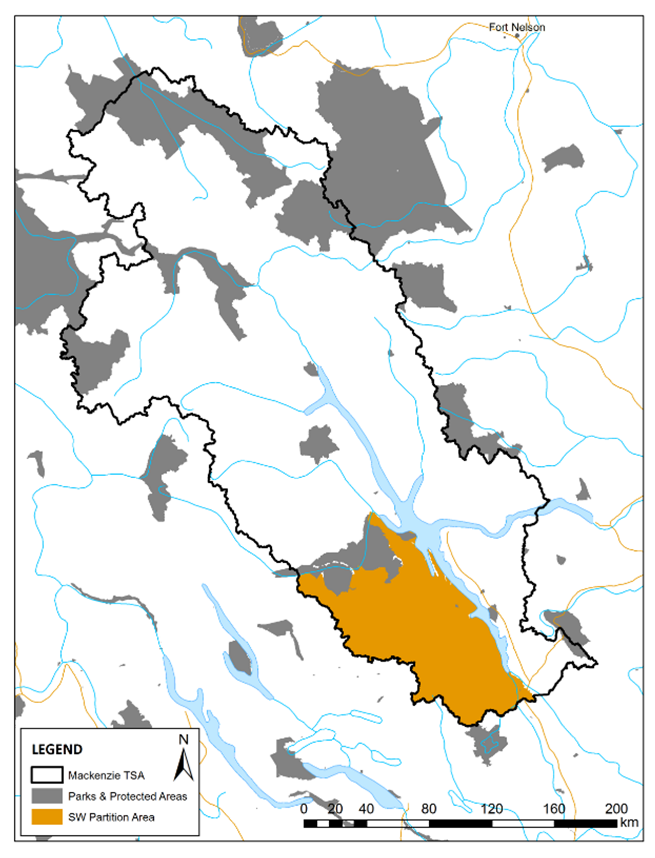
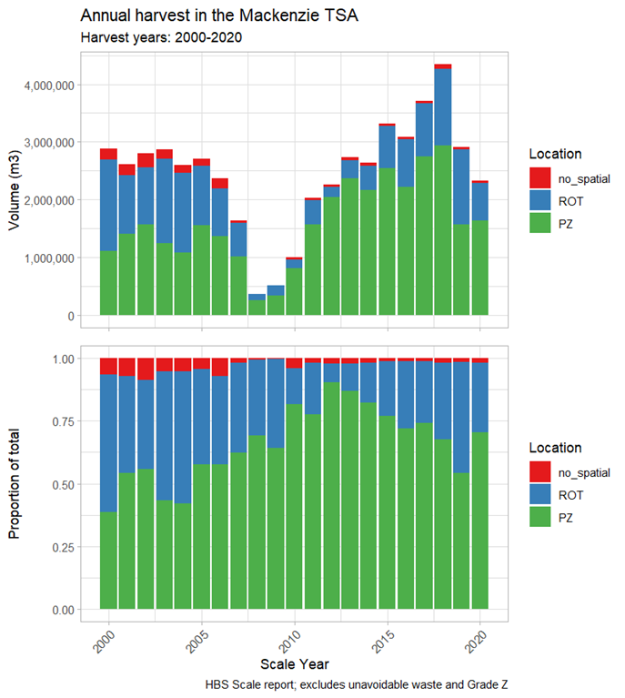
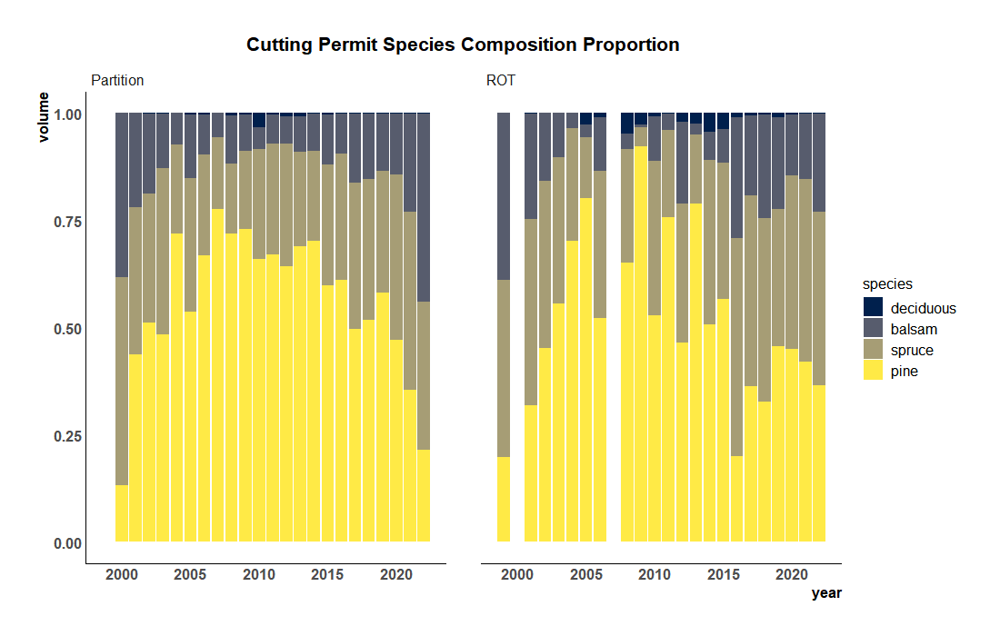
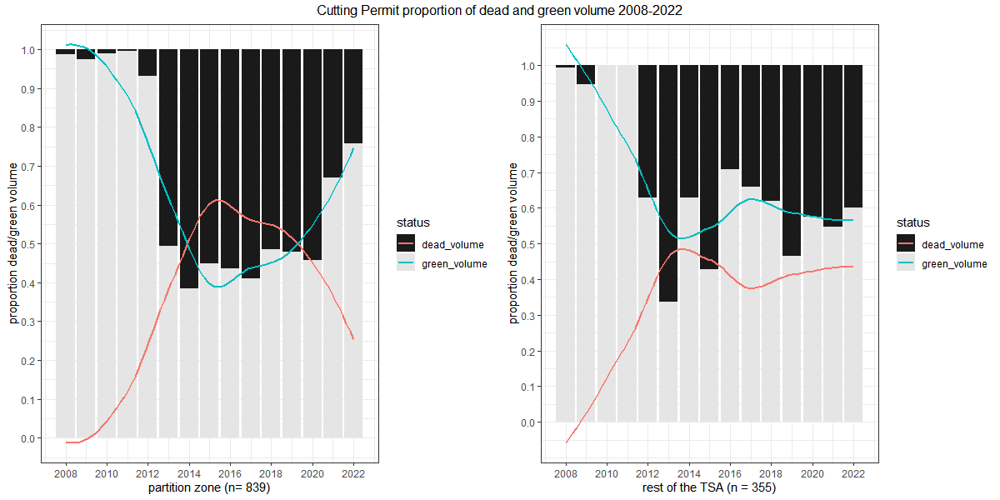
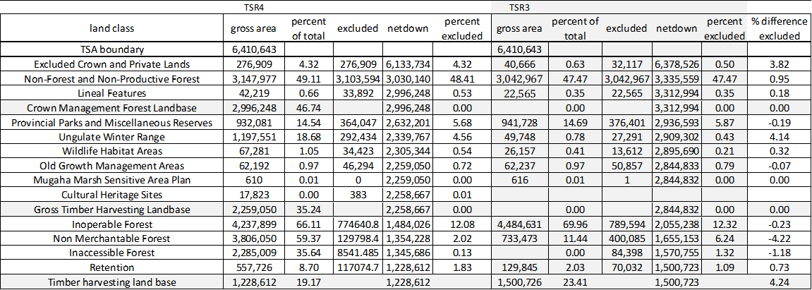
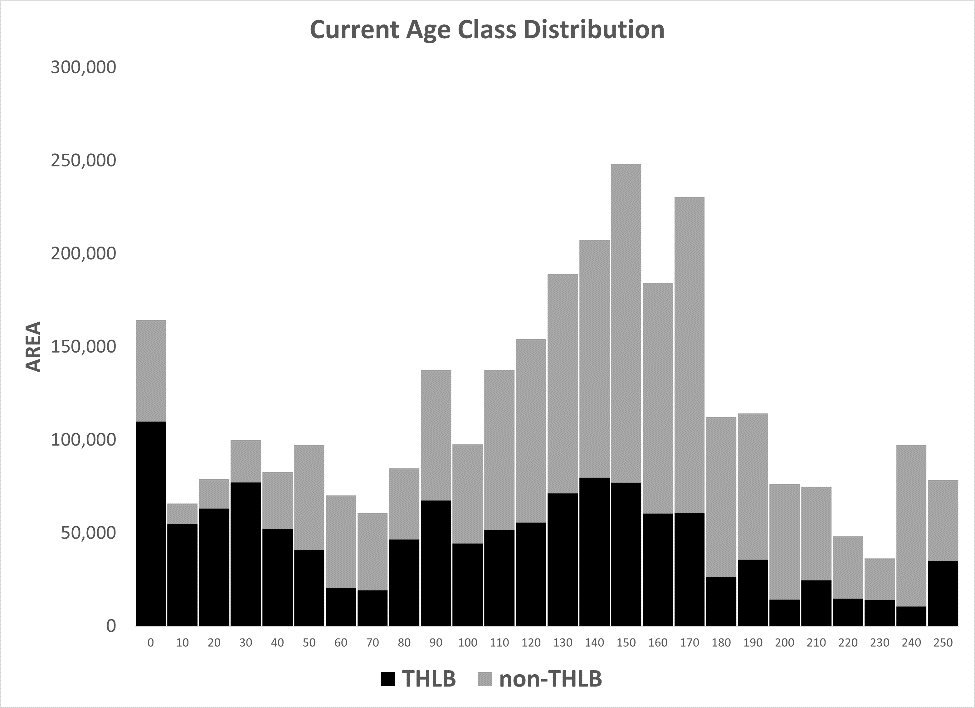
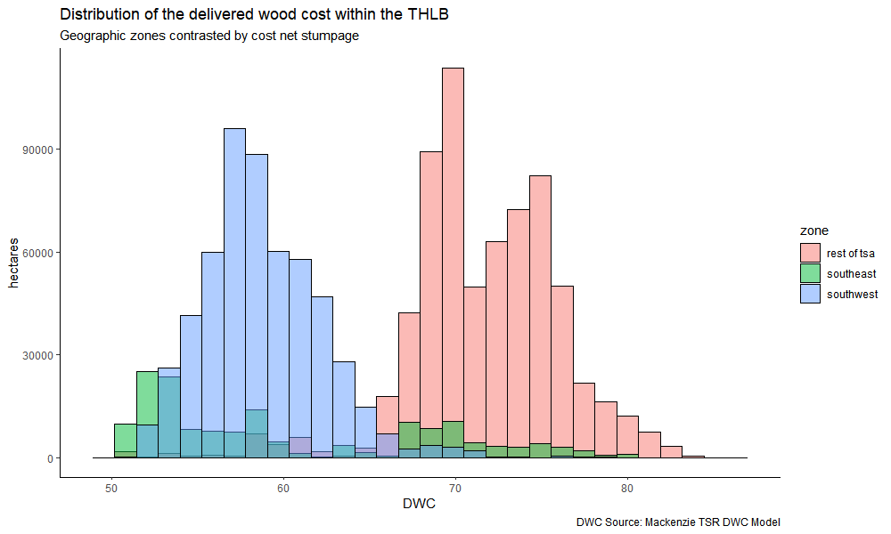
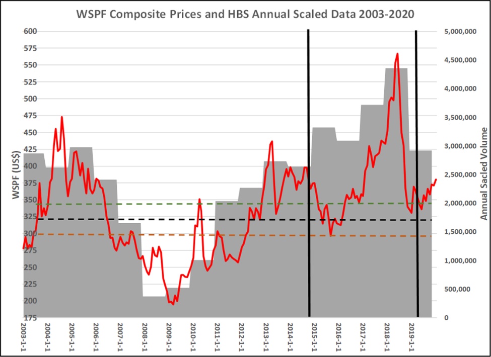
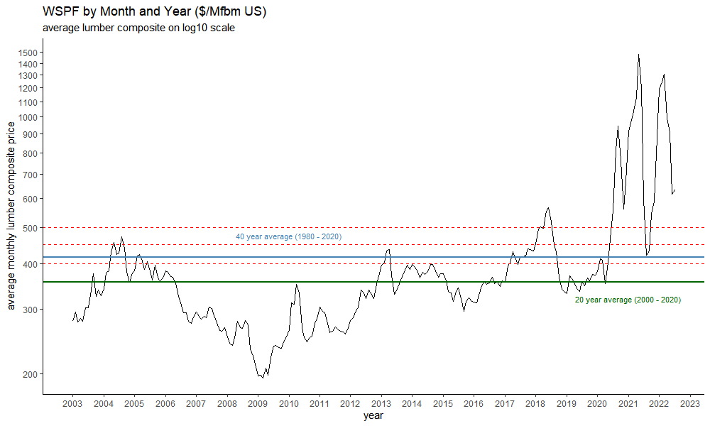

# Current Condition
## Unit Description
### Major Changes Since Last TSR

The last AAC determination for the Mackenzie TSA in November 2014 (TSR#3) was necessitated as part of an ongoing assessment of the (IBM) mountain pine beetle epidemic impacts to timber supply in the central interior.  Since then, several changes have occurred to the land base, forest management data and practices, which include but not limited to:

  - the end of the IBM epidemic and salvage phase (here salvage is defined as the coordinated unit-wide program to maximize the recovery of dead volume).
  - a rapid decline in value from the dead pine profile.
  - [mature (Change Monitoring Inventory) and immature (YSM) audits completed in 2018/2019.](https://alpha.gov.bc.ca/gov/content/industry/forestry/managing-our-forest-resources/forest-inventory/ground-sample-inventories/provincial-monitoring)
  - [historic lumber prices coupled with border tariffs.](https://www2.gov.bc.ca/gov/content/industry/forestry/competitive-forest-industry/forest-industry-economics/weekly-prices)
  - [Spruce Beetle (IBS) outbreak in the south-east portion of the TSA.](https://www2.gov.bc.ca/gov/content/industry/forestry/managing-our-forest-resources/forest-health/forest-pests/bark-beetles/spruce-beetle/omineca-spruce-beetle)
  - new area-based tenures deletions, new ungulate winter ranges, wildlife habitat areas, caribou and potential old growth deferrals.

Historically approximately 80% of all harvesting has occurred within a 150 km radius of the Mackenzie milling complex and 65% within 100 km of the milling complex. Since 2010 75% of the harvest has occurred within a 100 km of the milling complex with 43% occurring within 50 kms of the milling complex. 

(\#fig:figure1)Mackenzie TSA

\newpage

HBS data indicate that over the period from 2011 through to 2021 on average 78% of the AAC was harvested annually and that the total AAC has only been fully realized in one year (2018). The mean annual harvest over the past two decades has been approximately 2.5 million m3/year with an average of 3.04 million m3 havervested annually since 2011 

(\#fig:figure5)Scaled volume between 2000 and 2020 by geographic partition zone in the Mackenzie TSA

Over the past decade 72% of scaled harvest (~ 2.28M m3/yr) originated in the partition zone (the “partition zone” is refered to as PZ in the chart above and is located in the south-west portion of the TSA, ROT stands for the “rest of the TSA”)

During the past decade harvest has been directed at pine leading stands to expedite the salvage of IBM damaged timber. Since 2011 the mean annual percentage of scaled pine volume was 53% [standard deviation: 11.96%].

The proportion of pine volume permitted over the past decade has declined significantly primarily as a function of shelf-life reflecting the decaying value in the damaged profile. It is understood that commercial value (shelf-life) of damaged timber is determined by, and fluctuates with, changes in log costs, sawlog quality (and the consequential impact log quality has on lumber grade outturns), and sawmill performance. Each of these determinants of economic viability for damaged timber deteriorates each passing year.

Licensees have observed that receipts from the sale of low-grade lumber originating in the northern part of the TSA have become too low to cover the extraction costs, let alone contributing to the recovery of manufacturing costs, and believe there is very little, if any commercial value remaining in beetle-killed stands in the Mackenzie TSA

The following chart, using ECAS data, depicts the species proportions of permitted volume from 2000 to the present. Since 2011 the pine proportion has declined from a high of 71% in 2013 to a low of 38% in 2021 (26% in 2022 [partial year]). 

(\#fig:figure6)Permited Pine Contribution

The dead volume portion of permitted volume has declined annually from a high of 56% in 2014 to a low of 36% in 2021 (26% in 2022 [partital year]).This trend is also reflected in  the HBS data where the percentage of cutting permits designated as "cruise-based" have declined from 81% in 2013 to 32% in 2021.

(\#fig:figure7)Permitted Dead/Green Contribution

The most significant changes that have incurred to the land base definition since TSR#3 have been the area reductions resulting from the Kwadacha First Nations Woodland Licence and the establishment of new ungulate winter ranges which were excluded from the THLB of the TSA. Area reductions are partially offset by the broadening of the definition of merchantability and isolation. Consequently, the THLB is approximately 18% smaller than the previous iteration and 4% smaller relative to the gross boundary of the TSA.

The land base netdown contrasting the current (TSR4) with the previous (TSR3) is presented here:

(\#fig:table1)Mackenzie Netdown Table

Not identified in the netdown table are 33,645 hectares of THLB (2.7% of the total) within the caribou moratorium recovery zones in the southeast portion of the TSA which are subject to Part 13 designation and section 16 & 17 Land Act reserve designation.  These areas are currently treated in the timber supply model as a permanent 100% deferral.

The following chart depicts the age class distribution within the Analysis Forest Landbase (AFLB) of the Mackenzie TSA. Approximately 64% of the THLB is 80 years or greater in age while approximately 50% of all forests are greater than 140 years of age (30% THLB, 70% nTHLB)

(\#fig:ageclass)Age Class Distribution in the AFLB

There is approximately 157M m3 of green growing stock within the THLB, of which approximately 128M m3 (81.5% of the volume in the THLB) meets the coarse merchantability definition (if harvest system thresholds are applied merchantable estimate falls to 116M m3), of which approximately 108M m3 (85% of the merchantable volume) is considered available for harvest (i.e., not required to meet forest cover constraints).

Current estimates suggest there is approximately 16.4 M m3 of available (un-constrained) dead merchantable volume in the THLB (approximately 65% pine, 35% spruce/balsam), of which approximately 8.1M m3 (50% pine, 50% spruce/balsam) occurs in the southern portion of the TSA.

Change Monitoring Inventory (CMI) sampling indicate a mean merchantable dead pine volume of 70 m3/ha where dead pine occurs in the sample. The inventory correlate for the same ground sample location indicates a BCMPB derived mean merchantable dead pine volume of 76 m3/ha suggesting an average 7% overestimation in the inventory. Where the sample is restricted to polygons where dead pine occurs in both populations then the over-estimation increases to 24% (mean inventory dead volume equals 98m3/ha). CMI sampling also indicate that mortality in the Balsam profile are not captured in the inventory and therefore significantly under-estimated.

### Unit Economics

In order to better understand harvest history, performance, and the spatial bounds of activity an understanding of the economics of the unit provides the necessary context. Mackenzie is 6.4M ha in size and has the highest delivered wood costs in the interior.The area in brown is the current partition zone, it also contains the lion's share of winter-roaded portion of the TSA.

The unit is stratified by two separate and distinct log delivery systems: road and waterborne. Road based operations located in the southern portion of the TSA can delivery timber to the mill year-round while water borne delivery is limited to a short 105-day operating window in the summer. Consequently, there is a structural operating cost differential of between $20-25/m3 between this winter-roaded (year-round access) southern portion of the TSA and rest of the TSA.

And it’s the higher operating costs associated with the rest of the TSA that significantly limit the ability to action low quality (damaged) timber.

The following chart depicts the modeled distribution of delivered wood costs (DWC) in the TSA.

(\#fig:figure2)Modeled Delivered Wood Cost

\newpage

The following table contrast the modeled mean DWC for each geographic zone.

<table>
 <thead>
  <tr>
   <th style="text-align:left;"> zone </th>
   <th style="text-align:right;"> mean </th>
   <th style="text-align:right;"> sd </th>
  </tr>
 </thead>
<tbody>
  <tr>
   <td style="text-align:left;"> rest of tsa </td>
   <td style="text-align:right;"> 71.68 </td>
   <td style="text-align:right;"> 4.37 </td>
  </tr>
  <tr>
   <td style="text-align:left;"> southeast </td>
   <td style="text-align:right;"> 60.16 </td>
   <td style="text-align:right;"> 8.27 </td>
  </tr>
  <tr>
   <td style="text-align:left;"> southwest </td>
   <td style="text-align:right;"> 58.79 </td>
   <td style="text-align:right;"> 3.45 </td>
  </tr>
</tbody>
</table>

For comparison purposes Price Waterhouse analysis of provincial logging and forest management costs for the interior indicate the average DWC pre-stumpage is $53.90/m3 (in 2018 dollars)

It is the structural cost differential that makes the level of activity in the unit highly sensitive to fluctuation in market prices, far more so then the majority of the units in the interior, with significant portions of supply in the TSA extremely vulnerable to down markets, making the extensive margin of extraction highly elastic (bound by lumber price).

(\#fig:figure3)HBS WSPF Comparison

\newpage

Economic analysis indicates that with a long-term forecast of benchmark lumber prices above $US500/Mfbm , companies could rely on sustainable sawlog supply from all portions of the THLB.  With the long-term forecast of benchmark lumber price below 400/Mfbm, companies would only rely on sustainable sawlog supply from SW portion of TSA.

(\#fig:figure4)Western SPF Composite

The inflation adjusted average benchmark lumber price (Western SPF 2x4 2 & btr) has been:

  - $US 356/Mfbm over last 20 years  (as of 2020)
  - $US 415/Mfbm over last 40 years  (as of 2020)
  
### Climate Change

The evidence of global climate change is very clear, the 10 hottest years on global record have all occurred since 2010. The climate trend at Fort St. James, which has the longest instrumental record in northern BC, is warming three times the global average.

Climate change is already affecting the forests of north-central interior of B.C., primarily in the increase of natural disturbances such as wildfire and beetle outbreaks, as climate conditions in summer and winter months have become more favourable for such disturbances.

Data from Environment and Climate Change Canada weather stations within the Mackenzie TSA, that provide greater than 10 years of consecutive record, show mean annual temperature has increased by 1.7oC, extreme maximum temperatures by 1.3oC, and extreme minimum temperatures by 5.5oC over the last 70 years. 

The most significant changes have occurred during the winter and summer seasons, the winter has less cold extremes and less precipitation (-26%), whereas the summer has hotter temperatures and no increase in preciptation which likely results in greater moisture stress on vegetation. 

The table below describes the trends in the Mackenzie TSA (1951-2021)

(\#fig:figure66)Historic Climate Trends for the Mackenzie TSA

It is very likely temperatures will continue to increase in the Mackenzie TSA, double the rate of the current trends. Using a mid-range emission scenario and an average of climate model output, an additional 3.2oC increase in mean annual temperatures is projected for 2041-2070. These temperature increases will be highly variable and wide ranging; however, it is likely that there will be further increases in extreme maximum temperatures and decreases in extreme minimum temperatures. 

Precipitation is projected to increase in the TSA, potentially the most in the fall and least in the summer; however, the delivery of that precipitation is unclear. It is likely that such increases could be from short-term storm events, or there could be prolonged periods of wet conditions as well as prolonged periods of dry conditions. 

In the summer months, the minor increase in precipitation projected is unlikely to compensate for the evaporation demands of the large projected increases in temperature and therefore lead to moisture deficits. Projected decreases in precipitation as snow will reduce water availability for plants and aqautic ecosystems in the spring and summer and further exasperate the impacts of summer moisture deficits.

The table below describes the projected climate trends in the Mackenzie TSA described as the difference between the mean Future (2041-2070) and historic mean (1961-1990)

(\#fig:figure67)Projected Climate Trends for the Mackenzie TSA

Growing degree days and the number of frost free days are projected to increase, which may lead to more favourable conditions for some terrestrial species, including perhaps enhanced tree growth, but will also favour conditions for some pests and invasive species. 

Extreme events, which are already increasing in the Mackenzie TSA, are also more likely to occur with further warming (e.g., storms, extreme heat and cold, extreme precipitation excess and deficits) and lead to an increase in natural disturbances (e.g., floods, landslides, droughts, wildfire, pest outbreaks).

Given both the uncertainty of the rate and specific characteristics of climate change, and the uncertainty around the impact to the forest and how management will respond, it is not possible to quantify climate change impacts on timber supply with confidence.

For this review, sensitivity analysis is used to assess climate change related natural disturbance impacts (e.g. future wildfire, insect and drought risk) and subsequent impacts to timber supply assumptions and harvest projections.

