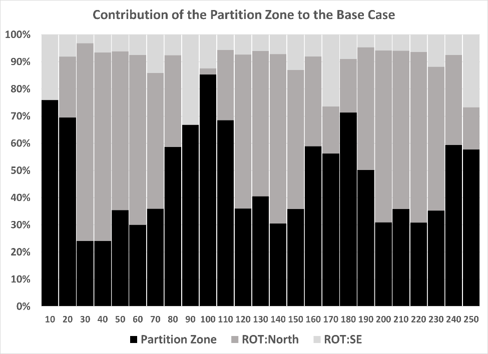
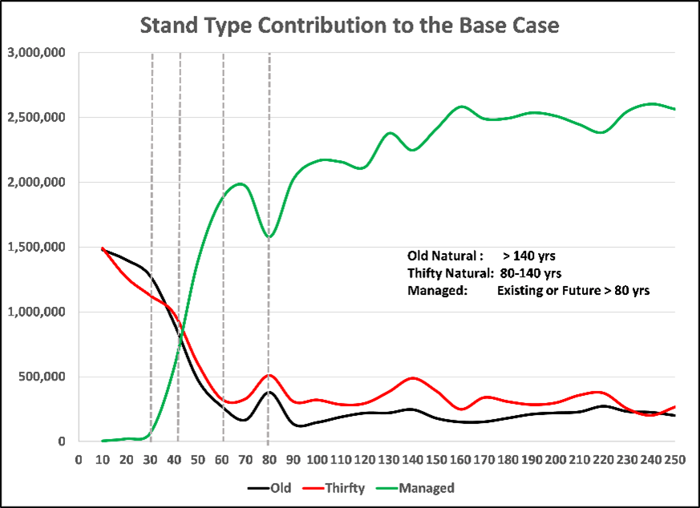
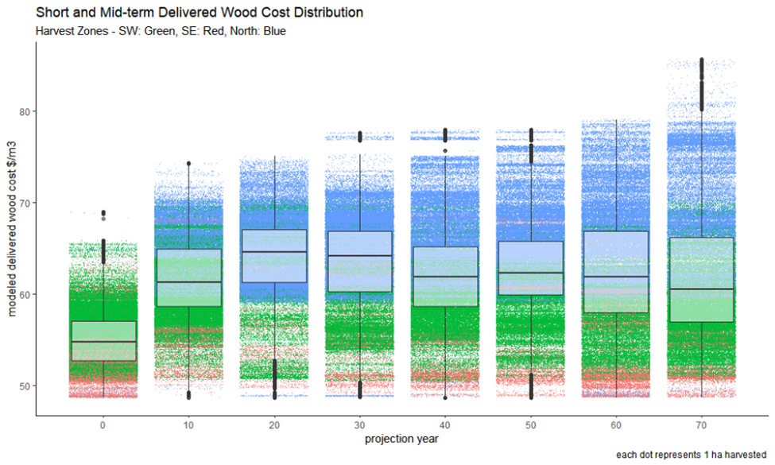
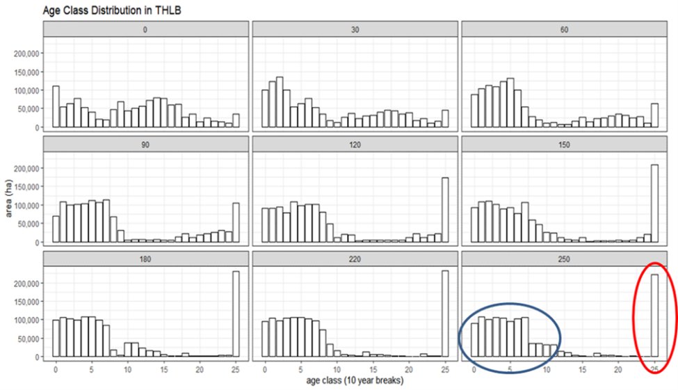
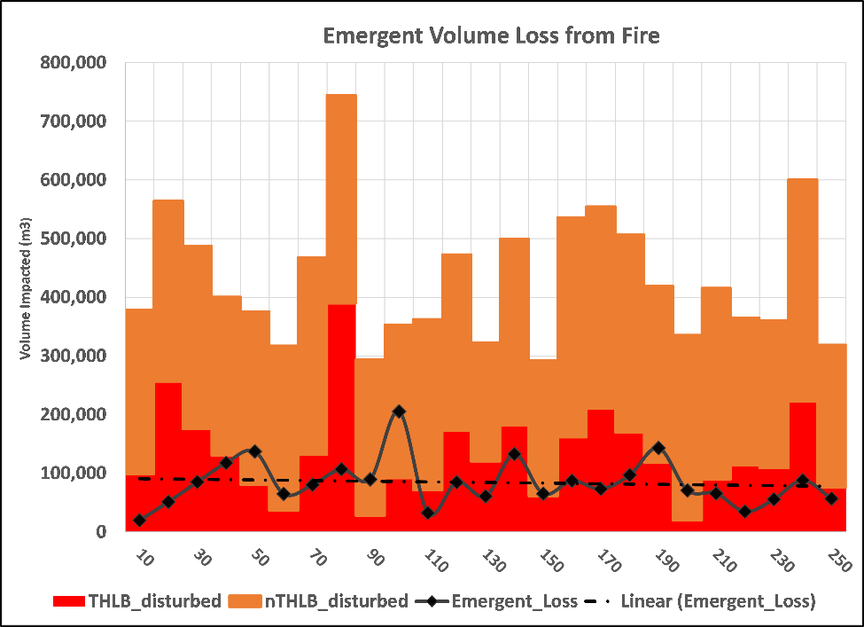

# Overview of the Base case
## Base Case Objectives and Modeling Parameters

**Model used for analysis**

  - The Spatial Timber Supply Model (STSM2020) was used for this analysis.
  - STSM is run using the Spatially Explicit Landscape Event Simulator (SELES).
  - STSM is approved for use in timber supply analysis by Forest Analysis Inventory Branch (FAIB) and the results of the analysis were peer reviewed.
  - The model was run at a spatial resolution of one hectare.
  - The model was run at a 10-year time step.
  - The model includes both explicit simulated road development and natural disturbance 
  
**Harvest Flow Objectives**

  - Do not exacerbate the most constraining period: the harvest level should be maintained at or above the maximum even-flow harvest level for the unit.
  - Maximized harvest levels should be feasible and sustainable in practice.
  - Maintain existing harvest levels to the degree possible.
  - Modeled harvest outcomes (profiles) should reasonably approximate historic conditions and practice recognising the effect of transitioning from natural to managed stands.
  - Limit supply decline discontinuity to steps of no more than 10% per decade where feasible.
  - Increased long-term harvest levels should be enduring beyond the planning horizon.

**Initial Base Case Assumptions**

 - Salvage (see \@ref(Salvage)  - defined as the unit-wide focused harvest to maximize the recovery of dead volume) is not modeled as an over-arching management objective. 
 - No existing dead volume contribute to the base case harvest projection. The base case represents the 'least risk' scenario related to the ongoing merchantability of dead volume
 - The base case was developed to emphasize the geographic distribution of harvest (practice) that has occurred over the past 12 years and to highlight the implications of that practice being sustained for as long as possible, as close to the milling complex as possible.
 - The THLB is stratified by harvest system (75% conventional, 15% mixed, 10% cable)
 - Available stands must be greater than or equal to 80 years of age and greater than minimum harvest volume per hectare for the harvest system 
 - Harvest preferentially progresses from south to north to reflect historic patterns of development
 - Harvest preferentially progresses from existing road network outward
 - Emergent Non-Recoverable Losses (NRLs) are produced via fire simulation Salvage of fire damaged timber is not prioritized and occurs as bycatch.
 - Harvest must initiate within a maximum of 2km of the road network
 - Target block sizes can range between 5 to 100 hectares in size (as demonstrated by current practice)
 - Adjacency is not applied (as demonstrated by current practice)
 - Deciduous-leading stands contribute to base case 

**Supplemental (Alternatives to the Base case) Assumptions**

 - A south-west and a southern geographic partition are assessed, and each geographic area is treated as a discrete management unit.
 - Residual existing dead volume is available for harvest for one time-step (5 and 10 years respectively).
 - Residual existing dead volume is available everywhere in the TSA and alternatively, only in the southern part of the TSA (south of Omineca Park and south of the Peace Arm).

**Harvest Queue**

 - The probability of harvest initiation is based on maximum volume per hectare relative to volume at culmination age weighted by distance to mill and distance to road. 
 
 \newpage
 
## Base Case Projection

The following figure contrasts the base case harvest projection (dark solid line) with the salvage alternative from the previous TSR (solid red and red-dashed line represent the base case and salvage alternative from the previous TSR). The black dashed line represents the maximum even flow for the Mackenzie TSA.

(\#fig:figure8)Base Case Harvest Projection

The initial harvest level of 2.97 M m3/yr is maintained for 10 years before stepping down to 2.46 M m3/yr by the end of the 3rd decade.  The mid-term harvest level is sustained for 60 years before climbing to the long-term harvest level of 3.1M m3 in the 20th decade.

The transition to harvesting existing managed stands begins in the 4th decade and continues for 40 years with 75% of the harvest coming from existing or model-generated managed stands.  Existing natural stand harvest persists throughout the planning horizon as the implementation of stand recovery in existing damaged stands (secondary stand structure \@ref(SSS)) allows damaged stands to become merchantable and available over time.

Non-pine leading stands contribute over 80% of the mature harvest over the first 4 decades with an average deciduous-leading contribution of 11%.  The harvest profile shifts during the transition to managed stands with >70% coming from pine-leading stands by the 10th decade.

## Base Case Diagnostics

The following chart depicts the base case contributions of the current SW partition zone and the rest of the TSA (ROT).  The columns in black represent the percentage of the total harvest originating in the SW partition zone, the columns in light grey represent the percentage of the total harvest originating in the south-eastern portion of the TSA (south of the Peace Arm) while the columns in dark grey represent the percentage of the total harvest originating in the northern portion of the TSA (North of Omineca park and Peace Arm).

(\#fig:figure9)Harvest Contribution by Geographic Zone

In the absence of a geographic regulation of harvest approximately 78% (2.3M m3/yr) originates in the current partition zone, continuing the trend of harvest performance that has occurred since the last determination in 2014.  Harvest continues to be concentrated in the SW portion of the TSA for another decade (69% of the harvest request) until growing stock depletion forces harvest into the rest of the TSA for five decades.

The dependence on the rest of the TSA for the mid-term timber harvest projection runs counter to both the historic trend of < 50% of the harvest originating outside the southern partition of the TSA and the need to balance operations between the two log delivery systems to offset the elevated costs associated with operations in the rest of the TSA

The starting growing stock within the THLB is approximately 157M m3 with approximately 108M m3 of merchantable, available (unconstrained) volume.  The long-term growing stock in the THLB levels out at approximately 140M m3/yr. or 88% of the starting condition.

<table class="table table-striped" style="font-size: 8px; margin-left: auto; margin-right: auto;">
<caption style="font-size: initial !important;">(\#tab:table23)Growing Stock Summary</caption>
 <thead>
  <tr>
   <th style="text-align:right;"> Year </th>
   <th style="text-align:left;"> THLB Volume </th>
   <th style="text-align:left;"> THLB Volume Old (&gt; 140) </th>
   <th style="text-align:left;"> THLB Volume Thrifty </th>
   <th style="text-align:left;"> THLB Volume Managed </th>
   <th style="text-align:left;"> Above minimum  Age/Volume threshold </th>
   <th style="text-align:left;"> Above MHA/V Old </th>
   <th style="text-align:left;"> Above MHA/V Thrifty </th>
   <th style="text-align:left;"> Above MHA/V Managed </th>
   <th style="text-align:left;"> Available (Unconstrained) Volume </th>
  </tr>
 </thead>
<tbody>
  <tr>
   <td style="text-align:right;"> 0 </td>
   <td style="text-align:left;"> 157,491,698 </td>
   <td style="text-align:left;"> 89,051,004 </td>
   <td style="text-align:left;"> 64,157,115 </td>
   <td style="text-align:left;"> 4,283,579 </td>
   <td style="text-align:left;"> 116,211,094 </td>
   <td style="text-align:left;"> 71,011,968 </td>
   <td style="text-align:left;"> 45,137,697 </td>
   <td style="text-align:left;"> 61,429 </td>
   <td style="text-align:left;"> 108,490,456 </td>
  </tr>
  <tr>
   <td style="text-align:right;"> 10 </td>
   <td style="text-align:left;"> 141,242,553 </td>
   <td style="text-align:left;"> 74,992,007 </td>
   <td style="text-align:left;"> 55,810,549 </td>
   <td style="text-align:left;"> 10,439,997 </td>
   <td style="text-align:left;"> 94,974,858 </td>
   <td style="text-align:left;"> 57,063,240 </td>
   <td style="text-align:left;"> 37,189,127 </td>
   <td style="text-align:left;"> 722,491 </td>
   <td style="text-align:left;"> 87,866,106 </td>
  </tr>
  <tr>
   <td style="text-align:right;"> 20 </td>
   <td style="text-align:left;"> 130,191,915 </td>
   <td style="text-align:left;"> 61,683,104 </td>
   <td style="text-align:left;"> 47,693,359 </td>
   <td style="text-align:left;"> 20,815,452 </td>
   <td style="text-align:left;"> 77,116,686 </td>
   <td style="text-align:left;"> 43,627,312 </td>
   <td style="text-align:left;"> 30,783,749 </td>
   <td style="text-align:left;"> 2,705,624 </td>
   <td style="text-align:left;"> 69,834,330 </td>
  </tr>
  <tr>
   <td style="text-align:right;"> 30 </td>
   <td style="text-align:left;"> 123,351,347 </td>
   <td style="text-align:left;"> 48,234,515 </td>
   <td style="text-align:left;"> 40,135,962 </td>
   <td style="text-align:left;"> 34,980,871 </td>
   <td style="text-align:left;"> 64,986,786 </td>
   <td style="text-align:left;"> 30,332,504 </td>
   <td style="text-align:left;"> 23,953,584 </td>
   <td style="text-align:left;"> 10,700,699 </td>
   <td style="text-align:left;"> 57,637,703 </td>
  </tr>
  <tr>
   <td style="text-align:right;"> 40 </td>
   <td style="text-align:left;"> 120,192,586 </td>
   <td style="text-align:left;"> 38,916,526 </td>
   <td style="text-align:left;"> 33,575,790 </td>
   <td style="text-align:left;"> 47,700,270 </td>
   <td style="text-align:left;"> 57,562,300 </td>
   <td style="text-align:left;"> 21,002,543 </td>
   <td style="text-align:left;"> 17,522,352 </td>
   <td style="text-align:left;"> 19,037,406 </td>
   <td style="text-align:left;"> 50,440,742 </td>
  </tr>
  <tr>
   <td style="text-align:right;"> 50 </td>
   <td style="text-align:left;"> 119,042,520 </td>
   <td style="text-align:left;"> 34,872,373 </td>
   <td style="text-align:left;"> 30,264,655 </td>
   <td style="text-align:left;"> 53,905,491 </td>
   <td style="text-align:left;"> 51,072,323 </td>
   <td style="text-align:left;"> 16,796,314 </td>
   <td style="text-align:left;"> 14,203,197 </td>
   <td style="text-align:left;"> 20,072,813 </td>
   <td style="text-align:left;"> 43,665,342 </td>
  </tr>
  <tr>
   <td style="text-align:right;"> 60 </td>
   <td style="text-align:left;"> 119,349,800 </td>
   <td style="text-align:left;"> 31,958,320 </td>
   <td style="text-align:left;"> 27,609,222 </td>
   <td style="text-align:left;"> 59,782,258 </td>
   <td style="text-align:left;"> 45,046,540 </td>
   <td style="text-align:left;"> 13,736,125 </td>
   <td style="text-align:left;"> 11,289,747 </td>
   <td style="text-align:left;"> 20,020,668 </td>
   <td style="text-align:left;"> 37,465,655 </td>
  </tr>
  <tr>
   <td style="text-align:right;"> 70 </td>
   <td style="text-align:left;"> 121,193,301 </td>
   <td style="text-align:left;"> 29,447,212 </td>
   <td style="text-align:left;"> 25,496,821 </td>
   <td style="text-align:left;"> 66,249,269 </td>
   <td style="text-align:left;"> 40,163,043 </td>
   <td style="text-align:left;"> 12,082,814 </td>
   <td style="text-align:left;"> 10,369,255 </td>
   <td style="text-align:left;"> 17,710,974 </td>
   <td style="text-align:left;"> 32,650,880 </td>
  </tr>
  <tr>
   <td style="text-align:right;"> 80 </td>
   <td style="text-align:left;"> 123,566,892 </td>
   <td style="text-align:left;"> 25,381,602 </td>
   <td style="text-align:left;"> 21,366,798 </td>
   <td style="text-align:left;"> 76,818,492 </td>
   <td style="text-align:left;"> 49,690,562 </td>
   <td style="text-align:left;"> 8,473,674 </td>
   <td style="text-align:left;"> 6,136,322 </td>
   <td style="text-align:left;"> 35,080,566 </td>
   <td style="text-align:left;"> 42,978,788 </td>
  </tr>
  <tr>
   <td style="text-align:right;"> 90 </td>
   <td style="text-align:left;"> 126,225,181 </td>
   <td style="text-align:left;"> 24,839,523 </td>
   <td style="text-align:left;"> 21,597,679 </td>
   <td style="text-align:left;"> 79,787,979 </td>
   <td style="text-align:left;"> 57,786,651 </td>
   <td style="text-align:left;"> 8,216,852 </td>
   <td style="text-align:left;"> 7,976,234 </td>
   <td style="text-align:left;"> 41,593,564 </td>
   <td style="text-align:left;"> 50,883,326 </td>
  </tr>
  <tr>
   <td style="text-align:right;"> 100 </td>
   <td style="text-align:left;"> 127,123,196 </td>
   <td style="text-align:left;"> 23,516,750 </td>
   <td style="text-align:left;"> 21,217,996 </td>
   <td style="text-align:left;"> 82,388,451 </td>
   <td style="text-align:left;"> 60,101,723 </td>
   <td style="text-align:left;"> 7,071,298 </td>
   <td style="text-align:left;"> 7,865,191 </td>
   <td style="text-align:left;"> 45,165,234 </td>
   <td style="text-align:left;"> 53,621,364 </td>
  </tr>
  <tr>
   <td style="text-align:right;"> 110 </td>
   <td style="text-align:left;"> 129,392,028 </td>
   <td style="text-align:left;"> 22,836,986 </td>
   <td style="text-align:left;"> 20,984,640 </td>
   <td style="text-align:left;"> 85,570,403 </td>
   <td style="text-align:left;"> 62,632,964 </td>
   <td style="text-align:left;"> 6,617,972 </td>
   <td style="text-align:left;"> 7,955,203 </td>
   <td style="text-align:left;"> 48,059,789 </td>
   <td style="text-align:left;"> 56,116,006 </td>
  </tr>
  <tr>
   <td style="text-align:right;"> 120 </td>
   <td style="text-align:left;"> 132,979,311 </td>
   <td style="text-align:left;"> 22,323,934 </td>
   <td style="text-align:left;"> 20,501,483 </td>
   <td style="text-align:left;"> 90,153,894 </td>
   <td style="text-align:left;"> 64,517,307 </td>
   <td style="text-align:left;"> 6,114,418 </td>
   <td style="text-align:left;"> 7,623,218 </td>
   <td style="text-align:left;"> 50,779,671 </td>
   <td style="text-align:left;"> 58,366,994 </td>
  </tr>
  <tr>
   <td style="text-align:right;"> 130 </td>
   <td style="text-align:left;"> 133,084,860 </td>
   <td style="text-align:left;"> 21,758,073 </td>
   <td style="text-align:left;"> 19,088,029 </td>
   <td style="text-align:left;"> 92,238,758 </td>
   <td style="text-align:left;"> 62,685,465 </td>
   <td style="text-align:left;"> 5,721,678 </td>
   <td style="text-align:left;"> 6,529,470 </td>
   <td style="text-align:left;"> 50,434,317 </td>
   <td style="text-align:left;"> 56,717,674 </td>
  </tr>
  <tr>
   <td style="text-align:right;"> 140 </td>
   <td style="text-align:left;"> 133,253,799 </td>
   <td style="text-align:left;"> 21,446,923 </td>
   <td style="text-align:left;"> 16,493,441 </td>
   <td style="text-align:left;"> 95,313,435 </td>
   <td style="text-align:left;"> 60,652,017 </td>
   <td style="text-align:left;"> 5,562,013 </td>
   <td style="text-align:left;"> 4,072,405 </td>
   <td style="text-align:left;"> 51,017,599 </td>
   <td style="text-align:left;"> 54,416,004 </td>
  </tr>
  <tr>
   <td style="text-align:right;"> 150 </td>
   <td style="text-align:left;"> 132,211,223 </td>
   <td style="text-align:left;"> 21,013,429 </td>
   <td style="text-align:left;"> 15,849,728 </td>
   <td style="text-align:left;"> 95,348,066 </td>
   <td style="text-align:left;"> 61,453,109 </td>
   <td style="text-align:left;"> 5,276,192 </td>
   <td style="text-align:left;"> 3,669,461 </td>
   <td style="text-align:left;"> 52,507,456 </td>
   <td style="text-align:left;"> 55,522,921 </td>
  </tr>
  <tr>
   <td style="text-align:right;"> 160 </td>
   <td style="text-align:left;"> 130,489,495 </td>
   <td style="text-align:left;"> 20,782,241 </td>
   <td style="text-align:left;"> 15,465,696 </td>
   <td style="text-align:left;"> 94,241,558 </td>
   <td style="text-align:left;"> 62,264,611 </td>
   <td style="text-align:left;"> 5,217,067 </td>
   <td style="text-align:left;"> 3,442,942 </td>
   <td style="text-align:left;"> 53,604,602 </td>
   <td style="text-align:left;"> 56,464,926 </td>
  </tr>
  <tr>
   <td style="text-align:right;"> 170 </td>
   <td style="text-align:left;"> 128,828,818 </td>
   <td style="text-align:left;"> 20,776,490 </td>
   <td style="text-align:left;"> 15,356,423 </td>
   <td style="text-align:left;"> 92,695,905 </td>
   <td style="text-align:left;"> 62,394,272 </td>
   <td style="text-align:left;"> 5,316,146 </td>
   <td style="text-align:left;"> 3,420,262 </td>
   <td style="text-align:left;"> 53,657,863 </td>
   <td style="text-align:left;"> 56,692,026 </td>
  </tr>
  <tr>
   <td style="text-align:right;"> 180 </td>
   <td style="text-align:left;"> 127,038,938 </td>
   <td style="text-align:left;"> 20,716,877 </td>
   <td style="text-align:left;"> 15,161,986 </td>
   <td style="text-align:left;"> 91,160,075 </td>
   <td style="text-align:left;"> 60,741,811 </td>
   <td style="text-align:left;"> 5,616,472 </td>
   <td style="text-align:left;"> 3,352,382 </td>
   <td style="text-align:left;"> 51,772,956 </td>
   <td style="text-align:left;"> 54,707,606 </td>
  </tr>
  <tr>
   <td style="text-align:right;"> 190 </td>
   <td style="text-align:left;"> 125,356,526 </td>
   <td style="text-align:left;"> 20,769,924 </td>
   <td style="text-align:left;"> 15,050,488 </td>
   <td style="text-align:left;"> 89,536,115 </td>
   <td style="text-align:left;"> 56,971,757 </td>
   <td style="text-align:left;"> 5,828,533 </td>
   <td style="text-align:left;"> 3,255,688 </td>
   <td style="text-align:left;"> 47,887,536 </td>
   <td style="text-align:left;"> 50,226,366 </td>
  </tr>
  <tr>
   <td style="text-align:right;"> 200 </td>
   <td style="text-align:left;"> 123,930,147 </td>
   <td style="text-align:left;"> 20,105,175 </td>
   <td style="text-align:left;"> 14,769,809 </td>
   <td style="text-align:left;"> 89,055,163 </td>
   <td style="text-align:left;"> 54,428,100 </td>
   <td style="text-align:left;"> 5,284,962 </td>
   <td style="text-align:left;"> 3,024,726 </td>
   <td style="text-align:left;"> 46,118,412 </td>
   <td style="text-align:left;"> 47,376,736 </td>
  </tr>
  <tr>
   <td style="text-align:right;"> 210 </td>
   <td style="text-align:left;"> 123,381,363 </td>
   <td style="text-align:left;"> 19,856,062 </td>
   <td style="text-align:left;"> 14,543,903 </td>
   <td style="text-align:left;"> 88,981,398 </td>
   <td style="text-align:left;"> 51,933,034 </td>
   <td style="text-align:left;"> 5,096,473 </td>
   <td style="text-align:left;"> 2,779,356 </td>
   <td style="text-align:left;"> 44,057,204 </td>
   <td style="text-align:left;"> 45,014,523 </td>
  </tr>
  <tr>
   <td style="text-align:right;"> 220 </td>
   <td style="text-align:left;"> 122,974,511 </td>
   <td style="text-align:left;"> 19,674,191 </td>
   <td style="text-align:left;"> 14,457,351 </td>
   <td style="text-align:left;"> 88,842,969 </td>
   <td style="text-align:left;"> 50,456,846 </td>
   <td style="text-align:left;"> 4,901,325 </td>
   <td style="text-align:left;"> 2,735,855 </td>
   <td style="text-align:left;"> 42,819,666 </td>
   <td style="text-align:left;"> 43,653,272 </td>
  </tr>
  <tr>
   <td style="text-align:right;"> 230 </td>
   <td style="text-align:left;"> 121,854,195 </td>
   <td style="text-align:left;"> 19,720,892 </td>
   <td style="text-align:left;"> 14,491,896 </td>
   <td style="text-align:left;"> 87,641,407 </td>
   <td style="text-align:left;"> 50,057,563 </td>
   <td style="text-align:left;"> 5,027,486 </td>
   <td style="text-align:left;"> 2,774,759 </td>
   <td style="text-align:left;"> 42,255,319 </td>
   <td style="text-align:left;"> 43,060,451 </td>
  </tr>
  <tr>
   <td style="text-align:right;"> 240 </td>
   <td style="text-align:left;"> 119,663,376 </td>
   <td style="text-align:left;"> 19,773,658 </td>
   <td style="text-align:left;"> 14,455,110 </td>
   <td style="text-align:left;"> 85,434,608 </td>
   <td style="text-align:left;"> 50,997,491 </td>
   <td style="text-align:left;"> 5,174,438 </td>
   <td style="text-align:left;"> 2,778,775 </td>
   <td style="text-align:left;"> 43,044,278 </td>
   <td style="text-align:left;"> 43,866,159 </td>
  </tr>
  <tr>
   <td style="text-align:right;"> 250 </td>
   <td style="text-align:left;"> 117,667,012 </td>
   <td style="text-align:left;"> 19,865,975 </td>
   <td style="text-align:left;"> 14,471,242 </td>
   <td style="text-align:left;"> 83,329,795 </td>
   <td style="text-align:left;"> 50,941,250 </td>
   <td style="text-align:left;"> 5,389,646 </td>
   <td style="text-align:left;"> 2,852,635 </td>
   <td style="text-align:left;"> 42,698,968 </td>
   <td style="text-align:left;"> 43,824,687 </td>
  </tr>
</tbody>
</table>

The long-term mean volume per hectare (vph = 280 m3/ha) is primarily a function of the minimum age constraint and is consistent with the historic volume per hectare harvested (median = 278m3/ha from 2002 - 2020). The mean stand age at the beginning of the projection is 142 years which falls to a mean of 92 years (median = 80 years by year 50) by the end of the mid-term (year 80). The minimum harvest age definition of merchantability for the model is 80 years.  However, the model can “look-ahead” to determine if a stand reaches 80 years during the time-step, and if so, the stand would be considered available with respect to age. 

The transition from natural to managed stands begins to occur in year 30 and is followed by a 30-year period where thrifty stands (80-140 yrs) and old stands (greater than 140 yrs) continue to a make a significant contribution (> 25 % of the harvest).

The transition is essentially complete by year 80 when the managed stand contribution makes-up greater than 75% of the harvest.  Thrifty and old stands continue to a make a contribution later in the projection as merchantability of previously damaged stands improves through secondary stand structure.

(\#fig:figure10)StandType Contribution to the base case

The following chart depicts the change in the distribution of modelled delivered wood costs (DWC) over the first 70 years of the base case projection (stumpage not included and unadjusted for inflation).

The green dots represent the DWC of stands harvested in the south-west, the red the south-east, and the blue coming from the northern part of the TSA

As harvest progresses northward the median cost increases from \$54US/m3 in the first decade where harvest is concentrated in the lower cost winter-roaded portion of the TSA to a median of \$64/m3 in the third decade.  Twenty-five percent of the harvest in the northern portion of the TSA from the second decade forward has DWC greater than $67.50/m3

(\#fig:figure11)DWC Distribution

The following chart depicts the change in age class distribution over time within the THLB as a result of the base case harvest flow.  Each facet in the chart represents the condition at thirty-year intervals for 250 years (year of projection at the top of each facet).  Two areas are circled in the last facet (lower right – year 250).  The blue circle (left) encompasses the age-classes that make-up the “realized THLB”; that portion of the THLB that is harvested in the base case.

(\#fig:figure12)Age Class Distribution

The THLB within the red circle is unharvested (age > 250 yrs), representing approximately 15% of the total THLB (~ 172 000ha).

  - Approximately 23% (~ 40 000 ha) of the unharvested THLB consists of stands that remain constrained or deferred (part 13), providing for forest cover to meet other resource objectives.
  
  - The remaining 73% (~ 132 000) of the unharvested THLB is made up of either Mountain Pine Beetle damaged stands that do not recover merchantability through secondary stand structure or are damaged by fire in the model and fall out of the harvest queue.

For the base case fire (\@ref(Fire)) was be modelled explicitly based on a simulated fire regime emulating the historic pattern of fire disturbance in the Mackenzie TSA and losses associated with fire were emergent in the model.

In the base case, 6164 hectares were disturbed in all forests in the TSA annually based on historic fire parametres.  On avaerage 874 hectares (14%) are disturbed in the THLB annual while 5291 hectares (86%) are disturbed in the nTHLB (for comparison the THLB ecompasses 29% of all forests within the TSA).  Once stands are disturbed ages are reset and stands revert to natural stand yield and height curves.

The following chart depicts the volume disturbed by modelled fire in the base case. The orange bars represent the volume disturbed in the n THLB while the red bars respresent the volume disturbed in the THLB.  The solid black line represnts the annual emergent non-recoverable losses which have also been summarized as an average linear trend in the dashed black line.

(\#fig:figure13)Fire and Emergent Loss Distribution

On average 83 000 m3/yr of emergent losses are attributed to fire in the base case.  An additional 30 000 m3/yr are attributed aspatially to represent non-recoverable losses associated with windthrow for a total average losss of 113 000 m3/yr.

