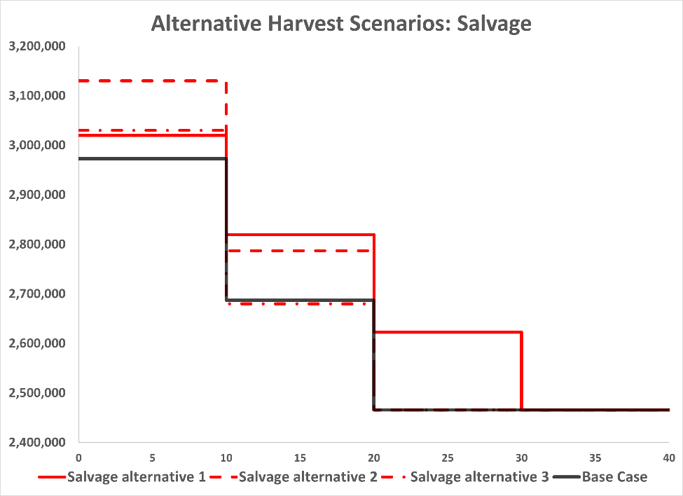
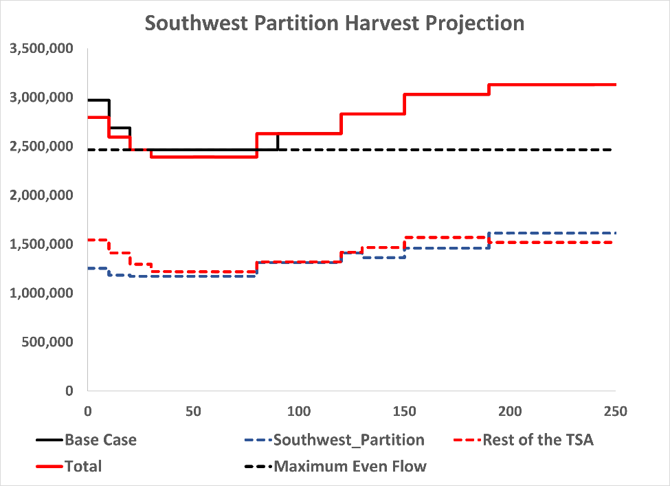
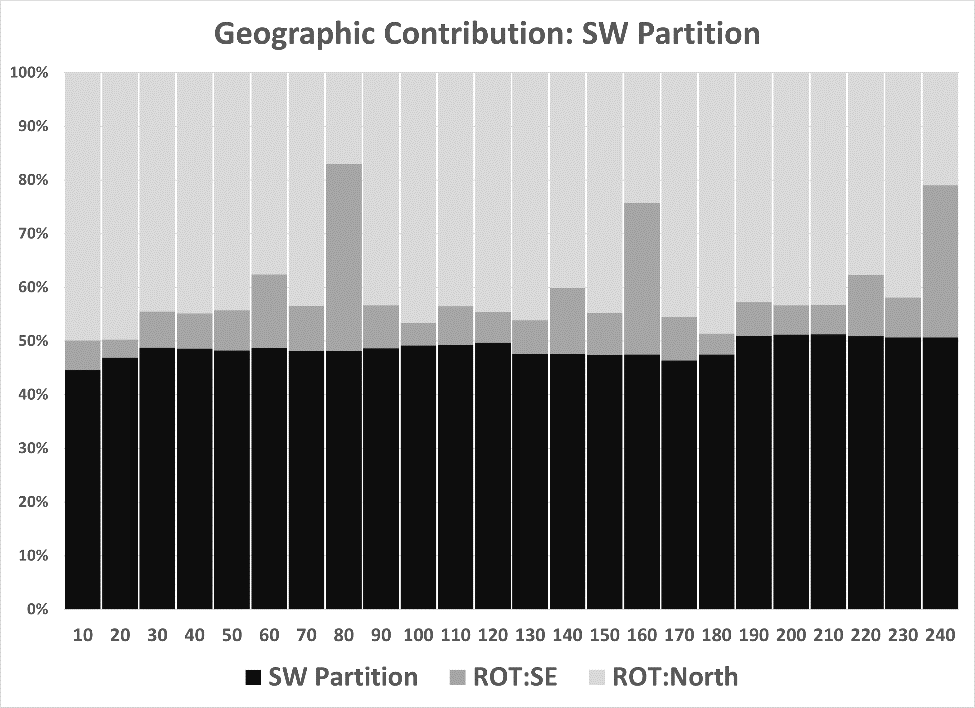
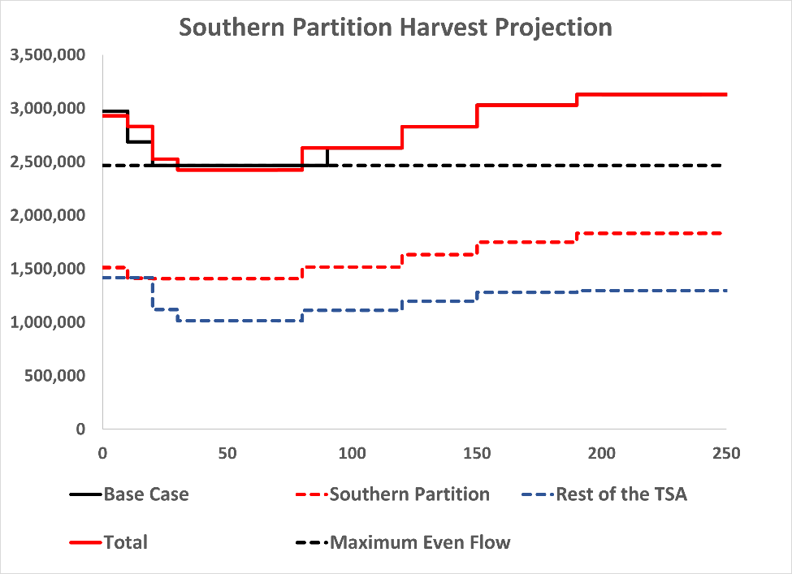
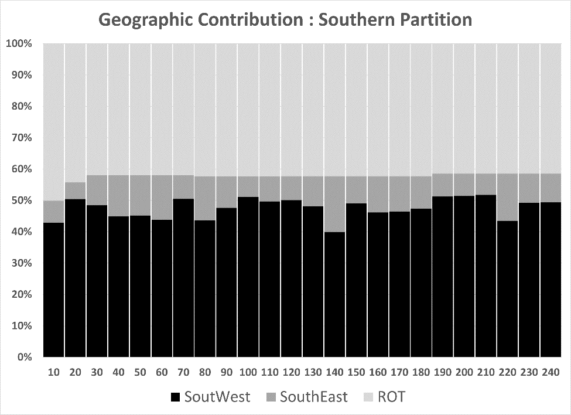
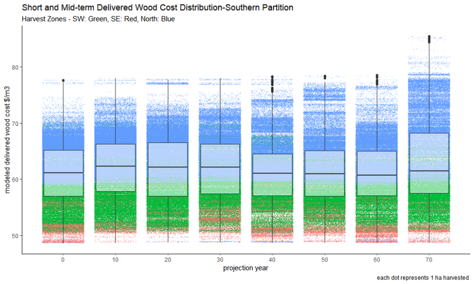
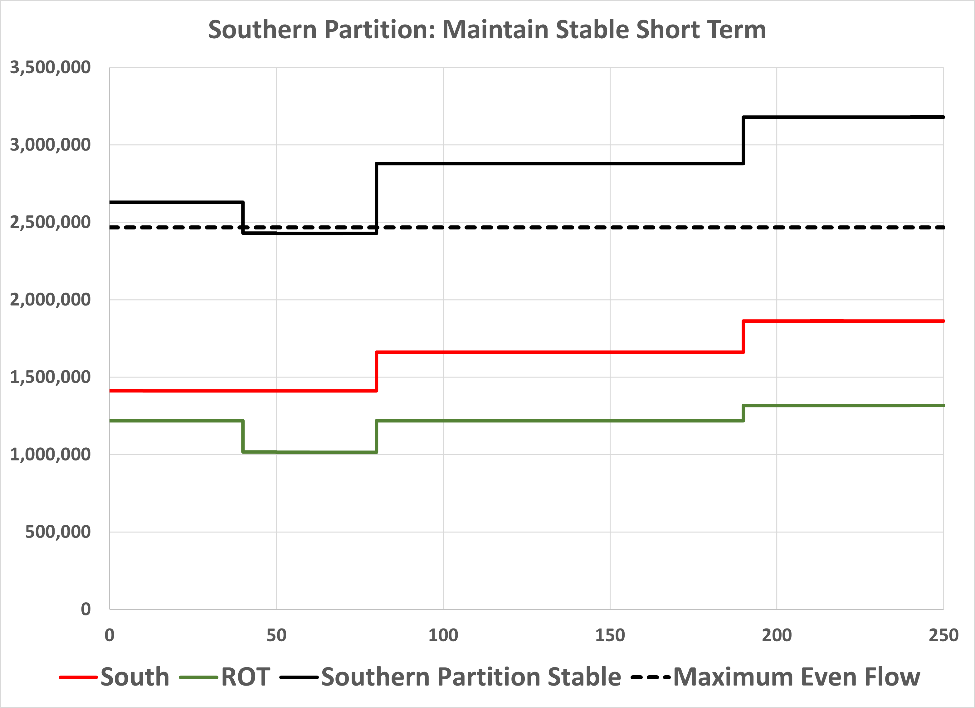

# Alternative Harvest Flows
## Salvage Options {#Salvage}

The CMI audit results indicate there remains a substantial amount of dead volume distributed throughout the TSA. The merchantability of this volume is defined by recovery costs (driven by geography), conversion potential (grade) and markets (lumber and pulp prices). These drivers are highly temporal in nature (what is merchantable and available in 2019 may not be in 2022). In order address the uncertainty associated with merchantability of current dead profile and to avoid overestimating its contribution it was excluded from the base case, then the effect of re-introducing it was tested through alternative harvest flows. 

Where estimates of dead volume exist from IBM losses these have been adjusted for grade decay using a negative exponential loss curve and the reference year of disturbance. Current dead volume not captured in the inventory (Sx and Ba mortality) where modeled using aerial overview sketch mapping and CMI plot data. Yield was bifurcated so that the profile contributions (live and dead) could be model separately (base case) and in aggregate (alternative flows). 

Three alternative flows explored the utilization of dead volume. The harvest of dead volume was not prioritized in the model and only occurred where dead volume exists as a component of selected live stands.

Salvage harvest alternative 1 assumed that the harvest of merchantable dead volume could occur anywhere in the TSA (southern portion and rest of TSA) for the 10 years following mortality. A starting harvest level of 3.05 M m3/yr is maintained for 10 years before stepping down to the mid-term harvest level in the 4th decade. Dead Harvest Alternative 1 is the only scenario that allows for an additional harvest level step which prolongs the transition to the mid-term harvest level. During the first decade an average of approximately 370 000 m3/yr of dead volume (12.6 %) is harvested.

Salvage harvest alternative 2 assumed that the harvest of merchantable dead volume could occur only in the southern portion of the TSA (the area bounded by the Peace Arm in the east and Omineca park in the west) for the 10 years following mortality. A starting harvest level of 3.1M m3/yr is maintained for 10 years before stepping down to the mid-term harvest level in the 3rd decade. Alternative 2 most closely approximates the average harvest level in the unit (3.28 M m3/yr) since the last determination. During the first decade an average of approximately 320 000 m3/yr of dead volume (10.1 %) is harvested.

Salvage harvest alternative 3 assumed that the harvest of merchantable dead volume could occur only in the southern portion of the TSA for the 5 years following mortality. A starting harvest level of 2.98M m3/yr (equivalent to the base case) is maintained for 10 years before stepping down to the mid-term harvest level in the 3rd decade. During the first 5 years an average of approximately 320 000 m3/yr of dead volume (10.1 %) is harvested.

(\#fig:figure14)Salvage Projection

## Geographic Options

Two alternative flows explored the application of geographic partitions on harvest flow

Partition Alternative 1 - Southwest Partition assumed the partition set with the current AAC remains in effect.  A starting harvest level of 2.8M m3/yr (6 % less than the base case) is maintained for 10 years before stepping down to the mid-term harvest level of 2.4M m3/yr (4 % less than the base case) in the 4th decade.  This transition required an additional step compared to the base case.

(\#fig:figure15)SouthWest Geographic Partition

For the Partition zone a starting harvest level of 1.27M m3/yr (45 % of the total) is maintained for 10 years before stepping down to the mid-term harvest level of 1.17 M 3/yr in the 3rd decade.  For the rest of the TSA a starting harvest level of 1.53 M m3/yr (55 % of the total) is maintained for 10 years before stepping down to the mid-term harvest level of 1.22 M m3/yr year in the 4th decade.

The harvest contribution from the rest of the TSA to the short- and mid-term timber harvest levels runs counter to the historic trend of less than 50 % of the harvest originating outside the current partition zone.

(\#fig:figure16)SouthWest Geographic Contribution

The second geographic partition alternative harvest projection (Partition Alternative 2 – Southern Partition) applies a partition that encompasses the entire “winter-roaded” portion of the TSA (here bounded by the Peace Arm in the east and Omineca park in the west.

A starting level is 2.93M m3/yr can be sustained for two decades (with a minor step down). The harvest then decreases to a mid-term harvest level of 2.42 M m3/yr (2%below the base case). For the southern partition zone, a starting harvest level of 1.51 M3/yr (52 % of the total) is maintained for 20 years (with a minor step down) before transitioning to a mid-term harvest level of 1.4 M m3/yr in the 3rd decade.

(\#fig:figure17)Southern Geographic Partition

The harvest projection from the rest of the TSA has a starting harvest level of 1.41 M m3/yr (48 % of the total) is maintained for 20 years before transitioning to the mid-term harvest level of 1.01 million cubic metres per year in the 3rd decade.

(\#fig:figure18)South Geographic Contribution

In this alternative harvest projection, the harvest contribution from the rest of the TSA is consistently at or below the contribution from the southern partition zone which more closely resembles historic harvest performance in the TSA.

The following chart depicts the change in the distribution of modelled delivered wood costs (DWC) over the first 70 years of the Southern Partition projection. 

(\#fig:figure19)DWC Distribution

Instituting a geographic partition for the winter-roaded portion of the TSA increases the median delivered wood cost by \$6.65 to \$61.44 in the first decade relative to the base case (\$54.79). The cost structuure remains relatively stable over the first 50 years of the projection as costs are balanced between the two geographic zones.

An alternative to the southern partition scenario explored lowering the initial short-term harvest level to create a more stable and enduring short-term harvest level with fewer steps down to the mid-term. This scenario includes the application of the southern partition to ensure that stable harvest flows exist in both the southern and northern portions of the TSA.

(\#fig:figure20)Southern Partition Stability Scenario

The starting harvest level is 2.63 million cubic metres per year (10 % less that the southern partition alternative) and can be sustained for 4 decades (2 decades longer than the southern partition alternative). The harvest then decreases to a mid-term harvest level of 2.41 million cubic metres per year (equivalent to the southern partition alternative) before climbing to the long-term harvest level of 3.18 million cubic metres per year (1 % higher than the southern partition alternative).

For the southern partition zone, a starting harvest level of 1.41 million cubic metres per year is maintained for 8 decades before transitioning to the long-term harvest level of 1.86 million cubic metres per year.

The harvest projection for the rest of the TSA has a starting harvest level of 1.22 million cubic metres per year for 4 decades after which time is steps down to the mid-term harvest level of 1.02 million cubic metres for 4 decades.

