# Inventory, Yield and Carbon
## Inventory

The Vegetation Resources Inventory (VRI) is the standard for forest cover inventory in the province of British Columbia. It follows a set of procedures with associated standards, administered by the ministry.

The VRI is a photo based, two phased program.  Phase 1 delineates polygons of homogenous land cover types through photo interpretation and provides estimates of the vegetation attributes for each polygon.  Phase 2 is ground sampling to verify the accuracy of volumes and some of the key Phase 1 vegetation attributes.

VRI attribute adjustments, as described in early VRI documentation are not being applied to VRI inventories as a standard. When designed, the objective was to adjust VRI photo estimated inventories using the results of ground sampling data analyses.  Procedures to adjust and maintain adjusted inventories are complex, and large sample sizes are needed to provide meaningful adjustments.Complex inventory adjustment procedures were developed, however, a database needed to accommodate the additional attributes/tools needed to house an adjusted inventory was not built.  Based on the complexities and costs associated with adjusting and maintaining VRI inventories, development of these tools and database were discontinued.  Ground sample data analyses (CMI/YSM) are currently being used to describe the accuracy of inventories.  

It should be noted that non-standard adjustments have been applied to inventories, where logical, to address known inventory concerns (i.e., using LiDAR to improve estimated heights, or reducing the live volumes in MPB impacted stands).  The FAIB are currently testing/implementing new data/tools to adjust specific inventory attributes

Phase I VRI program for the Mackenzie TSA was completed in 2012 and covers two thirds of the TSA with the northern third remaining. Most of the southern portion of the TSA (67%) is based on aerial photography acquired between 1999 and 2010, but some of the current forest inventory of the TSA is based on photography dating as far back as 1956.

<div class="figure" style="text-align: center">
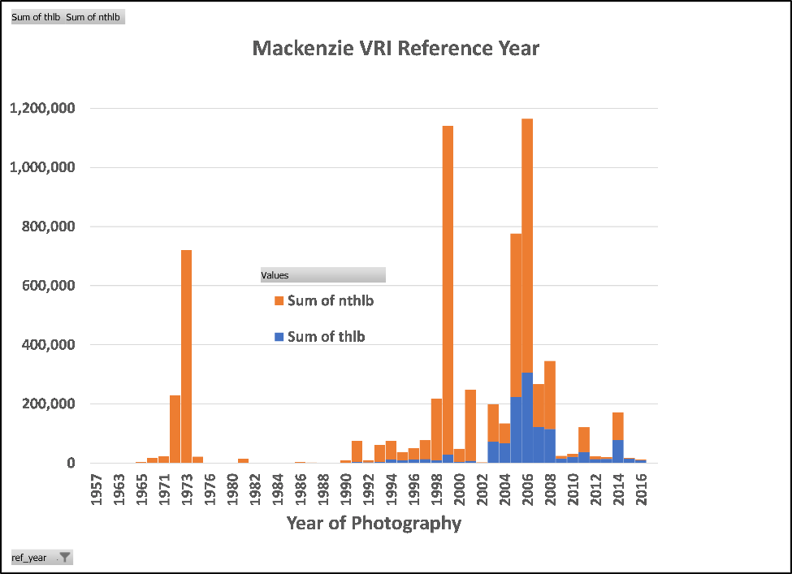
<p class="caption">(\#fig:figure21)Mackenzie VRI Reference Year</p>
</div>

The inventory data has been updated to 2020 for recent harvest depletions and major disturbances. To identify any harvested or disturbed areas not yet recorded in the inventory the consolidated cutblock layer was used. In addition to existing ministry databases the consolidated cutblock layer also includes satellite change detection data to identify any recent major disturbance areas not recorded in any of the other data sources.

The Mackenzie TSA has been severely impacted by mountain pine beetle (IBM). FAIB has developed a process to estimate the amount of dead pine volume that exists in land bases affected by IBM. In 2015 the forest inventory incorporated changes to account for IBM losses. For inventories captured before the IBM outbreak like the Mackenzie TSA, stand density and volume estimates were adjusted / pro-rated based on the BC Provincial Mountain Pine Beetle Model (BCMPB) output and a Year of Death data layer

A total of 1.309M ha had VRI/VDYP attributes adjusted affecting 49% of the THLB (518 334 ha). Yield curves developed for this TSR represent live (green) volume only based on the 2015 BCMPB adjustment.

## Depletion and Age Update

The following SQL script implements the VRI age update:


```sql


drop table if exists tsa16_openings2020;

\echo ---------------------------------------
\echo create opening table with integrated_au
\echo --------------------------------------

create table tsa16_openings2020 as (select a.ogc_fid, a.feature_id as vri_feature_id,a.open_id as vri_opening_id2020,
a.cc_opening_id,
a.cc_harvest_year,
a.cc_data_source,
a.n_log_dist,
a.n_log_date, 
a.project_id,
a.proj_date,
a.ref_year,
a.proj_age_1 as vri_age2020
from tsa16_ar2020 a where cc_harvest_year > 0);
vacuum tsa16_openings2020;
analyze verbose tsa16_openings2020;
drop table if exists tsa16_age2021;

\echo ---------------------------------------
\echo create age2020 spatial table with fids table (CFMLB)
\echo -----------------------------------------

create table tsa16_age2021 as (select a.ogc_fid as ogc,a.feature_id as fid,
a.cflb_fact,
a.wkb_geometry,
b.*,
c.ru_id,
c.fire_year,
c.fire_severity_grid,
proj_age_1 as vri_age2017,
d.*
from fids a left join tsa16_openings2020 b using (ogc_fid) 
left join tsa16_ar2018_inc c using (ogc_fid)
left join integrated_au d on a.feature_id = d.feature_id); 
vacuum tsa16_age2021;
analyze verbose tsa16_age2021;


\echo ---------------------------------------
\echo calculate fire_age: 10 year regen delay assigned radomly within severity polys adjusted to 2020
\echo --------------------------------------
alter table tsa16_age2021 add column fire_age numeric;
select setseed(0.5);
update tsa16_age2021 set fire_age = case 
when fire_severity_grid = 1 and random() <= 0.1 then 2011 - fire_year 
when fire_severity_grid= 2 and random() <= 0.3 then 2011 - fire_year
when fire_severity_grid= 3 and random() <= 0.5 then 2011- fire_year
when fire_severity_grid = 4 and random() <= 0.95 then 2011 - fire_year 
else vri_age2017 + 3 end;
															  
\echo ---------------------------------------
\echo start age netdown
\echo ---------------------------------------
	
alter table tsa16_age2021 add column age_adj numeric;
update tsa16_age2021 set age_adj = case 
when fire_severity_grid is not null and 2020 - fire_year > rslt_age_2018 then fire_age
when  rslt_age_2018 is not null then rslt_age_2018 +2
when  cc_harvest_year is not null then 2020 - cc_harvest_year
else fire_age end;
																  
\echo ---------------------------------------
\echo clean_up crown forest
\echo --------------------------------------	
alter table tsa16_age2021 add column age2020 numeric;
update tsa16_age2021 set age2020 = case when cflb_fact > 0 and age_adj is null then 0 else age_adj end;
```
## Natural Stand Yield Tables (NSYT)

Existing natural stands are those that have not been logged or are not subject to silviculture treatment (planting/density control). Natural stands have had their yields projected using the Variable Density Yield Prediction (VDYP7) model. VDYP7 is an empirical growth and yield prediction model for natural stands, based upon data from temporary inventory sample plots and permanent growth and yield sample plots.

In development of VDYP 7, both temporary sample plot (TSP) data that covered the majority of the province (52,000 plots), plus permanent sample plot (PSP) data (9,300 plots) were used. Additionally, inventory audit samples (2,700 plots) were used to validate the model. The strength of the model should also be about how it performs against independent data; in the case of the recent Mackenzie inventory assessment results, VDYP 7 projections were generally in agreement with ground measurements if anything trending to being conservative by about 7% (in overall volume comparisons). 

Below illustrates all growth natural PSPs in FAIB’s database in the BWBSdk, for both PL and SX mixed and pure species plots. This is the largest single BGC variant in Mackenzie.  The average PSPL site index in Mackenzie is PL=18m, SW=19.  This is plotted against a VDYP 7 run in the BWBS, PL:60% SX:40%, with leading site index = 20 (RED DASHED LINE). This comparison helps support the VDYP 7 projection as being robust and well within the range of the subjectively located PSP remeasured data.


<div class="figure" style="text-align: center">
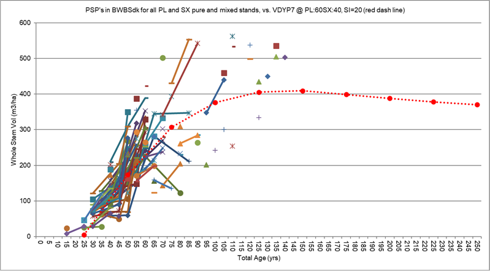
<p class="caption">(\#fig:figure22)PSP in BSWSdk</p>
</div>

The live volume projections for natural stands were created for each inventory polygon. Input information for the VDYP7 model is drawn from attributes of individual VRI polygons, each of which will constitute a discrete analysis unit for naturally established stands in the base case.


Dead volume estimates due to the mountain pine beetle infestation are discussed in the Forest Health Section -  Mountain Pine Beetle. The natural stand yield estimates were then adjusted in the timber supply model to account for losses due to natural disturbance not captured in the inventory. See Forest Health Section -  Spruce Bark Beetle and Forest Health Section -  Balsam Decline for future discussion.

Sensitivity analysis assessed the impacts of increasing and decreasing natural stand yield estimates by 5%, 15%, and 25% respectively.

<div class="figure" style="text-align: center">
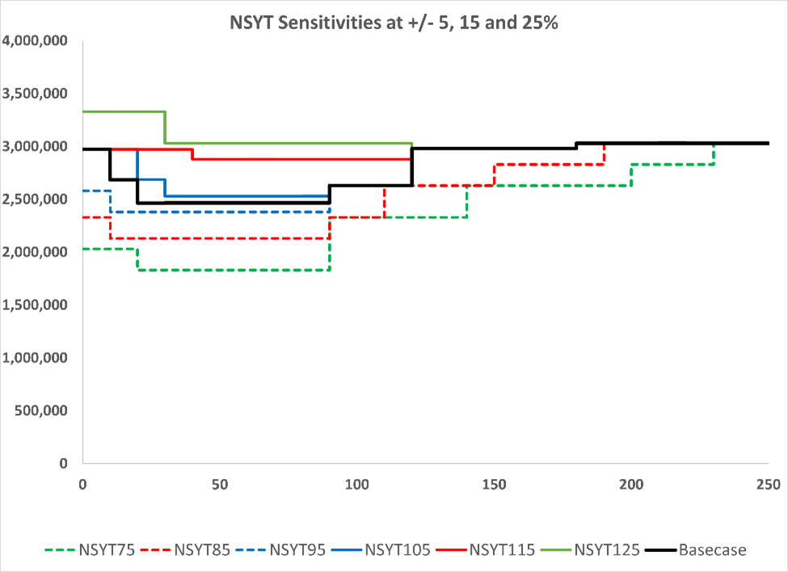
<p class="caption">(\#fig:figure23)NSYT Sensitivities</p>
</div>
### Change Monitoring Inventory (CMI)

In 2018/2019 FAIB initiated a Change Monitoring Inventory (CMI) sampling program for the Mackenzie TSA. The program established 134 plots in mature forest on a systematic grid spanning the southern two-thirds of the TSA. Data from the CMI plots were summarised and contrasted with data collected from 59 additional mature phase 1 audit plots established in 2011 to assess inventory metrics used to determine natural stand yield estimates (NSYT).  The combined sampling coverage makes Mackenzie TSA one of the most intensely sampled units in the province.

Some of the major findings of the survey include:

  -- Detailed statistical analysis suggests that the ratio of CMI ground sample yield estimates with the phase 1 volume per hectare estimates (based on TSR NSYT volume estimates) likely falls within a region of practical equivalence and that the phase 1 volume estimates should be considered a reasonable approximation of the ground condition.

  -- Sampling suggests there is a statistically significant difference between balsam volume estimated from the ground plots and those estimated in the phase 1. Sampling suggests Balsam is substantially underestimated in the phase 1 inventory.

  -- The CMI sampling also suggests that dead pine volume is overestimated in the phase 1, but there is significantly more merchantable dead balsam volume, which has not been captured in the inventory.

## Managed Stand Yield Tables (MSYT)

In the base case, managed stand yield estimates were produced using Table Interpolation Program for Stand Yields (TIPSY) console. TIPSY provides yield tables for single species and even aged stands based upon the interpolation of yield tables generated by the individual tree growth model Tree and Stand Simulator (TASS). Mixed species yield tables generated by TIPSY are weighted averages of single species yields and do not directly consider inter species interactions.
 
BatchTipsy Composer version 2019.10.28 was be used for this analysis. This version uses a database of TASS III generated yield tables for lodgepole pine and white spruce and TASS II generated yield tables for all other species.

Generating unique yield curves fully utilizes field data stored in both the VRI and RESULTS databases. Input information for TIPSY was based on stand initiation characteristics including species, initial density, regeneration method (planted or natural), genetic gains, and potential site index.  TIPSY also enables considerations for various silviculture treatments, forest health, and general operational adjustment factors.

The species composition for existing managed stands was taken from RESULTS and augmented with natural stand composition using total stems from VRI survey data. Species composition was adjusted by combining the two sets of data to allow for changes in species composition from the time of planting until the time of survey. The PSPL was used for assigning site index for managed stands at the opening id or feature id level. If PSPL site index didn’t exist, a BEC zone and subzone average was used.

In addition to a set of managed stand yield tables (MSYTs), a stand age was derived from RESULTS for those stands that are currently managed. The age was intended for use in timber supply modeling.Stands that did not have sufficient existing data were assigned to an aggregate yield curve. These curves had a species composition and density derived from an average of the BEC zone and subzone based on recent planting history in the TSA. The curves were linked to a feature_id (provincially unique identifier) using BEC zone and subzone. In addition, a feature_id species specific set of site indices were derived from the PSPL.

Over the timber supply modelling horizon stands may transition from one stand type to another, this is to ensure that an appropriate yield is projected for each stand under different conditions throughout the planning horizon. As discussed, natural stands require a VDYP yield curve for their current condition, and a TIPSY yield curve for their future managed condition. 

Existing managed stands (stands with a silviculture record) regenerated prior to 1987 require a TIPSY yield curves to reflect their current and future conditions. These stands are built in TIPSY assuming stems are regenerated naturally because stands regenerated prior to 1987 have limited planting records and were frequently regenerated without stocking standards. Existing managed stands regenerated after 1987 require a single yield curve, assuming stems are planted, to reflect their current and future conditions; this is based on the assumption that their future condition will be very similar to their current condition.


<div class="figure" style="text-align: center">
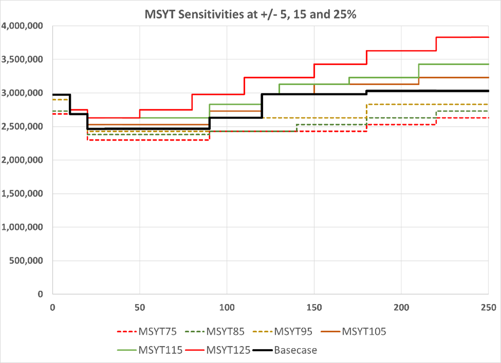
<p class="caption">(\#fig:figure24)MSYT Sensitivities</p>
</div>

### Young Stand Monitoring (YSM)

In 2018/2019 FAIB initiated a Young Stand Monitoring (YSM) sampling program establishing 51 plots across the Mackenzie TSA. The target population focused on 15 - 50-year-old stands in the analysis forest as defined by the VRI rank 1 layer.

Some key YSM objectives are to: describe the characteristics and structure of young stands, report on forest health, assess the accuracy of predicted attributes, and compare against growth models to help evaluate if young stands will meet future timber supply expectations.

The Mackenzie YSM samples established in 2018 are scheduled for five-year remeasurement in 2023 and will provide for growth comparisons between ground measurements and TIPSY projections.  In addition, neighbouring TSAs have had 5year remeasurements already completed, and to date have shown that TASS / TIPSY projected growth rates are consistent with (Williams Lake) or conservative (Prince George) when compared against actual ground measured growth rates.

Some of the major findings of the Mackenzie survey include:

   -- There is a statistically significant difference in yield between the MSYT at age 60 for the plots sampled and the projected plot yields based on the sample data. YSM sampling suggests that the MSYT are conservative in their yield estimates.

  -- There is a statistically significant site index bias between the PSPL and the ground sample with the PSPL underestimating Spruce site index by up to 19% on average.

  -- The deciduous proportion in the YSM samples (% of total volume sampled) was 20% suggesting substantial engress of deciduous in managed stands

  -- There was 75% agreement between the species composition from YSM ground samples as compared with the MSYT inputs (derived from RESULTS and the VRI)
  
YSM/MSYT Comparison

YSM samples are on a grid and therefore represent an unbiassed sample of the young stand population.  We spatially matched each YSM plot location with a TSR-based MSYT / NSYT to compare against and ask the question: “will the growth of young stands meet TSR expectations at rotation?”.  Without yet having remeasured YSM plot data up to rotation, we need an interim method to project the stem mapped YSM tree lists to rotation age.  All ground-based attributes are used to project YSM samples forward (i.e.., ground based site index, species composition, tree size, spatial distribution pattern, forest health incidence), because the goal is to compare measured ground data against a TSR based MSYT / NSYT. The differences in parametrization of yield projections are intentional for the purposes of comparing TSR assumptions / expectations, against YSM remeasured data (supplemented with TASS projections where remeasured YSM data are not yet available).


<div class="figure" style="text-align: center">
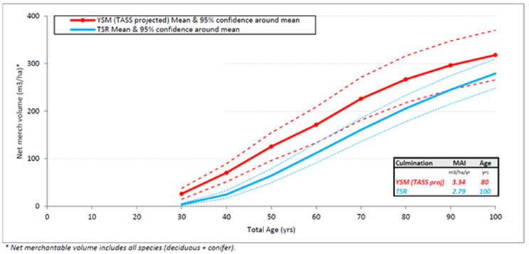
<p class="caption">(\#fig:figure25)MSYT/YSM(TASS) Comparison </p>
</div>
### Site Productivity

Site index is a measurement of site productivity based on the height of a site tree at breast height age 50 years. 

In the base case, volume estimates for natural stands used inventory site index estimates derived using Site Tools while volume estimates for managed stands utilized estimates from the Provincial Site Productivity Layer (PSPL) version 7.
The PSPL is a database of site index values for commercial species, which can be linked to the ecological, biophysical, and/or climatic conditions of growing sites across the province. The PSPL layer utilizes the same one-hectare grid framework as FAIB’s spatial data management process applied in this TSR. 

A site index value is provided for each species that could potentially be found growing in each hectare based on the ecological, biophysical, and/or climatic conditions of that hectare.

There are two sources of site index estimates in the PSPL: 

  -- The first source uses the Site Index Estimates by BEC Site Series (SIBEC) model which provides site index estimates based on ecosystem classifications from predictive ecosystem mapping (PEM) or a terrestrial ecosystem mapping (TEM). The SIBEC model provides site index estimate for multiple tree species that are expected to be found growing on each of the BEC site series across the province. 

  -- The other source is the biophysical model developed by FAIB which is a regression equation that predicts site index from BEC zone and biophysical variables, such as slope, aspect, elevation, and climate variables. The biophysical model is applied where the PEM or TEM data required for SIBEC are not available or are not reliable.  The SIBEC model currently does not cover all BEC site series and tree species combinations across the province and the biophysical model is applied to these exceptions.
  
**The following describes the process of site index assignmnet for MSYT production:**
  
Site Productivity data is joined with the VRI (for every feature that can grow trees) in the following order:

1. PEM/TEM + SIBEC  
2. BIOPHYSICAL Model  
3. Nearest Neighbour (99m)  
4. Site Index Conversion(s)  
5. Bec zone/subzone averages  
6. Site Index Conversion(s) on the averages  
7. VRI site index for leading species

Site Productivity (SP) Points

- a set of points are generated that cover the province in a regular grid
- a grid point is **only** generated where the point covers a **"forested"** area
- a site index is assigned to this point in a hierarchical manner  

1. PEM/TEM + SIBEC  
    - PEM/TEM map the spatial site series
    - SIBEC provides the site index for the site series
    - SIBEC currently does not cover all site series found in PEM/TEM
    - PEM/TEM does not cover the entire province
    - only the approved PEM/TEM are used for TSR
2. BIOPHYSICAL Model  
    - where SIBEC is not complete or a PEM/TEM is not available, a biophysical model is used to generate site index
    - the biophysical model is extrapolated to +/-5% beyond the range of the data used to develop the model
    - beyond this, NULL site index values are generated, leading to some SP points appearing in the data with NULL values
Merge SP points and VRI

- intersect the SP Points with VRI polygons
- attach a VRI feature id to each SP Point
- where a **"treed"** polygonal feature exists in VRI but not in the SPROD:
    - find any sprod points (with valid site index values) that are within 99m of the polygon
    - assign these site index values to the VRI feature id
    
Run site index conversions on all points to fill in gaps

- example: Sx site index provided, but either Sw or Se is missing
- in general we don't have Sx, we have either Sw or Se so need these site index values
- hence why we have to run the site index  conversions
- TASS requires a site index for each species
- Tipsy has been modified to accept all species site index as opposed to leading species site index
- we don't have a site index equation for Sx
- Note that Se is generally found in ESSF

Create average site index values

  - generate a set of average site index (by species) for each VRI feature
  - generate a set of average site index (by species) for each BEC zone and sub zone
  - this averaging may give a slight upward bias since area from a Bec zone/subzone may be missing
  - the assumption is that the excluded areas probably have a lower site index

Run site index conversions on the bec averages
- again need to fill in the gaps

**Species lookup for Site index**

Volume table derivation requires that each tree species be assigned an appropraite site index value.  A set of Planted species and/or a set of Ingress species are derived from Results data.  The site index for each of these species is derived using a lookup to the site indices by species generated as detailed above.  

In some cases, a species found in Results may not have an equivalent species site index in site productivity.  There are a number of substitutions that can be applied to attempt to replace the missing site indices with reasonable values.  These are, in order:
  
1. Use the bec zone/subzone averages for species 
    - example: if Bg is missing a site index value, look up the average Bg site index for the bec zone/subzone
    
2. Where species specific site index values are still missing, get the leading species site index values for all openings within a VRI feature_id.  Use these to fill in the missing site index values.  This may require an additional site index conversion run.  Note that when the VRI site index is used, if there is an opening link to Results, the site index in VRI is actually the Results site index.

**Site Index from ground samples:**

The question often arises: why not use site index from Results instead of the Site Producitivity site index?  

In general it is good practice to obtain site index values from ground sampling.  In Silviculture surveys, this is accomplished using the growth intercept method.  However, in practice only 6% of openings in the Province use this method to capture a site index.  So we can only consider replacing a Site Productivity site index in 6% of the areas surveyed in the province.

There is a potential that some of the ground measured trees were planted trees with genetic gain.  If a tree with a positive genetic gain was used to determine the SI in the field, the genetic gain would also be applied in the yield curves - essentially double counting the gain that would result in higher modeled yields than expected.

Given the above factors, VRI is used to fill the final missing site index values.

The YSM sample program provides a mechanism to quatify the differences between site index on the ground and site index from the Site Productivity tile.  This is verified on a managment unit basis.  Only if there is a significant difference beween the two is there a reason to look at using the results site index.

Sensitivity analysis explored the effect of increasing the average site index for Spruce for managed stand yields by 18%. Spruce makes approximately 50% of the species composition in existing managed stands and approximately 45% in future (modelled based) managed stands. In pure Spruce (Sw or Se) stands this yields an average 33.5% increase in volume between ages 70 - 90 years. The following chart depicts the harvest flow when Sw site index is increased by 18% (red line). The MSYT sensitivities (increase MSYT yield by 15 and 25%) have been included for contrast.


<div class="figure" style="text-align: center">
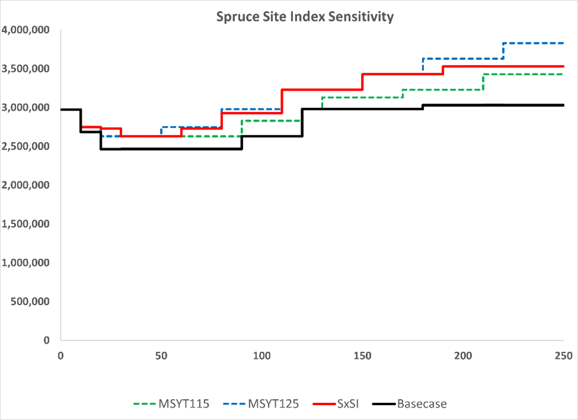
<p class="caption">(\#fig:figure26)Site Index Sensitivity </p>
</div>

### Genetic Worth

Licensees are obliged by regulation to use the best available seed source when regenerating sites with planted stock. Planted stock may have faster growth than natural trees that regenerate on the site.  The faster growth may be due to either use of high quality genetically improved seed from seed orchards or use of seed harvested from superior wild trees.

Tree improvement programs cycle between generations of testing, selection and breeding

  - Parents are evaluated based on the performance of their offspring in progeny tests which are well replicated and use peer reviewed experimental design
  - Data is collected after 10 to 15 years of field testing
  - The best parents and the best offspring from the best families are selected for seed orchards
  - Each tree is given a “breeding value” that represents its genetic contribution to a trait like growth
  - Breeding values are calculated from measurements in field trials and the family connections throughout the program increase the precision of estimates
  - Each generation new data is collected that improves the accuracy of all values
  - Genetic worth estimates for a seed orchard seedlot are based on breeding values calculated from multiple years of field data and all the family connections tested in many different environments

As such genetic worth is an indication of the quality of genetically improved seed, as represented by a percentage volume increase expected near rotation age. Information on the use of select seed and the associated genetic gains are available from the Seed Planning and Registry Application (SPAR) of the Forest Improvement and Research Management Branch. RESULTS information provides a seed source for individual plantations and thus enables linkage to the genetic gain database. 

The seed use and its genetic worth recorded in RESULTS for each existing managed stand was considered in the production of the yield curves used in the base case.

In the Mackenzie TSA Pl comprises 56% of the species composition planted since 2010 of which 36% were sown from select seed. Sx comprises 43% of the species planted of which 87% were sown from select seed.The weighted average of select seed used (from which genetic worth is estimated) since 2010 equals 58% of all seedlings sown of which over 69% has a genetic worth > 0. Of that select seed sown over the past decade the total weighted average of genetic worth was 19%. The weighted average genetic worth for Pl select seed is 9% while the weighted average genetic worth for Sx select seed is 24%.

The values reported in SPAR are greater than the genetic gain values reported in RESULTS that were used to produce MSYT.
For future MSYT used in the base case the average genetic worth assignment for Pl is 1.5% while the average genetic worth assignment for Sw and Se is 19% and 14%, respectively.

## Carbon

Forest carbon is of emerging importance in forest management in British Columbia. The implementation of projects under the Forest Carbon Initiative (FCI) should be considered as management practice impacts on forest carbon. The carbon stocks in a given forest ecosystem are described by different carbon pools. The five terrestrial ecosystem carbon pools defined by the Intergovernmental Panel on Climate Change (IPCC) include aboveground biomass carbon (ABC), belowground biomass carbon (BBC), dead organic matter (DOM), forest floor litter (FFL), and soil organic carbon (SOC).  The sum of all fives pools is referred to as total ecosystem carbon (TEC).

From the climate change perspective, regardless of what management strategies are implemented on the ground, the ultimate goal is to reduce greenhouse gas (GHG) emissions to the atmosphere.  The net ecosystem carbon balance (NECB) is used to describe the net change between the given ecosystem and the atmosphere.  If the atmosphere is used as the basis for measuring gains or losses, a positive NECB means the atmospheric carbon pool is increasing, thus, the given ecosystem is losing carbon, namely, a carbon source ecosystem, while a negative NECB means the ecosystem is a carbon sink.

In order to make different GHGs (e.g., carbon dioxide, methane) comparable in carbon accounting, carbon dioxide equivalent (CO2e) is adopted, and a global warming potential (GWP) over 100 years is used to convert each greenhouse gas into CO2e. The conversions in this analysis are: 1 CO = 1 CO2e; 1 CH4 = 25 CO2e; 1 N2O = 298 CO2e. The harvested wood product (HWP) 100 years retention factors were used according to “Protocol for the Creation of Forest Carbon Offsets in British Columbia Version 1.0”. In this analysis, a set of simple factors 0.234 and 0.405 were adopted for carbon in-use and carbon in-landfill after 100 years, respectively.

In the base case, the harvest flow was 2.97 and 2.69 million cubic metres for the first 10 years (2020-2029), and the next 10 years (2030-2039), respectively. The harvest flow was 2.47 million cubic metres for the next 70 years, and in the year 100, the harvest level was 2.63 million cubic metres. The other major disturbances causing direct GHG emissions were also modelled, such as wildfires (~6164 ha per year in non-THLB and ~820 ha per year in THLB) and future road building (~208 ha per year).

The graph below describes the total ecosystem carbon (TEC) in TSA, THLB and nonTHLB.

<div class="figure" style="text-align: center">
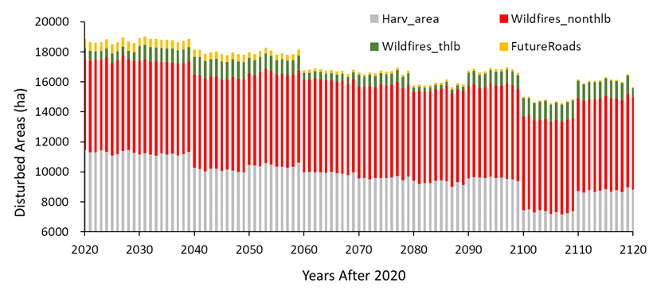
<p class="caption">(\#fig:figure66)Area by Disturbance Category</p>
</div>

The graph below describes the forest carbon for the Mackenzie TSA base case (ABC: Aboveground Biomass Carbon, BBC: Belowground Biomass Carbon, FFL: Forest Floor Litter, DOM: Dead Organic Matter, SOC: Soil Organic Carbon).


<div class="figure" style="text-align: center">
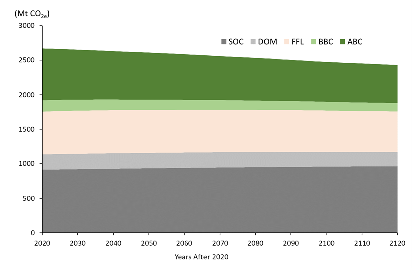
<p class="caption">(\#fig:figure67)Forest Carbon</p>
</div>

In 2020, the aboveground biomass carbon (ABC), belowground biomass carbon (BBC), forest floor litter (FFL), dead organic matter (DOM), and soil organic carbon (SOC) pool are around 746, 166, 663, 223, and 910 Mt  CO2e, respectively. All the pools are relatively stable, except the ABC, which decrease ~26.8% over the first 100 years due to harvesting and fires.

The total ecosystem carbon (TEC, see figure below) increased about 1.2% in non-THLB, while it decreased about 22.6% in THLB. The cause of the decrease in THLB is largely due to harvesting and all the harvested wood products being treated as one-time emissions.

The graph below describes the total ecosystem carbon (TEC) in TSA, THLB and non-THLB

<div class="figure" style="text-align: center">
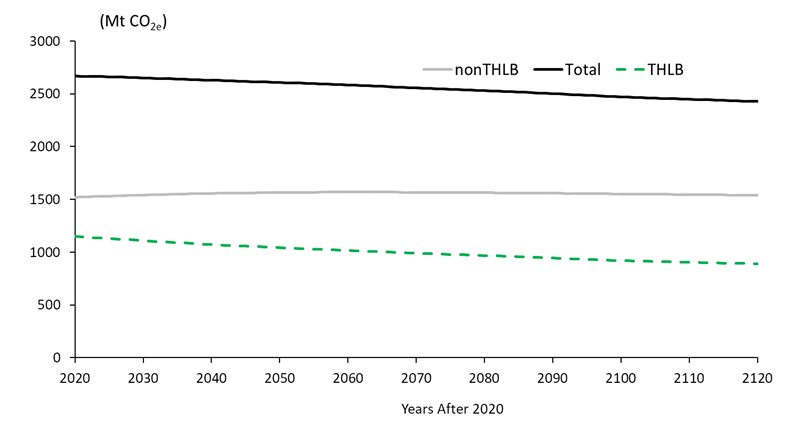
<p class="caption">(\#fig:figure68)Total Ecosystem Carbon</p>
</div>
The carbon density varied according to land use types, ranged from 200 tonnes per hectare (wildlife habitat areas) to 261 tonnes per hectare (provincial parks and miscellaneous reserves), with a mean of 243 tonnes per hectare for the whole TSA. The table below describes the land use types areas, total ecosystem carbon (TEC), and carbon density. 

<table class="table table-striped" style="font-size: 10px; margin-left: auto; margin-right: auto;">
<caption style="font-size: initial !important;">(\#tab:table24)Land Use Types</caption>
 <thead>
  <tr>
   <th style="text-align:left;"> Land use Type </th>
   <th style="text-align:left;"> Area (ha) </th>
   <th style="text-align:right;"> TEC (Mt C) </th>
   <th style="text-align:right;"> Carbon Density (T/ha) </th>
  </tr>
 </thead>
<tbody>
  <tr>
   <td style="text-align:left;"> Inaccessible Forest </td>
   <td style="text-align:left;"> 8,557 </td>
   <td style="text-align:right;"> 2.1 </td>
   <td style="text-align:right;"> 245 </td>
  </tr>
  <tr>
   <td style="text-align:left;"> Inoperable Forest </td>
   <td style="text-align:left;"> 774,647 </td>
   <td style="text-align:right;"> 178.7 </td>
   <td style="text-align:right;"> 231 </td>
  </tr>
  <tr>
   <td style="text-align:left;"> Non-Merchantable Forest </td>
   <td style="text-align:left;"> 129,897 </td>
   <td style="text-align:right;"> 29.2 </td>
   <td style="text-align:right;"> 225 </td>
  </tr>
  <tr>
   <td style="text-align:left;"> Old growth management areas </td>
   <td style="text-align:left;"> 46,294 </td>
   <td style="text-align:right;"> 11.1 </td>
   <td style="text-align:right;"> 239 </td>
  </tr>
  <tr>
   <td style="text-align:left;"> Provincial parks and miscellaneous reserves </td>
   <td style="text-align:left;"> 364,047 </td>
   <td style="text-align:right;"> 94.9 </td>
   <td style="text-align:right;"> 261 </td>
  </tr>
  <tr>
   <td style="text-align:left;"> Ungulate winter ranges </td>
   <td style="text-align:left;"> 291,898 </td>
   <td style="text-align:right;"> 61.8 </td>
   <td style="text-align:right;"> 212 </td>
  </tr>
  <tr>
   <td style="text-align:left;"> Wildlife habitat areas </td>
   <td style="text-align:left;"> 34,423 </td>
   <td style="text-align:right;"> 6.9 </td>
   <td style="text-align:right;"> 200 </td>
  </tr>
  <tr>
   <td style="text-align:left;"> Retention </td>
   <td style="text-align:left;"> 117,100 </td>
   <td style="text-align:right;"> 29.7 </td>
   <td style="text-align:right;"> 253 </td>
  </tr>
  <tr>
   <td style="text-align:left;"> Timber Harvesting Landbase </td>
   <td style="text-align:left;"> 1,228,877 </td>
   <td style="text-align:right;"> 313.2 </td>
   <td style="text-align:right;"> 255 </td>
  </tr>
  <tr>
   <td style="text-align:left;"> Total </td>
   <td style="text-align:left;"> 2,995,740 </td>
   <td style="text-align:right;"> 727.5 </td>
   <td style="text-align:right;"> 243 </td>
  </tr>
</tbody>
</table>

The graph below describes greenhouse gas emissions by disturbance types (wildfire, harvests, slash burning, and road building) and net ecosystem carbon balances (NECB).

<div class="figure" style="text-align: center">
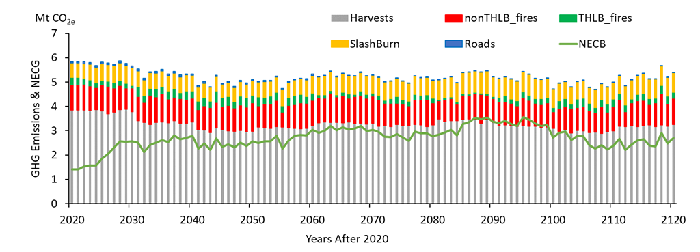
<p class="caption">(\#fig:figure69)Green house Gas Emissions</p>
</div>
The TSA is a carbon source (NECB > 0, see figure below), with an annual carbon loss of ~2.7 (range varies from 1.4 to 3.6) Mt CO2e over the 100 years analysis forecasts. The major carbon sources are timber harvesting, which releases ~3.3 Mt CO2e annually, ranging from 2.9 to 3.9 Mt CO2e depending on harvests (all the harvested logs are treated as one-time emission). The wildfires are the second largest carbon source, releasing ~1.2 Mt CO2e annually (ranging from 0.8 to 1.6 Mt CO2e). Slash-burnings release ~0.7 Mt CO2e in annual emissions (ranging from 0.6 to 0.9 Mt CO2e). Future road building is ~ 0.03 Mt CO2e, per year.

<div class="figure" style="text-align: center">
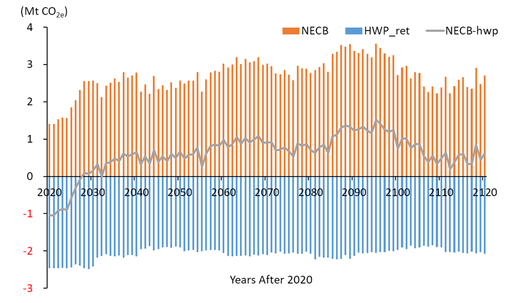
<p class="caption">(\#fig:figure70)Carbon Status</p>
</div>
