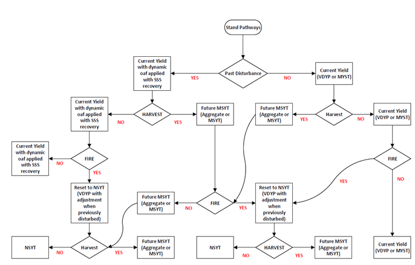
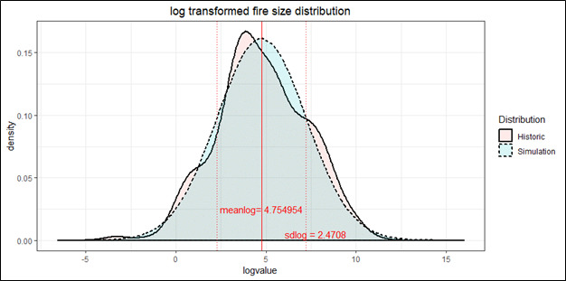
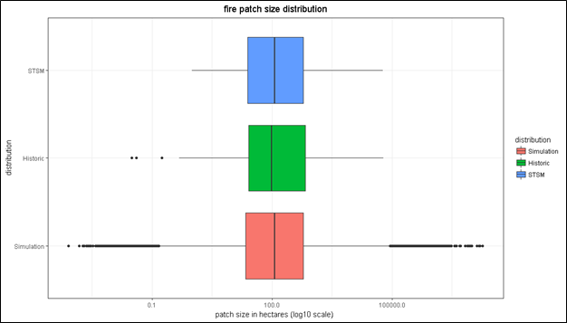
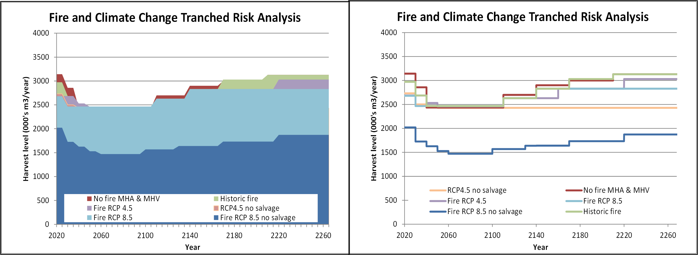
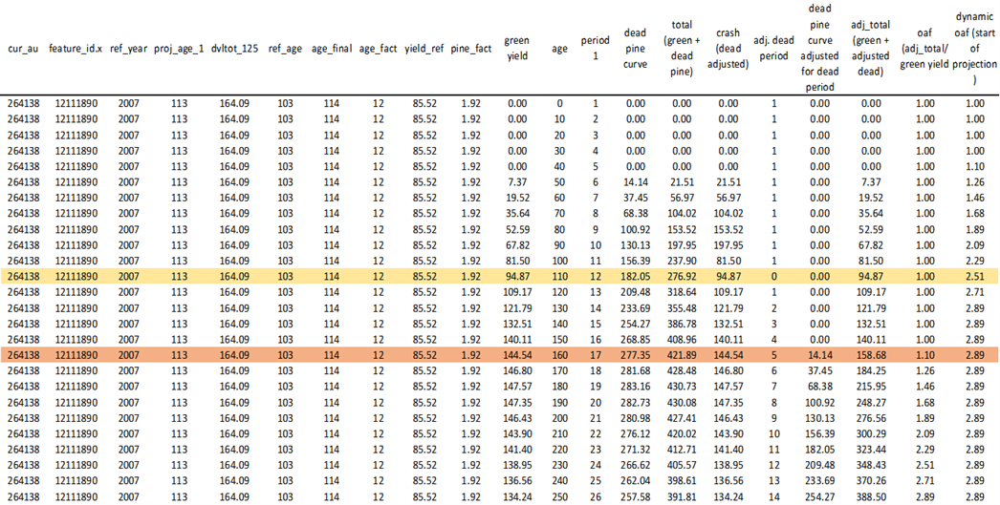
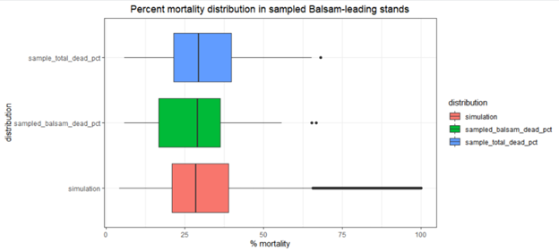
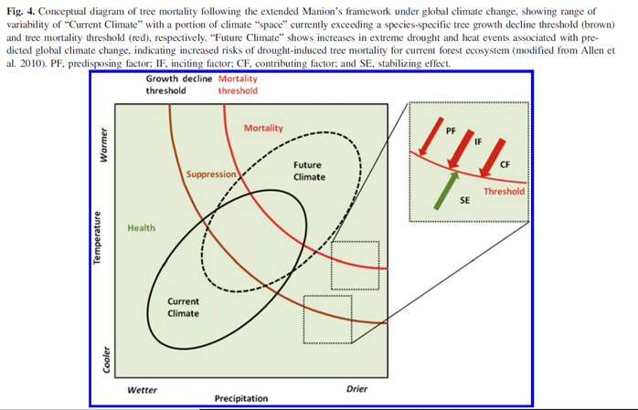
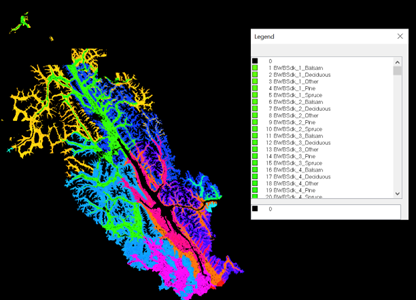
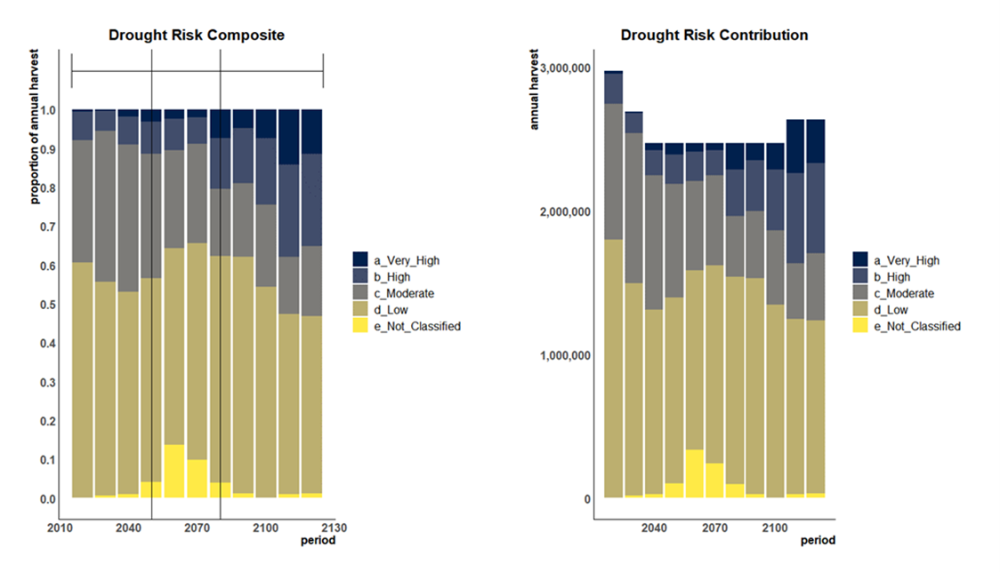
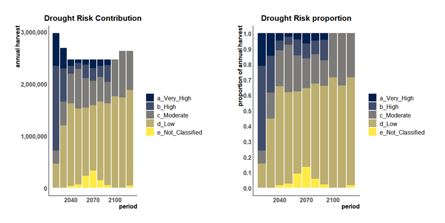

# Forest Health/Natural Disturbance

Forest Health and the potential impacts of [climate change on natural disturbance](https://www2.gov.bc.ca/assets/gov/environment/natural-resource-stewardship/nrs-climate-change/applied-science/2c_va_disturbance-aug30-final.pdf) is a major theme for this review. Yield adjustments where made to account for mortality not captured in the inventory and stand recovery was also simulated in the timber supply model. The following schematic depicts the various potential pathways for stand treatment in the timber supply model.


<div class="figure" style="text-align: center">

<p class="caption">(\#fig:figure70)Stand Pathways</p>
</div>

The following table summarize the treatment of major disturbance agents in the timber supply analysis. A detailed description of each treatment follows.


<table class="table table-striped" style="font-size: 9px; ">
<caption style="font-size: initial !important;">(\#tab:table30)Natural Disturbance Summary</caption>
 <thead>
  <tr>
   <th style="text-align:left;"> Disturbance Type </th>
   <th style="text-align:left;"> Mortality Source Data </th>
   <th style="text-align:left;"> Mortality Application </th>
   <th style="text-align:left;"> Area of yield adjustment </th>
   <th style="text-align:left;"> Yield previously adjusted in Inventory/Curves </th>
   <th style="text-align:left;"> Dead volume identified in inventory </th>
   <th style="text-align:left;"> Shelf-life applied to residual dead volume in TSM </th>
   <th style="text-align:left;"> OAF applied to current yield </th>
   <th style="text-align:left;"> Ages Reset </th>
   <th style="text-align:left;"> SSS add-on applied </th>
   <th style="text-align:left;"> Sensitivity: Cimate Change </th>
   <th style="text-align:left;"> Sensitivity: Yield </th>
  </tr>
 </thead>
<tbody>
  <tr>
   <td style="text-align:left;"> Past Fire (2008 - Present) </td>
   <td style="text-align:left;"> VRI FIRE UPDATE </td>
   <td style="text-align:left;"> Green yield based on Yield Aggregation </td>
   <td style="text-align:left;"> 142,454 </td>
   <td style="text-align:left;"> YES </td>
   <td style="text-align:left;"> NO </td>
   <td style="text-align:left;"> NO </td>
   <td style="text-align:left;"> NO </td>
   <td style="text-align:left;"> YES based on fire severity </td>
   <td style="text-align:left;"> YES </td>
   <td style="text-align:left;"> NA </td>
   <td style="text-align:left;"> No yield adjustments/No SSS/No age adjustment </td>
  </tr>
  <tr>
   <td style="text-align:left;"> Sx Beetle </td>
   <td style="text-align:left;"> AOS </td>
   <td style="text-align:left;"> OAF based on cummulative severity class </td>
   <td style="text-align:left;"> 263,034 </td>
   <td style="text-align:left;"> NO </td>
   <td style="text-align:left;"> NO </td>
   <td style="text-align:left;"> Yes: 1 time step </td>
   <td style="text-align:left;"> YES </td>
   <td style="text-align:left;"> NO </td>
   <td style="text-align:left;"> YES </td>
   <td style="text-align:left;"> Maintain 3 decade long outbreak t0 </td>
   <td style="text-align:left;"> No yield adjustments/No SSS </td>
  </tr>
  <tr>
   <td style="text-align:left;"> Balsam Bark Beetle and Balsam Decline </td>
   <td style="text-align:left;"> CMI </td>
   <td style="text-align:left;"> Modelled mortality distribution applied to Balsam leading feature_ids </td>
   <td style="text-align:left;"> 1,172,831 </td>
   <td style="text-align:left;"> NO </td>
   <td style="text-align:left;"> NO </td>
   <td style="text-align:left;"> Yes: 1 time step </td>
   <td style="text-align:left;"> YES </td>
   <td style="text-align:left;"> NO </td>
   <td style="text-align:left;"> YES </td>
   <td style="text-align:left;"> project 1% annual decline starting at age 100 </td>
   <td style="text-align:left;"> No yield adjustments/No SSS </td>
  </tr>
  <tr>
   <td style="text-align:left;"> MPB </td>
   <td style="text-align:left;"> BCMPB/ VRI 2015 MPB UPDATE </td>
   <td style="text-align:left;"> Green yield based on VRI attribute adjustment </td>
   <td style="text-align:left;"> 1,142,875 </td>
   <td style="text-align:left;"> YES </td>
   <td style="text-align:left;"> YES </td>
   <td style="text-align:left;"> Yes: 1 time step </td>
   <td style="text-align:left;"> NO </td>
   <td style="text-align:left;"> NO </td>
   <td style="text-align:left;"> YES </td>
   <td style="text-align:left;"> Re-initiate decade long outbreak t80 </td>
   <td style="text-align:left;"> No yield adjustments/No SSS </td>
  </tr>
  <tr>
   <td style="text-align:left;"> Future Fire </td>
   <td style="text-align:left;"> Modelled Projection </td>
   <td style="text-align:left;"> Modelled fire regime projected in TSM </td>
   <td style="text-align:left;"> NA </td>
   <td style="text-align:left;"> NA </td>
   <td style="text-align:left;"> NA </td>
   <td style="text-align:left;"> Yes: 1 time step </td>
   <td style="text-align:left;"> NA </td>
   <td style="text-align:left;"> YES in TSM </td>
   <td style="text-align:left;"> NA </td>
   <td style="text-align:left;"> Change frequency over 100 years by RCP </td>
   <td style="text-align:left;"> No Shelflife/No Salvage </td>
  </tr>
</tbody>
</table>


## Fire {#Fire}
### Fire Current 

**Pre-Existing Inventory Fires (2008-2020)**

Merchantable fire damaged volumes were calculated using aggregate yields from total (pre-disturbed) natural and managed stand curves. These curves were substituted for the inventory attribute generated curves (IAGC) to address issues related to height specific constraints.

Yield related attribution has be adjusted in the inventory to account for losses related to [fire severity](https://www2.gov.bc.ca/assets/gov/farming-natural-resources-and-industry/forestry/stewardship/forest-analysis-inventory/data-management/mpb_changes_to_veg_2015.pdf).

Age and site index are not adjusted. Consequently, height curves generated using inventory attribution reflect the pre-disturbance stand condition. This becomes problematic when applying height-based constraints in a TSM as the height curves no longer reflect the condition on the ground.

To address this issue ages of fire damaged feature id were reset based on their fire severity classification and were randomly distributed within each fire severity polygon (set fire_age = case when fire_severity_grid = 1 and random() <= 0.1 then 2011 - fire_year…). A 10-year regeneration delay were assigned randomly within severity polys adjusted to 2020. No dead volume was attributed to pre-existing fire damaged stands.

Simulated Fires

Simulating a fire natural disturbance regime in STSM is a four-step process:

1.	Examine the fire regime in the study area
2.	Establish theoretical and historic distributions
3.	Parametrize timber supply model
4.	Run model and assess goodness of fit

Examine historic fire distribution for TSA16

Two data sources were used to parameterize the fire regime in the Mackenzie (TSA16) timber supply model: the historic fire perimeters spatial file and the 2017 BC Wildfire Provincial Strategic Threat Analysis (PSTA) dataset.

The fire perimeter spatial file contains perimeter areas of historical fire incidents as of Spring 2019. The data contains the spatial representation of the area the incident occurred within, specific and generalized cause information, and the total hectares, as well as the method used to create the [spatial representation of the data](https://catalogue.data.gov.bc.ca/dataset/fire-perimeters-historical : WHSE_LAND_AND_NATURAL_RESOURCE_ PROT_HISTORICAL_FIRE_POLYS_SP).

The PSTA dataset is built upon three key fire behaviour characteristics: fire density, head fire intensity and spotting impact. These inputs were combined to produce an overall wildfire threat analysis layer that integrates many different aspects of [fire hazard and risk](https://www2.gov.bc.ca/gov/content/safety/wildfire-status/prevention/vegetation-and-fuel-management/fire-fuel-management/psta).

The following table summarizes the fire distribution based on historic fire perimeter spatial analysis:

<table class="table table-striped" style="font-size: 12px; ">
<caption style="font-size: initial !important;">(\#tab:table3)Historic Fire Parameters</caption>
 <thead>
  <tr>
   <th style="text-align:left;"> Fire Metrics </th>
   <th style="text-align:left;"> Historic </th>
  </tr>
 </thead>
<tbody>
  <tr>
   <td style="text-align:left;"> Total Forested Area </td>
   <td style="text-align:left;"> 4,222,298 </td>
  </tr>
  <tr>
   <td style="text-align:left;"> Total # of fires mapped </td>
   <td style="text-align:left;"> 416 </td>
  </tr>
  <tr>
   <td style="text-align:left;"> Total period of mapping </td>
   <td style="text-align:left;"> 93 </td>
  </tr>
  <tr>
   <td style="text-align:left;"> mean fires/year total period </td>
   <td style="text-align:left;"> 4.47 </td>
  </tr>
  <tr>
   <td style="text-align:left;"> standard deviation fires/year total period </td>
   <td style="text-align:left;"> 42.67 </td>
  </tr>
  <tr>
   <td style="text-align:left;"> total area burned </td>
   <td style="text-align:left;"> 573,363 </td>
  </tr>
  <tr>
   <td style="text-align:left;"> mean area burned /year total period </td>
   <td style="text-align:left;"> 6,165.19 </td>
  </tr>
  <tr>
   <td style="text-align:left;"> standard deviation area burned/year total period </td>
   <td style="text-align:left;"> 13,917.61 </td>
  </tr>
  <tr>
   <td style="text-align:left;"> mean patch size </td>
   <td style="text-align:left;"> 1,378.28 </td>
  </tr>
  <tr>
   <td style="text-align:left;"> standard deviarion patch size </td>
   <td style="text-align:left;"> 4,520.80 </td>
  </tr>
  <tr>
   <td style="text-align:left;"> median patch size </td>
   <td style="text-align:left;"> 97.74 </td>
  </tr>
  <tr>
   <td style="text-align:left;"> interquartile range patch size </td>
   <td style="text-align:left;"> 657.4 </td>
  </tr>
  <tr>
   <td style="text-align:left;"> minimum patch size </td>
   <td style="text-align:left;"> 0.03 </td>
  </tr>
  <tr>
   <td style="text-align:left;"> maximum patch size </td>
   <td style="text-align:left;"> 61,285.03 </td>
  </tr>
  <tr>
   <td style="text-align:left;"> geometric mean patch size </td>
   <td style="text-align:left;"> 116.16 </td>
  </tr>
  <tr>
   <td style="text-align:left;"> geometric sd patch size </td>
   <td style="text-align:left;"> 11.87 </td>
  </tr>
</tbody>
</table>

From the spatial analysis the rotation period and the annual rate of disturbance were calculated. The rotation period refers to the time (in years) it takes to disturb and area equal to the total forested area of the TSA.  Not all stands will necessarily be impacted in that period, as some stands may be disturbed multiple times. The inverse of rotation (1/rotation period) is the expected annual rate of disturbance (Fall 2018). The following table summarizes the derived fire regime for the Mackenzie TSA.

**Establishing a theoretical (simulated) distribution**

Examination of the fire perimeter spatial data using a Shapiro-Wilk test (for testing normality on the transformed observations: H0 = The data is consistent with a specified reference distribution - alpha = 0.05) indicated the regime followed a log-normal patch distribution (p = 0.06028). The [fitdistrplus package](https://cran.r-project.org/web/packages/fitdistrplus/vignettes/paper2JSS.pdf) in R was utilized to fit a univariate distribution curve to the historic fire perimeter data . 

The estimated parameters for the fitted distribution were meanLog = 4.754954 and sdLog = 2.4708 respectively.
The following is a probability density plot of the log transformed historic distribution overlapping a log transformed simulated distribution using the fitted parameters (Simulation <- log(rlnorm(n = 1000000, 4.754954, 2.470800)).

<div class="figure" style="text-align: center">

<p class="caption">(\#fig:figure27)Simulated Fire Distribution </p>
</div>

The following table summarizes the parameters used to implement a simulated fire regime in the Mackenzie timber supply model (for further detail see: SELES Spatial Timber Supply Model (STSM): Parameterizing landscape-scape natural disturbance 2018, Fall. A)

<table class="table table-striped" style="font-size: 12px; ">
<caption style="font-size: initial !important;">(\#tab:table4)STSM Fire Parameters</caption>
 <thead>
  <tr>
   <th style="text-align:left;"> Parameter </th>
   <th style="text-align:left;"> Value </th>
   <th style="text-align:left;"> Notes </th>
  </tr>
 </thead>
<tbody>
  <tr>
   <td style="text-align:left;"> Rotation </td>
   <td style="text-align:left;"> 685 years </td>
   <td style="text-align:left;"> forested area/mean area burnt per year </td>
  </tr>
  <tr>
   <td style="text-align:left;"> StochasticityCV </td>
   <td style="text-align:left;"> 0 </td>
   <td style="text-align:left;"> constant disturbance rate each step </td>
  </tr>
  <tr>
   <td style="text-align:left;"> pImmedLoss </td>
   <td style="text-align:left;"> 0.2 </td>
   <td style="text-align:left;"> 20% immediate loss when burnt </td>
  </tr>
  <tr>
   <td style="text-align:left;"> Shelflife </td>
   <td style="text-align:left;"> 10 </td>
   <td style="text-align:left;"> 10 year shelf life (1 step) </td>
  </tr>
  <tr>
   <td style="text-align:left;"> Preference </td>
   <td style="text-align:left;"> rRandomOrder </td>
   <td style="text-align:left;"> selected stands initiated randomly </td>
  </tr>
  <tr>
   <td style="text-align:left;"> Preference parameter </td>
   <td style="text-align:left;"> 0 </td>
   <td style="text-align:left;"> not used </td>
  </tr>
  <tr>
   <td style="text-align:left;"> PatchSize Dist </td>
   <td style="text-align:left;"> ndLogNormal </td>
   <td style="text-align:left;"> select patchsize from log-normal distribution </td>
  </tr>
  <tr>
   <td style="text-align:left;"> PatchSize parameter1 </td>
   <td style="text-align:left;"> 4.754 </td>
   <td style="text-align:left;"> mean of distribution </td>
  </tr>
  <tr>
   <td style="text-align:left;"> PatchSize parameter2 </td>
   <td style="text-align:left;"> 2.47 </td>
   <td style="text-align:left;"> standard deviation of distribution </td>
  </tr>
  <tr>
   <td style="text-align:left;"> roslayer </td>
   <td style="text-align:left;"> -1 </td>
   <td style="text-align:left;"> use PSTA spatial layer for spread preference </td>
  </tr>
  <tr>
   <td style="text-align:left;"> maxFrontN </td>
   <td style="text-align:left;"> 30 </td>
   <td style="text-align:left;"> create moderately complex patch shapes </td>
  </tr>
  <tr>
   <td style="text-align:left;"> pIsland </td>
   <td style="text-align:left;"> 0 </td>
   <td style="text-align:left;"> no islands </td>
  </tr>
</tbody>
</table>

For the base case a single natural disturbance unit was established encompassing the forested land base (nd = 1). The simulated regime is defined by a rotation length of 685 years equaling an annual rate of disturbance of 0.001459854 (disturbance rate /* forested area = annual area disturbed) . No variance is applied to the annual area disturbed (stochascityCV = 0) so the amount of annual fire related disturbance is held constant throughout the planning horizon at 6165 ha/year . Once disturbed the volume associated with the patch is immediately reduced by 20% (pImmedLoss) with the residual volume remaining salvageable (shelflife) for 10 years, after which volumes and ages of impacted stands are set to 0. 

In this scenario fire is initiated randomly (preference), while in subsequent scenarios fire is initiated based on PSTA wildfire threat analysis layer with the highest hazard areas having the greatest probability of initiation. Fire patch size is chosen from a log-normal distribution using the simulated meanlog and sdlog parameters described earlier. Fire spreads preferentially to areas of high hazard (PSTA wildfire threat analysis layer = roslayer) creating a moderately complex patch shape (maxFrontN = 30) with no internal skips or islands (pIsland = 0).

The boxplot below contrasts the historic, simulated, and model generated (STSM) fire patch size distributions. The chart demonstrates that the model is satisfactorily implementing the simulated distribution and although the median values between the modelled outcome and the historic data differ slightly the quartiles, range and kurtosis of the distributions are very similar. 

<div class="figure" style="text-align: center">

<p class="caption">(\#fig:figure28)Fire distribution contrast</p>
</div>
Testing the means between the log transformed historic patch size distribution and the model generated log transformed distribution with an unpaired T-test indicates the log transformed means of the distributions are not statistically significantly different. These results suggest that the timber supply model reasonably approximates the historic distribution of fire patch size in the Mackenzie TSA.

**Future Fires**

Although our understanding of the interactions between climate, vegetation and disturbance and our capacity to predict the climate of the future or the frequency of severe fire weather remains limited, nonetheless, there are some statements that can probably be made with confidence regarding the future of fire in BC’s forests: First, it is very likely that as BC’s climate warms larger, more severe wildfires will occur than have historically. Similarly, in a warmer and drier climate the fire regime will shift towards higher relative frequency.

A climate change tranche sensitivity was developed to assess and visualize risk within the base case associated with a changing fire regime associated with a warming climate. Parametres for historic/current wildfire were derived using the Provincial historic wildfire database, in which parametres were fitted to the historic fire size distribution using a log-transformation. Changes due to climate were modelled as dynamic adjustments to fire rotation. Wotton et al. (2017) estimated expected change in key fire regime parametres for an area of boreal forest in central Alberta at 2030 and 2090 under moderate climate change (Representative Concentration Pathway, RCP 4.5) and more severe climate change (RCP 8.5) 

These factors effectively integrated changes in fire season length, individual fire behaviour and suppression potential. We multiplied these factors to estimate net fire regime effect

<table class="table table-striped" style="font-size: 12px; ">
<caption style="font-size: initial !important;">(\#tab:table5)Changing Fire Regime Parameters</caption>
 <thead>
  <tr>
   <th style="text-align:left;"> Factor </th>
   <th style="text-align:right;"> RCP4.5 - 2030 </th>
   <th style="text-align:right;"> RCP4.5 - 2090 </th>
   <th style="text-align:right;"> RCP8.5 - 2030 </th>
   <th style="text-align:right;"> RCP8.5 - 2090 </th>
  </tr>
 </thead>
<tbody>
  <tr>
   <td style="text-align:left;"> Expected # of fire growth days (spread event day probability) </td>
   <td style="text-align:right;"> 1.04 </td>
   <td style="text-align:right;"> 1.24 </td>
   <td style="text-align:right;"> 1.15 </td>
   <td style="text-align:right;"> 1.65 </td>
  </tr>
  <tr>
   <td style="text-align:left;"> Expected # of days with crowning potential (crown fraction burned &gt; 0.1) </td>
   <td style="text-align:right;"> 1.08 </td>
   <td style="text-align:right;"> 1.30 </td>
   <td style="text-align:right;"> 1.25 </td>
   <td style="text-align:right;"> 1.63 </td>
  </tr>
  <tr>
   <td style="text-align:left;"> Expected # of days that will require air tanker support (head fire intesity &gt; 2MW/m2) </td>
   <td style="text-align:right;"> 1.13 </td>
   <td style="text-align:right;"> 1.37 </td>
   <td style="text-align:right;"> 1.28 </td>
   <td style="text-align:right;"> 1.68 </td>
  </tr>
  <tr>
   <td style="text-align:left;"> Net fire regime effect </td>
   <td style="text-align:right;"> 1.27 </td>
   <td style="text-align:right;"> 2.20 </td>
   <td style="text-align:right;"> 1.84 </td>
   <td style="text-align:right;"> 4.53 </td>
  </tr>
</tbody>
</table>

While the forest in Mackenzie TSA is different from the boreal forest of central Alberta, the expected changes seemed reasonable at least for illustrative purposes.  Effects between 2030 and 2090, and at the start time-step, were scaled linearly.  This resulted in dynamic changes in fire regime, implemented by dividing fire rotation by the dynamic change values (e.g., a 100 percent increase in fire regime would mean a fire rotation that was half as long).  Effects after 2090 were held constant.

Five risk classes were defined based on a gradient from a more pessimistic outlook on climate change and management response to a more optimistic outlook: 

  - Risk class 1: Lowest risk (most pessimistic outlook): assume “worst case” fire under RCP 8.5 climate change (increasing fires), no salvage, and no fire suppression.
  - Risk class 2: Assume timber recovery from potential salvage under RCP 8.5 (accounting for emergent loss of disturbed timber that is not merchantable or that is not salvaged before passing shelf life).
  - Risk class 3: Assume a less severe fire regime under RCP 4.5 climate change (without salvage).
  - Risk class 4: Assume a less severe fire regime under RCP 4.5 climate change (with salvage).
  - Risk class 5: Assume no climate change (historic fire regime and fire suppression, with salvage).
  - Risk class 6: no fire.

Risk class 5 is the TSR base case scenario, with fires modelled explicitly (rather than using non-recovered loss factors). Risk classes 2, 3 and 4 incrementally add increasing fires under moderate and more severe climate change, respectively. Risk class 1 separates the effect of salvage, resulting in a relatively low risk scenario that assumes increased fire under RCP 8.5 climate change and no salvage.

Under the RCP4.5 scenario the frequency of fire and area burnt doubles over the first 100 years relative to the base case.  The area burnt in the THLB increases 50 percent to 1500 ha/year while the average number of fires per year increases to 13 per year. 

Under the RCP8.5 scenario the frequency of fire and area burnt increase approximately five-fold (450 percent increase) in the first 100 years relative to the base case, with on average 84 percent of the disturbance occurring in the non-contributing portion of the TSA (the THLB makes up approximately 28 percent of the forest estate).  

Area burnt in the THLB increases from an average 1000 ha/year to 2800 ha/years or approximately a three-fold increase.  The average number of fires per year increases from 8 to 23.

The following charts detail the 6 risk classes as flowed tranche projections. The dark blue represents RCP8.5 with no salvage (tranche1), the light blue represents RCP8.5 with salvage, gold represents RCP4.5 with no salvage, the purple represents RCP4.5 with salvage, the green represents the base case with historic fires and salvage while the ochre represents a projection without historic fire.

<div class="figure" style="text-align: center">

<p class="caption">(\#fig:figure29)Fire Tranche</p>
</div>

About 59 percent of the long-term timber supply for the TSA (beyond 1st 100 years) is supported in the presence of the more severe RCP 8.5 climate change and no salvage (Tranche 1). An additional 35 percent of the long-term timber supply is supported by potential salvage under RCP 8.5 climate change (Tranche 2). An additional 2 percent (total 96 percent) of the long-term timber supply is supported in the presence of moderate RCP 4.5 climate change with salvage (Tranche 4). An additional 4 percent (100 percent) of the long-term timber supply is supported under historic fires with salvage (Tranche 5).

Mid-term timber supply is dramatically affected by the most severe climate scenario with Tranche 1 (no salvage) reducing the mid-term harvest level by 39 percent. Conversely, when salvage occurs, the more severe impacts are partially mitigated with the mid-term harvest flows for Tranches 2 thru 4 stepping down to approximately the mid-term level of the base case (Tranche 5). 

Salvage harvest plays a significant role in mitigating the most severe impacts of increased frequency of fire in the TSA. Thirty five percent of the long-term timber supply is supported by potential salvage under RCP 8.5 climate change (Tranche 2). The higher operating costs associated with the northern portion of the TSA significantly limit the ability to action low-quality (damaged) timber, and future fire damage in the northern portion of the TSA poses a significant risk to long-term timber supply.

Other drivers affecting fire frequency and timber supply impacts include the proportion of THLB to forested non-THLB, with the vast majority of modelled fires not directly impacting and reducing available growing stock in the THLB in a significant way.  The impacts are also moderated by degree of roading within the THLB which serves to limit spread in the model and by extension the average size of fires that occur there.
This analysis suggests that even modest climate change (RCP 4.5) has the potential for significant disruption to timber supply based on more optimistic assumptions (e.g., projecting historic fire).

While the parametres derived for this analysis could certainly be refined and improved, it seems reasonable to expect increased fires due to a combination of increased fire season length, increased change of fires crowning and increased fire intensity (decreased suppression potential). Combined, this suggests that there can be an expectation of a protracted time period of adjustment, and increased timber production from salvage (which may interact with the economic aspects of the geographic risk analysis).

The analysis also indicates that there is a window of a couple of decades over which the timber supply in the fire risk scenarios with salvage are similar. This represents a planning opportunity to refine understanding of how climate change may affect this landscape and improve anticipation of appropriate strategic forest management response.

## Mountain Pine Beetle (IBM)

### IBM Current {#SSS}

**Merchantable Dead Volume**

Natural yield curves have been adjusted for IBM loss in accordance with the process outlined in [mpb_changes_to_veg_2015.pdf](https://www2.gov.bc.ca/assets/gov/farming-natural-resources-and-industry/forestry/stewardship/forest-analysis-inventory/data-management/mpb_changes_to_veg_2015.pdf) 

Merchantable dead pine volume was calculated for each impacted feature_id in the inventory where the dead pine volume was greater than 0 (dvltot_125 > 0 (n=93603)). A year since death (YSD) was calculated for each impacted feature_id as the year of maximum difference in dead pct from 1999 to 2026 (based on BCMPB mortality projection).

An exponential decay factor was applied to dead volume estimate from the inventory. A dead volume spatial layer was generated and made available in the model during the first time-step as salvaged by-catch.

The following SQL script implements the expotential decay factor:


```sql
##libraries
library(data.table)
library(tidyverse)
library(dbplyr)
library(RPostgreSQL)
library(nnet)
rm(list = ls())

require(rio)
#get death grid outputs from BCMPB
path<-"C:\\data\\tsa16\\bcmpb\\TSA16_mpbsumstats2.csv"

mpb = import(path)
#declare empty lists
feature_id<-c()
max<-c()
index<-c()
##loop trough and populate lists
for (r in 1:nrow(mpb)){
  # get feature_id
  a<-mpb[r,2]
  #what is the maximum difference in dead pct from 1999 to 2026
  b<-max(diff(as.numeric(mpb[r,3:30])))
  #return a vector of differences for each successive year from 1999 to 2026
  y<-diff(as.numeric(mpb[r,3:30]))
  # if a feature_id has a difference > 0 return the position of that maximum within difference vector
  c<-if(b > 0){which.is.max(y)} else{0}
  feature_id<-c(feature_id,a)
  max<-c(max,b)
  index<-c(index,c)
}
# aggregate the lists into a dataframe
df<-data.frame(feature_id,max,index)
# create ysd attribute
df<-df%>%
  filter(index > 0)%>%
  mutate(
  yrMD =1999+index,
  ysd = ifelse(2018-(1999+index) <= 0,0, 2018-(1999+index)))

#0.197*EXP(0.0739*D8)---shelf-life function
####################################create death table##########################################
con <- DBI::dbConnect(RPostgreSQL::PostgreSQL(), host="localhost", user = "postgres")
# get the dead volume @ reference year from postgres
dv<-tbl_df(as.data.frame(dbGetQuery(con,"select feature_id,new_dead_pine from tsa16_spc_sum where new_dead_pine is not null ")))
#create summary data frame groupeb by feature_id
dv2<-dv%>%group_by(feature_id)%>%
  summarise(
    dvltot = median(new_dead_pine),
    tot_dead_pine = sum(new_dead_pine))
#add ysd
test<-inner_join(df,dv2)#,by = c("feature_id" = "feature_id"))
str(test)
dv3<-left_join(dv2,df)
dv4<-dv3 %>% replace_na(list(max = median(df$max), index = median(df$index),yrMd = median(df$yrMD),ysd = median(df$ysd)))
#create decremented dead volume fields for rasterization
death<-dv4%>%#filter(dvltot > 0)%>%
  mutate(
    v2018 =  ifelse (1-(0.197*exp(0.0739*ysd)) > 0,(1-(0.197*exp(0.0739*ysd))) * dvltot,0),
    v2019 =  ifelse (1-(0.197*exp(0.0739*(ysd+1))) > 0,(1-(0.197*exp(0.0739*(ysd+1)))) * dvltot,0),
    v2020 =  ifelse (1-(0.197*exp(0.0739*(ysd+2))) > 0,(1-(0.197*exp(0.0739*(ysd+2)))) * dvltot,0),
    v2021 =  ifelse (1-(0.197*exp(0.0739*(ysd+3))) > 0,(1-(0.197*exp(0.0739*(ysd+3)))) * dvltot,0),
    v2022 =  ifelse (1-(0.197*exp(0.0739*(ysd+4))) > 0,(1-(0.197*exp(0.0739*(ysd+4)))) * dvltot,0),
    v2023 =  ifelse (1-(0.197*exp(0.0739*(ysd+5))) > 0,(1-(0.197*exp(0.0739*(ysd+5)))) * dvltot,0),
    v2024 =  ifelse (1-(0.197*exp(0.0739*(ysd+6))) > 0,(1-(0.197*exp(0.0739*(ysd+6)))) * dvltot,0),
    v2025 =  ifelse (1-(0.197*exp(0.0739*(ysd+7))) > 0,(1-(0.197*exp(0.0739*(ysd+7)))) * dvltot,0),
    v2026 =  ifelse (1-(0.197*exp(0.0739*(ysd+8))) > 0,(1-(0.197*exp(0.0739*(ysd+8)))) * dvltot,0),
    v2018a =  ifelse (1-(0.197*exp(0.11*ysd)) > 0,(1-(0.197*exp(0.11*ysd))) * dvltot,0),
    v2019a =  ifelse (1-(0.197*exp(0.11*(ysd+1))) > 0,(1-(0.197*exp(0.11*(ysd+1)))) * dvltot,0),
    v2020a =  ifelse (1-(0.197*exp(0.11*(ysd+2))) > 0,(1-(0.197*exp(0.11*(ysd+2)))) * dvltot,0),
    v2021a =  ifelse (1-(0.197*exp(0.11*(ysd+3))) > 0,(1-(0.197*exp(0.11*(ysd+3)))) * dvltot,0),
    v2022a =  ifelse (1-(0.197*exp(0.11*(ysd+4))) > 0,(1-(0.197*exp(0.11*(ysd+4)))) * dvltot,0),
    v2023a =  ifelse (1-(0.197*exp(0.11*(ysd+5))) > 0,(1-(0.197*exp(0.11*(ysd+5)))) * dvltot,0),
    v2024a =  ifelse (1-(0.197*exp(0.11*(ysd+6))) > 0,(1-(0.197*exp(0.11*(ysd+6)))) * dvltot,0),
    v2025a =  ifelse (1-(0.197*exp(0.11*(ysd+7))) > 0,(1-(0.197*exp(0.11*(ysd+7)))) * dvltot,0),
    v2026a =  ifelse (1-(0.197*exp(0.11*(ysd+8))) > 0,(1-(0.197*exp(0.11*(ysd+8)))) * dvltot,0))
```
**Secondary Stand Structure (SSS)** 

Forests within the Mackenzie TSA have been impacted by the mountain pine beetle epidemic that swept through the area in the late-2000s. As of 2020, it is estimated that approximately 481,000 hectares of timber harvesting land base (THLB) includes dead pine volume amounting to approximately 60 million cubic meters. In stands affected by mountain pine beetle, there is little data on how these complex unmanaged stands are [regenerating](http://sortie-nd.org/research/pubs/Hawkins_et_al_2012.pdf). Further, the future dynamics of these stands and their ability to contribute to timber supply is largely unknown. 

One approach to understand the uncertainty in timber supply associated with recovering mountain pine beetle-affected stands is to apply an adjustment to natural stand yield estimates based on the pre-mountain pine beetle volume capacity of the stand. The primary (unsubstantiated) assumption with this methodology is that stands will, at some point in the future, be able to grow a similar amount of volume as they have historically. 

The following outlines the process used for applying secondary stand structure (natural regeneration) to mountain pine beetle-affected stands in the Mackenzie TSA as part of the timber supply review. It concludes with a summary of several sensitivity analyses that illustrate the influence of applying adjustment factors to volume estimates and timber supply projections.

At the start of the harvest projection the original pine component of the total yield (pre-adjusted) of impacted natural stands is added incrementally each time step after an initial regeneration delay until 100% of their projected total yield is achieved. The process is as follows:

2015 adjustment

  -	Year of Death (YOD) = 2000-2009 based on change detection modeling 
  -	YOD = earliest_nonLogging_disturbance = reference year
  -	PercentDead = 2010 BCMPB cumkill % of dead pine
  -	Attributes for yield @ reference year are split into live and dead layers and are adjusted based on PercentDead. 
  -	Dead volume and attributes remain static while live volume continues to grow 			based on adjusted attributes @ reference year

Pine factor derivation

  -	Projection year= 2017 (for the 2018 VRI)
  -	age@reference year = projected_age – (projection year -reference year)
  -	green_volume@reference year = green yield curve for age @reference year
  -	Total Volume @ reference year = dvltot_125 + green volume@reference year
  -	PineFactor = dvltot_125 / green volume@reference year

SSS

  -	Generate pine curve: PineFactor * Green Curve
  -	Add pine curve to green yield curve @ green current age: green yield @ current standage + pine curve @year 0

The following tables and charts provide additional detail and examples on the creation and application of a SSS related dynamic operational adjustment factor (OAF).

<div class="figure" style="text-align: center">

<p class="caption">(\#fig:figure30)SSS Adjustment Example</p>
</div>

The table represents the step-wise process and should be read progressively from the first column to the last. 

  - Column 1 (cur_au) is the SSS analysis unit unique identifier. 
  - Column 2 (feature_id) identifies the associated feature id from the 2018 VRI.
  - Column 3 (ref_year) is the reference year when the yield was biforcated into static dead volume and the residual green or growing volume. 
  - Column 4 (proj_age) is the projected age for the analysis unit for the green volume in 2017. 
  - Column 5 (dvltot_125)is the dead volume component of the analysis unit at 12.5 cm utilization.
  - Column 6 (ref_age) is the analysis unit age at the refernce year. 
  - Column 7 (age_final)is the projected age for 2018 (year of OAF derivation). 
  - Column 8 is the age factor. The age factor represents the end of current period and upper column position in the yield table and is calculated as the ceiling(age_final/10).
  - Column 9 (yield_ref) is the green volume yield at the reference year of 2007.
  - Column 10 (pine_fact) is the dead (pine) volume factor and is calculate as dvltot_125/yield_ref(green volume yield at the reference year of 2007).
  - Column 11 (green_yield) is the green volume yield curve for the SSS analysis unit.
  - Column 12 (age) is the decadal age associated with the green volume yield curve.
  - Column 13 (period_1) represents decades 1 thru 40 
  - Column 14 is the dead (pine) yield curve and is the product of green volume yield curve * dead (pine) volume factor
  - Column 15 is the total yield curve and is the sum of green volume yield curve + dead (pine) yield curve
  - Column 16 (crash) is the total yield curve with the dead curve component removed reflecting the condition at the end of the current period (Column 8: age factor)
  - Column 17 (adj dead period) is the period 1 column adjusted to the end of the current period commencing with period 0.
  - Column 18 is the dead(pine) volume curve adjusted downward to the end of the current period to allign with period 0 of Column 17.
  - Column 19 is the adjusted total volume (SSS add-on) and is the sum of green volume yield curve + adjusted dead (pine) yield curve (Column 11+Column 18)
  - Column 20 (new_oaf) is the prelimary SSS oaf and is the ratio of the adjusted total volume to the green volume yield curve (Column 11). Allow values of 0 are converted to 1
  - Column 21 (new_oaf2) is the resultant SSS oaf with the new_oaf value brought forward the number of rows equvilient to the sum of the age_factor+ the value in the period1 column (Column 13). This has the effect of alligning the initiation of SSS with the start of the planning horizon while randomizing incremental start period by tying it to the age_factor. This avoids the undesirable effect of “plusing” volume through the midterm but rather dispersing the SSS contribution across a longer period of time.
  
STSM2020 provides a  dynamic volume multiplier (called dynamicOAF1), that allows modelling of changes to a volume multiplication factor over time, which can be used to represent changes to fine-scale factors that affect volumes (e.g., increasing loss of volume due to regeneration issues and stand-level mortality from insects and fungi, or increasing volume due to increase levels of CO2 or SSS). The DVM is applied as an input table that matches the corresponding yield table: This table has one row for each timber AU (and in the timber supply model every inventory feature id is an analysis unit (AU)), and each subsequent column represents a decade in a run. The last column will be used for all decades beyond. The values represent multipliers on volume. Increasing stand-level disturbance losses means decreasing volumes, so multipliers should be < 1, and conversely for decreasing disturbance. For example, if the multiplier is 0.8, then the volume will be reduced by 20% at that time period in a run.

The following is a sample of the SSS portion pf the dynamic oaf table. The column headers represent the timestep the SSS oaf is applied while the ibm_au column identifies which analysis units the facor is applied to. Of the 80063 identified SSS analysis units 90% (72570) have postive adjustment factors applied. 


<table class="table table-striped" style="font-size: 12px; margin-left: auto; margin-right: auto;">
<caption style="font-size: initial !important;">(\#tab:table6)Dynamic OAF Example</caption>
 <thead>
  <tr>
   <th style="text-align:right;"> row.names </th>
   <th style="text-align:right;"> ibm_au </th>
   <th style="text-align:right;"> 0 </th>
   <th style="text-align:right;"> 10 </th>
   <th style="text-align:right;"> 20 </th>
   <th style="text-align:right;"> 30 </th>
   <th style="text-align:right;"> 40 </th>
   <th style="text-align:right;"> 50 </th>
   <th style="text-align:right;"> 60 </th>
   <th style="text-align:right;"> 70 </th>
   <th style="text-align:right;"> 80 </th>
   <th style="text-align:right;"> 90 </th>
   <th style="text-align:right;"> 100 </th>
   <th style="text-align:right;"> 110 </th>
   <th style="text-align:right;"> 120 </th>
   <th style="text-align:right;"> 130 </th>
   <th style="text-align:right;"> 140 </th>
   <th style="text-align:right;"> 150 </th>
  </tr>
 </thead>
<tbody>
  <tr>
   <td style="text-align:right;"> 19 </td>
   <td style="text-align:right;"> 258,689 </td>
   <td style="text-align:right;"> 1 </td>
   <td style="text-align:right;"> 1 </td>
   <td style="text-align:right;"> 1 </td>
   <td style="text-align:right;"> 1.000000 </td>
   <td style="text-align:right;"> 1.000000 </td>
   <td style="text-align:right;"> 1.000000 </td>
   <td style="text-align:right;"> 1.004382 </td>
   <td style="text-align:right;"> 1.014560 </td>
   <td style="text-align:right;"> 1.030063 </td>
   <td style="text-align:right;"> 1.039456 </td>
   <td style="text-align:right;"> 1.049767 </td>
   <td style="text-align:right;"> 1.060272 </td>
   <td style="text-align:right;"> 1.071325 </td>
   <td style="text-align:right;"> 1.083423 </td>
   <td style="text-align:right;"> 1.094773 </td>
   <td style="text-align:right;"> 1.094773 </td>
  </tr>
  <tr>
   <td style="text-align:right;"> 20 </td>
   <td style="text-align:right;"> 258,690 </td>
   <td style="text-align:right;"> 1 </td>
   <td style="text-align:right;"> 1 </td>
   <td style="text-align:right;"> 1 </td>
   <td style="text-align:right;"> 1.000000 </td>
   <td style="text-align:right;"> 1.000000 </td>
   <td style="text-align:right;"> 1.000000 </td>
   <td style="text-align:right;"> 1.000000 </td>
   <td style="text-align:right;"> 1.020930 </td>
   <td style="text-align:right;"> 1.057113 </td>
   <td style="text-align:right;"> 1.057113 </td>
   <td style="text-align:right;"> 1.057113 </td>
   <td style="text-align:right;"> 1.057113 </td>
   <td style="text-align:right;"> 1.057113 </td>
   <td style="text-align:right;"> 1.057113 </td>
   <td style="text-align:right;"> 1.057113 </td>
   <td style="text-align:right;"> 1.057113 </td>
  </tr>
  <tr>
   <td style="text-align:right;"> 21 </td>
   <td style="text-align:right;"> 258,691 </td>
   <td style="text-align:right;"> 1 </td>
   <td style="text-align:right;"> 1 </td>
   <td style="text-align:right;"> 1 </td>
   <td style="text-align:right;"> 1.000000 </td>
   <td style="text-align:right;"> 1.000000 </td>
   <td style="text-align:right;"> 1.003033 </td>
   <td style="text-align:right;"> 1.010104 </td>
   <td style="text-align:right;"> 1.021018 </td>
   <td style="text-align:right;"> 1.033526 </td>
   <td style="text-align:right;"> 1.046026 </td>
   <td style="text-align:right;"> 1.054431 </td>
   <td style="text-align:right;"> 1.061438 </td>
   <td style="text-align:right;"> 1.067879 </td>
   <td style="text-align:right;"> 1.073800 </td>
   <td style="text-align:right;"> 1.073800 </td>
   <td style="text-align:right;"> 1.073800 </td>
  </tr>
  <tr>
   <td style="text-align:right;"> 22 </td>
   <td style="text-align:right;"> 258,692 </td>
   <td style="text-align:right;"> 1 </td>
   <td style="text-align:right;"> 1 </td>
   <td style="text-align:right;"> 1 </td>
   <td style="text-align:right;"> 1.028826 </td>
   <td style="text-align:right;"> 1.092482 </td>
   <td style="text-align:right;"> 1.167033 </td>
   <td style="text-align:right;"> 1.236697 </td>
   <td style="text-align:right;"> 1.296901 </td>
   <td style="text-align:right;"> 1.347843 </td>
   <td style="text-align:right;"> 1.378405 </td>
   <td style="text-align:right;"> 1.405358 </td>
   <td style="text-align:right;"> 1.429734 </td>
   <td style="text-align:right;"> 1.451964 </td>
   <td style="text-align:right;"> 1.472541 </td>
   <td style="text-align:right;"> 1.489699 </td>
   <td style="text-align:right;"> 1.489699 </td>
  </tr>
  <tr>
   <td style="text-align:right;"> 23 </td>
   <td style="text-align:right;"> 258,695 </td>
   <td style="text-align:right;"> 1 </td>
   <td style="text-align:right;"> 1 </td>
   <td style="text-align:right;"> 1 </td>
   <td style="text-align:right;"> 1.000000 </td>
   <td style="text-align:right;"> 1.000000 </td>
   <td style="text-align:right;"> 1.000000 </td>
   <td style="text-align:right;"> 1.000000 </td>
   <td style="text-align:right;"> 1.000000 </td>
   <td style="text-align:right;"> 1.000000 </td>
   <td style="text-align:right;"> 1.000000 </td>
   <td style="text-align:right;"> 1.000000 </td>
   <td style="text-align:right;"> 1.000000 </td>
   <td style="text-align:right;"> 1.000000 </td>
   <td style="text-align:right;"> 1.000000 </td>
   <td style="text-align:right;"> 1.000000 </td>
   <td style="text-align:right;"> 1.000000 </td>
  </tr>
  <tr>
   <td style="text-align:right;"> 24 </td>
   <td style="text-align:right;"> 258,696 </td>
   <td style="text-align:right;"> 1 </td>
   <td style="text-align:right;"> 1 </td>
   <td style="text-align:right;"> 1 </td>
   <td style="text-align:right;"> 1.000000 </td>
   <td style="text-align:right;"> 1.000000 </td>
   <td style="text-align:right;"> 1.000000 </td>
   <td style="text-align:right;"> 1.000000 </td>
   <td style="text-align:right;"> 1.000000 </td>
   <td style="text-align:right;"> 1.000000 </td>
   <td style="text-align:right;"> 1.000000 </td>
   <td style="text-align:right;"> 1.000000 </td>
   <td style="text-align:right;"> 1.000000 </td>
   <td style="text-align:right;"> 1.000000 </td>
   <td style="text-align:right;"> 1.000000 </td>
   <td style="text-align:right;"> 1.000000 </td>
   <td style="text-align:right;"> 1.000000 </td>
  </tr>
  <tr>
   <td style="text-align:right;"> 25 </td>
   <td style="text-align:right;"> 258,697 </td>
   <td style="text-align:right;"> 1 </td>
   <td style="text-align:right;"> 1 </td>
   <td style="text-align:right;"> 1 </td>
   <td style="text-align:right;"> 1.000000 </td>
   <td style="text-align:right;"> 1.000000 </td>
   <td style="text-align:right;"> 1.000000 </td>
   <td style="text-align:right;"> 1.000000 </td>
   <td style="text-align:right;"> 1.000000 </td>
   <td style="text-align:right;"> 1.000000 </td>
   <td style="text-align:right;"> 1.000000 </td>
   <td style="text-align:right;"> 1.000000 </td>
   <td style="text-align:right;"> 1.000000 </td>
   <td style="text-align:right;"> 1.000000 </td>
   <td style="text-align:right;"> 1.000000 </td>
   <td style="text-align:right;"> 1.000000 </td>
   <td style="text-align:right;"> 1.000000 </td>
  </tr>
  <tr>
   <td style="text-align:right;"> 26 </td>
   <td style="text-align:right;"> 258,698 </td>
   <td style="text-align:right;"> 1 </td>
   <td style="text-align:right;"> 1 </td>
   <td style="text-align:right;"> 1 </td>
   <td style="text-align:right;"> 1.000000 </td>
   <td style="text-align:right;"> 1.000000 </td>
   <td style="text-align:right;"> 1.000000 </td>
   <td style="text-align:right;"> 1.000000 </td>
   <td style="text-align:right;"> 1.022807 </td>
   <td style="text-align:right;"> 1.047734 </td>
   <td style="text-align:right;"> 1.081186 </td>
   <td style="text-align:right;"> 1.081186 </td>
   <td style="text-align:right;"> 1.081186 </td>
   <td style="text-align:right;"> 1.081186 </td>
   <td style="text-align:right;"> 1.081186 </td>
   <td style="text-align:right;"> 1.081186 </td>
   <td style="text-align:right;"> 1.081186 </td>
  </tr>
  <tr>
   <td style="text-align:right;"> 27 </td>
   <td style="text-align:right;"> 258,699 </td>
   <td style="text-align:right;"> 1 </td>
   <td style="text-align:right;"> 1 </td>
   <td style="text-align:right;"> 1 </td>
   <td style="text-align:right;"> 1.000000 </td>
   <td style="text-align:right;"> 1.000000 </td>
   <td style="text-align:right;"> 1.000000 </td>
   <td style="text-align:right;"> 1.000000 </td>
   <td style="text-align:right;"> 1.000000 </td>
   <td style="text-align:right;"> 1.000000 </td>
   <td style="text-align:right;"> 1.000000 </td>
   <td style="text-align:right;"> 1.000000 </td>
   <td style="text-align:right;"> 1.000000 </td>
   <td style="text-align:right;"> 1.000000 </td>
   <td style="text-align:right;"> 1.000000 </td>
   <td style="text-align:right;"> 1.000000 </td>
   <td style="text-align:right;"> 1.000000 </td>
  </tr>
  <tr>
   <td style="text-align:right;"> 28 </td>
   <td style="text-align:right;"> 258,702 </td>
   <td style="text-align:right;"> 1 </td>
   <td style="text-align:right;"> 1 </td>
   <td style="text-align:right;"> 1 </td>
   <td style="text-align:right;"> 1.016664 </td>
   <td style="text-align:right;"> 1.059694 </td>
   <td style="text-align:right;"> 1.121884 </td>
   <td style="text-align:right;"> 1.172029 </td>
   <td style="text-align:right;"> 1.218732 </td>
   <td style="text-align:right;"> 1.257641 </td>
   <td style="text-align:right;"> 1.289832 </td>
   <td style="text-align:right;"> 1.318311 </td>
   <td style="text-align:right;"> 1.337238 </td>
   <td style="text-align:right;"> 1.352254 </td>
   <td style="text-align:right;"> 1.368003 </td>
   <td style="text-align:right;"> 1.380537 </td>
   <td style="text-align:right;"> 1.389447 </td>
  </tr>
  <tr>
   <td style="text-align:right;"> 29 </td>
   <td style="text-align:right;"> 258,704 </td>
   <td style="text-align:right;"> 1 </td>
   <td style="text-align:right;"> 1 </td>
   <td style="text-align:right;"> 1 </td>
   <td style="text-align:right;"> 1.000000 </td>
   <td style="text-align:right;"> 1.000000 </td>
   <td style="text-align:right;"> 1.000000 </td>
   <td style="text-align:right;"> 1.000000 </td>
   <td style="text-align:right;"> 1.038022 </td>
   <td style="text-align:right;"> 1.057643 </td>
   <td style="text-align:right;"> 1.069744 </td>
   <td style="text-align:right;"> 1.080302 </td>
   <td style="text-align:right;"> 1.090135 </td>
   <td style="text-align:right;"> 1.099376 </td>
   <td style="text-align:right;"> 1.108038 </td>
   <td style="text-align:right;"> 1.115330 </td>
   <td style="text-align:right;"> 1.115330 </td>
  </tr>
  <tr>
   <td style="text-align:right;"> 30 </td>
   <td style="text-align:right;"> 258,705 </td>
   <td style="text-align:right;"> 1 </td>
   <td style="text-align:right;"> 1 </td>
   <td style="text-align:right;"> 1 </td>
   <td style="text-align:right;"> 1.000000 </td>
   <td style="text-align:right;"> 1.000000 </td>
   <td style="text-align:right;"> 1.000000 </td>
   <td style="text-align:right;"> 1.014803 </td>
   <td style="text-align:right;"> 1.041945 </td>
   <td style="text-align:right;"> 1.078215 </td>
   <td style="text-align:right;"> 1.119201 </td>
   <td style="text-align:right;"> 1.161244 </td>
   <td style="text-align:right;"> 1.201901 </td>
   <td style="text-align:right;"> 1.201901 </td>
   <td style="text-align:right;"> 1.201901 </td>
   <td style="text-align:right;"> 1.201901 </td>
   <td style="text-align:right;"> 1.201901 </td>
  </tr>
</tbody>
</table>


Applying a SSS dynamic OAF7 to yield in the Mackenzie TSA timber supply model has little to no impact the base case harvest projection. The recovery of the stands with SSS coincides with the time at which managed stands become merchantable for harvest providing multiple options for harvest, therefore, the model is never critically dependent on the availability of SSS stands. 

Several sensitivity analyses were completed related to SSS OAF application The base case includes a randomized dispersed initiation time of secondary stand structure adjustment to yield over time. Moving the OAF forward in time that it initiates in either the 1st, 2nd, or 3rd decade increases the second period by 7% (~ 200,000 m3/year) while maintaining the base case flow for the rest of the projection Alternatively, the gain can be used to marginally increase the mid-term timber supply over 7 decades (as shown in Figure 2). 

Removing the dispersed SSS component entirely has no impact on the base case Removing all the OAFs (including OAFs for balsam and spruce mortality) can either increase the second period by 7% (to approximately the same level as the first period) (no OAFS1) or increase the midterm by 1.3% (~ 35,000m3/year over 7 decades).

### IBM Future

As a result of climate change, conditions relevant to IBM survival improved over much of its range during recent decades, allowing populations to invade formerly climatically unsuitable pine forests. For example, the winter survival temperature threshold is -40C, which in Mackenzie before 1997 occurred in approximately 50% of winters. Since 1997, temperatures have only been below -40C once.

Mountain pine beetle survival is expected to continue to improve under warming conditions while salvage harvest over the past decade has re established large areas of pine dominated forests over the southern portion of the Mackenzie TSA.

A sensitivity was run to explore the effects of a second mountain pine beetle epidemic on the base case harvest flow. The sensitivity assumes managed stands generated during the IBM salvage period have the greatest potential to generate sufficient host of appropriate size to trigger a second epidemic under a warming climate.

The sensitivity utilizes the Mountain Pine Beetle Hazard Rating system projected forward to capture current and near future managed stands. The hazard rating is the product of the host proportion of the stand, stem density, age at initiation and location (P\*D\*A*L).

The figure below is the MPB (IBM) hazard spatial distribution (lowest to highest, rank values = black:0, blue:1, teal:2, pink:3, red:4, yellow:5)

<div class="figure" style="text-align: center">

<p class="caption">(\#fig:figure31)IBM Hazard Mapping</p>
</div>
The epidemic was initiated in the 8th decade, where host age range between 80 and 110 years and yield (hence size) has culminated. It persists for 20 years, occurring in hazard rank values 3 or greater, and impacts 70% of the volume within a given patch. Shelf-life for damaged stands was modelled at 1 time step (10 years). 

The outbreak has a nominal effect on the short-term (-0.8%) and reducing the short-term harvest level does not mitigate the impact to the midterm as the model has already transitioned out on natural forests and has started its second pass. Consequently, the outbreak coincides with the harvest transition back to the southern portion of the TSA where the largest component of the target profile occurs. Therefore, a substantial portion of the impacted volume is salvaged as by-catch. 

The outbreak reduces the midterm by 7% with an average of 2.6Mm3/yr. killed over a 20-year period through-out the THLB. A second scenario limited salvage to the south by assigning 100% immediate losses to impacted stands in the north. The timing of events and the overall magnitude of the outbreak changes but the scenario #1 harvest flow can still be achieved (albeit with less damaged volume salvaged)

## Spruce Bark Beetle (IBS)

### IBS Current

The spruce beetle (IBS) is a native insect to spruce dominated forests of western North America.  In BC, the spruce beetle typically has a two year life cycle. Beetles exhibiting a one year life cycle can also be found after early, warm spring weather. IBS outbreaks occur regularly in BC and historically have lasted up to seven or eight years. In the Mackenzie TSA the outbreak has been concentrated in the south east portion of the TSA with over 220 000 hectares impacted. The estimated cumulative volume of the mortality as of 2019 in the THLB of the Mackenzie TSA is approximately 2.4 million m3.

In 2020, the chief forester issued [Expectations for Prioritization in Response to Spruce Beetle
Infestations](https://www2.gov.bc.ca/assets/gov/farming-natural-resources-and-industry/forestry/forest-health/bark-beetles/sprucebeetle_matrix_nov2020a.pdf). The expectations result from discussions between the ministry, BCTS, and licensees and are part of their ongoing collaboration to manage the infestation. Because spruce beetles behave differently than the MPB, the chief forester expects BCTS and licensees to take a different approach to managing this infestation than they did during the MPB outbreak. BCTS and licensees are to work with the ministry to [mitigate the impact of the spruce beetle infestation on forest values](https://www.bcfpb.ca/wp-content/uploads/2022/08/IRC245-PG-Spruce-Beetle-Mgmt.pdf). 

**Merchantable Dead Volume**

Current Spruce Beetle related mortality was assigned using the 2019 cumulative aerial overview survey estimates for Sx Beetle. Severity (% stand mortality) values were applied at 1 ha resolution, then summarised with the area weighted mean cumulative severity class assigned to each feature id (n =23218). The maximum stand mortality is 81%, while the area weighted mean stand mortality is 9.1%. Where impact has occurred, a dynamic oaf was applied to the yield curve.


The following SQL script implements the Spruce Beetle Mortality Adjustments:

```sql
########get severity values
ibs<-(dbGetQuery(con,"select * from tsa16_ibs2019"))

ibs_sum<-ibs%>%group_by(feature_id)%>%summarise(area = n(),
                                                med_sev = median(accum_2019),
                                                min_sev = min(accum_2019),
                                                max_sev = max(accum_2019),
                                                mean_sev = mean(accum_2019))

cur_ibs<-left_join(cur_wide,ibs_sum)
cur_ibs<-cur_ibs%>%mutate(ibs_factor = case_when(
  !is.na(mean_sev) ~ (100 - mean_sev)/100,
  TRUE ~ 1),
  rec_factor = case_when(
    ibs_factor < 1 ~ 1-ibs_factor,
    TRUE~1
  ))
View(cur_ibs)

fids<-dbGetQuery(con,"select * from integrated_au")

cur_ibs<-inner_join(cur_ibs,fids,by="feature_id")
cur_ibs<-cur_ibs%>%select(cur_au = cur_au.x,feature_id,age_final,ibs_factor,rec_factor)
cur_ibs<-inner_join(cur_ibs,cur_thin, by ="cur_au")
cur_ibs<-cur_ibs%>%mutate(final_age = case_when(
  is.na(age_final)~-99,
  TRUE ~ age_final
))
#create age factor as denomiator: period/agefactor to prorate OAF from 1 to IBS_oaf
cur_ibs<-cur_ibs%>%mutate(age_fact = case_when(
  final_age < 1 ~ 1,
  TRUE ~ ceiling(final_age/10)))
#create a period sequence field for each au
cur_ibs<-cur_ibs%>%group_by(cur_au)%>%mutate(period1 = row_number())%>%arrange(cur_au)

#create second period sequence that starts incrementing at vri_age
cur_ibs<-cur_ibs%>%group_by(cur_au)%>%
  mutate(period2 = case_when(period1 < age_fact ~ 1,
                             TRUE ~ (period1+1) - age_fact))%>%
  arrange(cur_au)%>%select(-age_final, -feature_id.y)
library(ramify)
cur_ibs<-cur_ibs%>%mutate(ibs_oaf1 = case_when(
  period2 < 2 ~ 1,
  TRUE ~ ibs_factor),
  recovery = case_when(
    period2 == 1 ~ 1,
    period2 <= 5 ~ ibs_oaf1, #regen delay
    period2 > 5 ~ clip((ibs_oaf1 + rec_factor * (period2-5)/age_fact),0,1),#SS
    TRUE ~ 1),
  adj_vol = recovery*vol)

cur_ibs<-cur_ibs%>%mutate(shelf_life = case_when(
  ibs_factor < 1 ~ (ceiling(final_age/10)*10 - final_age),
  TRUE ~ 0
))
View(cur_ibs)

tabIBS_thin<-as.data.frame(cur_ibs%>%filter(ibs_factor < 1)%>%arrange(cur_au))
library(ramify)

tabIBS_thin<-tabIBS_thin%>%mutate(curIBS_oaf = case_when(
  period1 < 5 ~ibs_factor,
  TRUE ~ ibs_factor+rec_factor * period1/age_fact),
  cur_oaf = case_when(curIBS_oaf > 1 ~ 1,
                      TRUE ~ curIBS_oaf))

```

The mortality oaf is applied to the yield at the beginning of the harvest projection and impacted stands recover incrementally after 50 years to 100% of their projected yield. A dead volume spatial layer (total yield – adjusted (oafed) yield) was generated and made available in the model during the first time-step as salvaged by-catch in salvage scenarios.

### Future IBS

Sensitivity analyses were conducted to assess the resilience of the timber supply to disturbances resulting from an ongoing IBS epidemic in the TSA. The premise for the sensitivity was that a warming climate may improve beetle survival, potentially altering its life cycle and extending the duration of outbreaks over longer periods than have been experienced historically.

The IBS epidemic expansion was developed geographically in three phases over a forty-year period:

  -	Current epicentre within the TSA bounded by the Peace Arm and Williston.
  -	Southern portion of the TSA bounded by Omineca Park and Williston.
  -	Rest of the TSA.

IBS damage was assumed to be concentrated in all spruce stands with greater than 50 percent spruce. The infestation moved northward as follows: 
 
  -	All stands were killed (modelled as stand replacement events with 30 percent reserved) in the south-east (SE) in the first two decades, 
  -	The mortality initiates in the south-west (SW) in the second decade and persists for 20 years, and 
  -	The mortality initiates in the north in the third decade and persists for another 20 years before ending.  

Beetle losses were modeled as stand replacement events with 30% reserved from loss within each impacted patch. The target patch size is normally distributed with a mean of 250ha and a standard deviation of 50 (Mean AOS polygon size is 76ha). Shelf life is assumed to be 1 timestep (10yrs)

Three sets (called constellations with each constellation containing multiple runs) of diagnostics were run against the base case harvest request. In diagnostic constellation #1 beetle damage was concentrated in IBS moderate to high hazard polygons based on the 2019 hazard mapping (the target profile is referred to as “natural analysis units” in each sensitivity). In diagnostic constellation #2 beetle damage is concentrated in all Sx stands with greater than 50% Sx. In diagnostic constellation #3 a southern partition is implemented beetle damage is concentrated in all Sx stands with greater than 50% Sx and salvage is allowed in the southern portion of the TSA.  

The beetle progression from southeast to north matches the base case progression therefore the beetle is chasing the same profile that the model is trying to log at the same time. The model logs a significant portion of the natural analysis units before the beetle has an opportunity to attack them creating a pre-emptive mitigation is the southwest and in the north. The model also logs the 30% residual therefore losses are either mitigated or moderate at worst. 

Sixty-five percent of the THLB within the natural analysis units for constellation #1  are harvested in the base case over the same period as a matter of course. When the model implements the beetle outbreak with a 10-year shelf-life in constellation #1 it doesn’t affect the sequence of harvest sufficiently the disrupt the base case flow because the target IBS profile in the natural analysis units harvested by the model while optimizing its harvest queue.

When 100% losses are implemented in constellation #1 there is disruption in the base case harvest flow though not catastrophic. Approximately 75% on the natural profile is impacted creating a 62% flow reduction in the 8th decade with the effect persisting for 20 years.

In constellation #2 non-recoverable losses are far more significant and disruptive to the harvest flow but again moderated by non-targeted harvest and salvaged by-catch. In the worst-case scenario, the harvest flow is reduced by 65% in the 5th decade with the disruption occurring over 4 decades.

Constellation #3 applies a southern partition that changes the harvest sequence and limits the model’s ability to capture loss through the regulated harvest levels within each zone. Approximately 25% of the targeted volume gets logged in the southwest and north prior to outbreak (38% in the north alone) with approximately 75% is damaged by the beetle.

Two flowed harvest projections were developed to explore worst-case scenarios: 
  -	Complete loss (100 percent) in the north with no partition:  The initial harvest level is 2.4 million cubic metres per year (18 percent less than the base case) and is maintained for 10 years then decreasing immediately to the mid-term harvest level of 2.2 million cubic metres (11 percent less than the base case) in the 2nd decade.
  -	Complete loss (100 percent) in the north and establish a southern partition:  The initial harvest level is 2.55 million cubic metres per year (14 percent less than the base case) and is maintained for 10 years then decreases to the mid-term harvest level of 2.26 million cubic metres (10 percent less than the base case) in the 3rd decade.  

Again IBS losses are partially mitigated in both scenarios by the northward expansion of harvest and in the partitioned scenario as harvest in the south is maintained at a constant level, which increases by-catch salvage recovery of damaged stands and reduces emergent additional losses from the expansion of the epidemic.

## Balsam Bark Beetle (IBB) and Balsam Decline

### IBB Current

**Merchantable Dead Volume**

Balsam decline has been an issue in the central interior for over 20 years. Eight-eight percent of the imagery used to create the inventory predates 2008 and therefore does not capture 15 years of ongoing incremental loss in this profile. CMI sampling completed in 2018/19 demonstrated significant balsam mortaility through-out its range. In order address the uncertainty associated with merchantability of this dead profile and to avoid overestimating its contribution it was excluded from the base case, then, as discussed, the effect of re-introducing it as dead salvage was tested through alternative harvest flows

Balsam mortality was assigned using the aggregated CMI sampling. Eighty plots with > 50% Balsam > 100 yrs were selected. The median total mortality was 31% (n=66) based on dead vs total sph where mortality occurred. 17.5% (n=14) of the plots had no mortality. Feature ids (n=76360) from the inventory were selected based on the 50% Balsam/100yr criteria. A log normal mortality distribution was developed with a simulated mean of 31.7%. Random mortality percentages were generated and assigned to each feature_id based on the simulated log normal distribution. 

The mortality oaf is applied to the yield at the beginning of the harvest projection and impacted stands recover incrementally after 50 years to 100% of their projected yield. A dead volume spatial layer (total yield – adjusted (oafed) yield) was generated and made available in the model during the first time-step as salvaged by-catch in salvage scenarios.

The following SQL script implements the Balsam Mortality Adjustments:


```sql
library(readr)
library(tidyr)
library(dplyr)
library(stringr)
library(ggplot2)
library(DBI)
library(RPostgreSQL)
library(nnet)
library(rio)
rm(list = ls())

options(scipen = 999)
# over 50% of Ba leading stand > 100 yrs old were inventoried with imagery < 2001, 90% < 2007

ba2<-import("C:\\Data\\tsa16\\CMI\\Ba_analysis2021.csv")
str(ba2)
####CMI ba_leading plots with some mortality##################

#############VRI ba Feature_ids: >50%Ba>100yrs############
con <-dbConnect(RPostgreSQL::PostgreSQL(), host="localhost", user = "postgres")
fids<-dbGetQuery(con,"select feature_id, sum(lvltot_125)vri_vol,count(*)ha from tsa16_spc_sum where
                   ba_pct > .5 and proj_age_1 > 100 and dead_pct is null 
                   group by feature_id order by feature_id")

runs<-nrow(fids)
#############simulated mortality distribution##################
sim_test<-ba2%>%filter(dead_ba_pct> 0 & ba_pct > 50 & AGEB_TLS > 100)
nrow(ba2)
set.seed(123)
m <-mean(sim_test$total_dead_pct)
s <- sd(sim_test$total_dead_pct)
location <- log(m^2 / sqrt(s^2 + m^2))
shape <- sqrt(log(1 + (s^2 / m^2)))
location
shape
#simulated <- rlnorm(n = 1000000, location, shape)
simulated <- rlnorm(n = runs, location, shape)
mean(simulated)
exp(location + shape^2/2)# = mean
sd(simulated)
s
plot(density(simulated[simulated< 100.1]))
lines(density(sim_test$dead_ba_pct),col = "blue")
lines(density(sim_test$total_dead_pct),col = "red")

Simulation<-data.frame(distribution = "simulation",pct_mortality = simulated)%>%filter(pct_mortality < 100.1)#rlnorm(n = 1000000, location, shape))
Historic<-data.frame(distribution = "sampled_balsam_dead_pct",pct_mortality =sim_test$dead_ba_pct)
STSM<-data.frame(distribution = "sample_total_dead_pct",pct_mortality =sim_test$total_dead_pct)
plot.data <- as.data.frame(rbind(Simulation,Historic, STSM))
ggplot(plot.data, aes(x=distribution, y= pct_mortality, fill=distribution))+ 
  geom_boxplot()+coord_flip()+theme_bw()+
  ggtitle("Percent mortality distribution in sampled Balsam-leading stands")+
  labs(y = "% mortality")+
  theme(plot.title = element_text(hjust = 0.5))

##################assignment#####################################
set.seed(456)
library(ramify)
# clip(b/age_width,0,max_decade)
total_sample<-nrow(ba2)
num_zero_plts<-ba2%>%filter(total_dead_pct == 0)%>%tally()
pct_zero<-num_zero_plts/total_sample

ba_oaf<-fids%>%mutate(oaf = case_when(
  runif(runs,0,1) < .175 ~ 1,
  TRUE ~ 1-(clip(simulated/100,0,1))
))
View(ba_oaf)
impact<-ba_oaf%>%mutate(adj_vol = vri_vol*oaf)
impact%>%summarise(total = sum(vri_vol),
                   adj_total = sum(adj_vol))
View(impact)

```

The following chart contrasts the simulated distribution applied as a dynamic oaf with the CMAI sampled distribution for Balsam mortality and Balsam-leading stand mortality.

<div class="figure" style="text-align: center">

<p class="caption">(\#fig:figure32)IBB Simulated Moratility Distribution</p>
</div>

### Future IBB and further decline

[Research](https://www.for.gov.bc.ca/ftp/dss/external/!publish/web/Forest%20Health%20Strategy/4_Forest%20Health%20Agents_Descr-etc/3%20Balsam%20Bark%20Beetle/Appendix%20Items/Maclauchlan_FORECO_2015.pdf) in the southern Interior found that once stands exceed 100 years of age, annual balsam losses from IBB can average as much as 1.6% per annum, with fluctuations as high as 3.2% mean annual mortality. The mean age of balsam leading stands in the Mackenzie THLB is 152 years. It's highly probable that the amount of loss (and subsequent merchantable volume reduction) has not been adequately captured in the VRI.

Sensitivity analysis explored the potential timber supply impacts of an additional 1% annual decline in merchantable volume from balsam-leading stands. Although applying an additional 1% annual decline reduction in yield to balsam-leading stands had a significant impact on mature balsam growing stock over the planning horizon, it had a modest short-term impact to the base case harvest flow. 

Applying 1% annual reduction in yield to balsam-leading stands reduced the harvest flow in the short-term by 3.2% (120 000m3/yr). The impacts are modest because the base case harvest level becomes progressively less dependent on the balsam-leading profile beyond the first three decades while the yield from the profile diminishes concurrently.

## Drought Tranche

Drought is a recurrent feature of climate involving a deficiency of precipitation over an extended period, resulting in a water shortage. In British Columbia, drought may be caused by combinations of insufficient snow accumulation, hot and dry weather, or a delay in rainfall.

Drought threatens forests by limiting the available water that trees need to survive. When water is limited, trees become weakened. Weakened trees cannot grow at a normal rate, may not be able to regenerate, or could die. It is also difficult for trees to defend themselves against insects and diseases as they become stressed. Similarly, during wildland fires, weakened trees are at higher risk. These issues directly affect the available timber supply.

**Drought and Climate Change**

Increases in [drought](https://www.nrcan.gc.ca/climate-change/impacts-adaptations/climate-change-impacts-forests/forest-change-indicators/drought/17772) could have far-reaching impacts on Mackenzie’s forests, both directly, through impacts on tree growth and survival, and indirectly, through drought-related increases in the frequency of disturbances such as fire and insect outbreaks. 

The following figure is an excerpt from [Drought-induced tree mortality: Ecological consequences, causes, and modeling](https://cdnsciencepub.com/doi/10.1139/a2012-004#:~:text=We%20find%20that%20an%20increase,turnover%20and%20ecological%20regime%20shifts.)


<div class="figure" style="text-align: center">

<p class="caption">(\#fig:figure33)Drought Induced Mortality</p>
</div>
Areas that have not previously experienced frequent drought are also expected to become drier in the future. Under projected climate change, the climatic regimes for many of the current ecosystems are expected to shift toward the warmer and drier extremes, which would lead to long-term reductions in available soil moisture. An increase in average temperature of 1°C over the past century in western North America has been linked to increased tree mortality rates possibly through changes in snowpack and summer drought. 

For the Mackenzie timber supply review the following sensitivity analysis explored the implications of increased drought related mortality on harvest flow

Drought sensitivity methodology

 - The Regional Silviculture Ecologist expanded the DroughtTool risk tables to encompass most bec variants in the TSA. 

<table class="table table-striped" style="font-size: 12px; margin-left: auto; margin-right: auto;">
<caption style="font-size: initial !important;">(\#tab:table7)Drought Tool Excerp</caption>
 <thead>
  <tr>
   <th style="text-align:left;"> BEC </th>
   <th style="text-align:right;"> RSMR </th>
   <th style="text-align:left;"> period </th>
   <th style="text-align:right;"> ASMR </th>
   <th style="text-align:left;"> Pl_risk </th>
   <th style="text-align:left;"> Sx_risk </th>
   <th style="text-align:left;"> Bl_risk </th>
   <th style="text-align:left;"> At_risk </th>
   <th style="text-align:left;"> Ac_risk </th>
   <th style="text-align:left;"> Ep_risk </th>
   <th style="text-align:left;"> Fd_risk </th>
  </tr>
 </thead>
<tbody>
  <tr>
   <td style="text-align:left;"> BWBSdk1 </td>
   <td style="text-align:right;"> 1 </td>
   <td style="text-align:left;"> current </td>
   <td style="text-align:right;"> 0.8517374 </td>
   <td style="text-align:left;"> L </td>
   <td style="text-align:left;"> M </td>
   <td style="text-align:left;"> H </td>
   <td style="text-align:left;"> L </td>
   <td style="text-align:left;"> VH </td>
   <td style="text-align:left;"> H </td>
   <td style="text-align:left;"> L </td>
  </tr>
  <tr>
   <td style="text-align:left;"> BWBSdk1 </td>
   <td style="text-align:right;"> 1 </td>
   <td style="text-align:left;"> 2020 </td>
   <td style="text-align:right;"> 0.8137104 </td>
   <td style="text-align:left;"> L </td>
   <td style="text-align:left;"> H </td>
   <td style="text-align:left;"> VH </td>
   <td style="text-align:left;"> L </td>
   <td style="text-align:left;"> VH </td>
   <td style="text-align:left;"> VH </td>
   <td style="text-align:left;"> L </td>
  </tr>
  <tr>
   <td style="text-align:left;"> BWBSdk1 </td>
   <td style="text-align:right;"> 1 </td>
   <td style="text-align:left;"> 2050 </td>
   <td style="text-align:right;"> 0.7620000 </td>
   <td style="text-align:left;"> M </td>
   <td style="text-align:left;"> VH </td>
   <td style="text-align:left;"> VH </td>
   <td style="text-align:left;"> M </td>
   <td style="text-align:left;"> VH </td>
   <td style="text-align:left;"> VH </td>
   <td style="text-align:left;"> L </td>
  </tr>
  <tr>
   <td style="text-align:left;"> BWBSdk1 </td>
   <td style="text-align:right;"> 1 </td>
   <td style="text-align:left;"> 2080 </td>
   <td style="text-align:right;"> 0.7409211 </td>
   <td style="text-align:left;"> H </td>
   <td style="text-align:left;"> VH </td>
   <td style="text-align:left;"> VH </td>
   <td style="text-align:left;"> H </td>
   <td style="text-align:left;"> VH </td>
   <td style="text-align:left;"> VH </td>
   <td style="text-align:left;"> L </td>
  </tr>
  <tr>
   <td style="text-align:left;"> BWBSdk1 </td>
   <td style="text-align:right;"> 2 </td>
   <td style="text-align:left;"> current </td>
   <td style="text-align:right;"> 0.8767524 </td>
   <td style="text-align:left;"> L </td>
   <td style="text-align:left;"> M </td>
   <td style="text-align:left;"> H </td>
   <td style="text-align:left;"> L </td>
   <td style="text-align:left;"> VH </td>
   <td style="text-align:left;"> H </td>
   <td style="text-align:left;"> L </td>
  </tr>
  <tr>
   <td style="text-align:left;"> BWBSdk1 </td>
   <td style="text-align:right;"> 2 </td>
   <td style="text-align:left;"> 2020 </td>
   <td style="text-align:right;"> 0.8408867 </td>
   <td style="text-align:left;"> L </td>
   <td style="text-align:left;"> H </td>
   <td style="text-align:left;"> H </td>
   <td style="text-align:left;"> L </td>
   <td style="text-align:left;"> VH </td>
   <td style="text-align:left;"> H </td>
   <td style="text-align:left;"> L </td>
  </tr>
  <tr>
   <td style="text-align:left;"> BWBSdk1 </td>
   <td style="text-align:right;"> 2 </td>
   <td style="text-align:left;"> 2050 </td>
   <td style="text-align:right;"> 0.8070000 </td>
   <td style="text-align:left;"> M </td>
   <td style="text-align:left;"> H </td>
   <td style="text-align:left;"> VH </td>
   <td style="text-align:left;"> M </td>
   <td style="text-align:left;"> VH </td>
   <td style="text-align:left;"> VH </td>
   <td style="text-align:left;"> L </td>
  </tr>
  <tr>
   <td style="text-align:left;"> BWBSdk1 </td>
   <td style="text-align:right;"> 2 </td>
   <td style="text-align:left;"> 2080 </td>
   <td style="text-align:right;"> 0.7912734 </td>
   <td style="text-align:left;"> M </td>
   <td style="text-align:left;"> VH </td>
   <td style="text-align:left;"> VH </td>
   <td style="text-align:left;"> M </td>
   <td style="text-align:left;"> VH </td>
   <td style="text-align:left;"> VH </td>
   <td style="text-align:left;"> L </td>
  </tr>
</tbody>
</table>

  - Relative Soil Moisture Regime (RSMR) values were extracted from 2020 VRI for leading species and these values were then added to species summary table in postgres: tsa16_spc_rsmr_sp = 4914161 ha of classified forest.
  

```sql

\echo --- species volume summary
drop table if exists tsa16_spc_sum;
create table tsa16_spc_sum as (select a.*,
	b.spec_cd_1,
	b.spec_pct_1,
	b.proj_age_1,
	b.p_age_cs_1,
	b.ac_vph125,
	b.at_vph125,
	b.b_vph125,
	b.ep_vph125,
	b.fd_vph125,
	b.pl_vph125,
	b.s_vph125,
	b.vph125,
	b.lvltot_125,
	b.dead_pct,
	b.dvltot_125,
	b.lu_name,
	b.tsb_number,
	b.bgc_label,
	b.cc_opening_id,
	b.cumkill2018,
	b.cc_harvest_year from tsa16_thlb2021_sp a join tsa16_ar2018_inc b using (ogc_fid));

vacuum tsa16_spc_sum;
analyze verbose tsa16_spc_sum;

alter table tsa16_spc_sum add column leading_spc_lbl varchar;

update tsa16_spc_sum set leading_spc_lbl = case when substr(spec_cd_1,1,1)='P' then 'Pine' 
	when substr(spec_cd_1,1,1)='S' then 'Spruce' 
	when substr(spec_cd_1,1,1)='B' then 'Balsam' 
	when substr(spec_cd_1,1,1)='A' or substr(spec_cd_1,1,1)='E' then 'Deciduous' else 'Other' end;
vacuum tsa16_spc_sum;
analyze verbose tsa16_spc_sum;

alter table tsa16_spc_sum 
  add column live_pl_pct numeric default 0,
  add column sx_pct numeric default 0,
  add column ba_pct numeric default 0,
  add column at_pct numeric default 0,
  add column dec_pct numeric default 0;
  
update tsa16_spc_sum set live_pl_pct = case when lvltot_125 = 0 then 0 else pl_vph125/lvltot_125 end;
vacuum tsa16_spc_sum;
analyze verbose tsa16_spc_sum;

update tsa16_spc_sum set sx_pct = case when lvltot_125 = 0 then 0 else s_vph125/lvltot_125 end;
vacuum tsa16_spc_sum;
analyze verbose tsa16_spc_sum;

update tsa16_spc_sum set ba_pct = case when lvltot_125 = 0 then 0 else b_vph125/lvltot_125 end;
vacuum tsa16_spc_sum;
analyze verbose tsa16_spc_sum;

update tsa16_spc_sum set at_pct = case when lvltot_125 = 0 then 0 else at_vph125/lvltot_125 end;
vacuum tsa16_spc_sum;
analyze verbose tsa16_spc_sum;

update tsa16_spc_sum set dec_pct = case when lvltot_125 = 0 then 0 else (at_vph125+ep_vph125+ ac_vph125)/lvltot_125 end;
vacuum tsa16_spc_sum;
analyze verbose tsa16_spc_sum;

alter table tsa16_spc_sum add column total_vol numeric;
update tsa16_spc_sum set total_vol = dvltot_125+lvltot_125;
vacuum tsa16_spc_sum;
analyze verbose tsa16_spc_sum;

alter table tsa16_spc_sum add column total_pine numeric;
update tsa16_spc_sum set total_pine = dvltot_125+pl_vph125;
vacuum tsa16_spc_sum;
analyze verbose tsa16_spc_sum;

alter table tsa16_spc_sum add column dead_pine_factor numeric;
update tsa16_spc_sum set dead_pine_factor = case when lvltot_125 = 0 then 1 else total_vol/lvltot_125 end;

DROP TABLE tsa16_rsmr;

\echo ---------------------------------------------------
\echo create tsa16_rsmr
\echo ----------------------------------------------------
CREATE TABLE tsa16_rsmr
(
FEATURE_ID numeric,
SOIL_MOISTURE_REGIME_1 numeric
);
COPY tsa16_rsmr FROM 'C:\\Data\\tsa16\\docs\\data_package\\disturbance\\vri2018_RSMR.csv' delimiter ',' csv header;

create table tsa16_spc_rsmr_sp as (select a.*, b.SOIL_MOISTURE_REGIME_1
 	 from tsa16_spc_sum a join tsa16_rsmr b using (feature_id));

```

  - A key was created using bec variant, rsmr and leading species label for the tsa16_spc_rsmr_sp table: drought_label_2
  

Tables were then modified to match species labels available in tsa16_spc_rsmr_sp table. Deciduous species risk ratings were aggregated based on leading species proportions withing the TSA. Hazard ratings for Deciduous species were given numeric values between 1(low) and very high (4) then each species proportion was applied to its numeric hazard rating and then summed across species. A new aggregate risk was assigned based on the following logic (which applies additional weighting to the minor deciduous leading species): =IF(Dec_sum>3.25,"VH",IF(Dec_sum >2.25,"H",IF(Dec_sum > 1.25,"M","L")))

Two bec subzones contained variants in the drought tool that did not correspond with the bec classifications in the tsa16_spc_rsmr_sp table: BWBSdk1/2 and BWBSmw. In these instances, risk categories identified for BWBSdk1 were used for BWBSdk and BWBSmw1 for BWBSmw

The resulting table was exported to csv: droughtTool1216.csv. The droughtTool1216.csv was imported and re-organized in R creating a drought label join field and associated risk ranking by leading species:

<table class="table table-striped" style="font-size: 12px; margin-left: auto; margin-right: auto;">
<caption style="font-size: initial !important;">(\#tab:table8) Drought Tool Input Table</caption>
 <thead>
  <tr>
   <th style="text-align:left;"> lbl </th>
   <th style="text-align:left;"> period </th>
   <th style="text-align:left;"> Pine </th>
   <th style="text-align:left;"> Spruce </th>
   <th style="text-align:left;"> Balsam </th>
   <th style="text-align:left;"> Deciduous </th>
   <th style="text-align:left;"> Other </th>
  </tr>
 </thead>
<tbody>
  <tr>
   <td style="text-align:left;"> BWBSdk_1 </td>
   <td style="text-align:left;"> current </td>
   <td style="text-align:left;"> L </td>
   <td style="text-align:left;"> M </td>
   <td style="text-align:left;"> H </td>
   <td style="text-align:left;"> M </td>
   <td style="text-align:left;"> L </td>
  </tr>
  <tr>
   <td style="text-align:left;"> BWBSdk_1 </td>
   <td style="text-align:left;"> 2020 </td>
   <td style="text-align:left;"> L </td>
   <td style="text-align:left;"> H </td>
   <td style="text-align:left;"> VH </td>
   <td style="text-align:left;"> M </td>
   <td style="text-align:left;"> L </td>
  </tr>
  <tr>
   <td style="text-align:left;"> BWBSdk_1 </td>
   <td style="text-align:left;"> 2050 </td>
   <td style="text-align:left;"> M </td>
   <td style="text-align:left;"> VH </td>
   <td style="text-align:left;"> VH </td>
   <td style="text-align:left;"> H </td>
   <td style="text-align:left;"> L </td>
  </tr>
  <tr>
   <td style="text-align:left;"> BWBSdk_1 </td>
   <td style="text-align:left;"> 2080 </td>
   <td style="text-align:left;"> H </td>
   <td style="text-align:left;"> VH </td>
   <td style="text-align:left;"> VH </td>
   <td style="text-align:left;"> H </td>
   <td style="text-align:left;"> L </td>
  </tr>
  <tr>
   <td style="text-align:left;"> BWBSdk_2 </td>
   <td style="text-align:left;"> current </td>
   <td style="text-align:left;"> L </td>
   <td style="text-align:left;"> M </td>
   <td style="text-align:left;"> H </td>
   <td style="text-align:left;"> M </td>
   <td style="text-align:left;"> L </td>
  </tr>
  <tr>
   <td style="text-align:left;"> BWBSdk_2 </td>
   <td style="text-align:left;"> 2020 </td>
   <td style="text-align:left;"> L </td>
   <td style="text-align:left;"> H </td>
   <td style="text-align:left;"> H </td>
   <td style="text-align:left;"> M </td>
   <td style="text-align:left;"> L </td>
  </tr>
  <tr>
   <td style="text-align:left;"> BWBSdk_2 </td>
   <td style="text-align:left;"> 2050 </td>
   <td style="text-align:left;"> M </td>
   <td style="text-align:left;"> H </td>
   <td style="text-align:left;"> VH </td>
   <td style="text-align:left;"> H </td>
   <td style="text-align:left;"> L </td>
  </tr>
  <tr>
   <td style="text-align:left;"> BWBSdk_2 </td>
   <td style="text-align:left;"> 2080 </td>
   <td style="text-align:left;"> M </td>
   <td style="text-align:left;"> VH </td>
   <td style="text-align:left;"> VH </td>
   <td style="text-align:left;"> H </td>
   <td style="text-align:left;"> L </td>
  </tr>
  <tr>
   <td style="text-align:left;"> BWBSdk_3 </td>
   <td style="text-align:left;"> current </td>
   <td style="text-align:left;"> L </td>
   <td style="text-align:left;"> L </td>
   <td style="text-align:left;"> M </td>
   <td style="text-align:left;"> L </td>
   <td style="text-align:left;"> L </td>
  </tr>
  <tr>
   <td style="text-align:left;"> BWBSdk_3 </td>
   <td style="text-align:left;"> 2020 </td>
   <td style="text-align:left;"> L </td>
   <td style="text-align:left;"> M </td>
   <td style="text-align:left;"> M </td>
   <td style="text-align:left;"> M </td>
   <td style="text-align:left;"> L </td>
  </tr>
  <tr>
   <td style="text-align:left;"> BWBSdk_3 </td>
   <td style="text-align:left;"> 2050 </td>
   <td style="text-align:left;"> L </td>
   <td style="text-align:left;"> H </td>
   <td style="text-align:left;"> H </td>
   <td style="text-align:left;"> M </td>
   <td style="text-align:left;"> L </td>
  </tr>
  <tr>
   <td style="text-align:left;"> BWBSdk_3 </td>
   <td style="text-align:left;"> 2080 </td>
   <td style="text-align:left;"> L </td>
   <td style="text-align:left;"> H </td>
   <td style="text-align:left;"> VH </td>
   <td style="text-align:left;"> M </td>
   <td style="text-align:left;"> L </td>
  </tr>
</tbody>
</table>

The droughtTool1216.csv was imported and re-organized in R creating a drought label join field and associated risk ranking by leading species:


```r

library(readr)
library(tidyr)
library(dplyr)
library(stringr)
library(ggplot2)
library(DBI)
library(RPostgreSQL)
library(nnet)
library(rio)
library(viridis)
library(hrbrthemes)
rm(list = ls())
options(scipen = 999)

drought<-import("C:\\Data\\tsa16\\docs\\data_package\\disturbance\\droughtTool1216.csv")
View(drought)
 
d1<-drought%>%gather(species,risk,-lbl,-period)
d2<-d1%>% pivot_wider(names_from = period,names_prefix = "p",  values_from = risk)
d2<-d2%>%unite(drought_lbl,c("lbl","species"),sep = "_")

con <-dbConnect(RPostgreSQL::PostgreSQL(), host="localhost", user = "postgres")
 if(dbExistsTable(con,"tsa16_drought")) {dbRemoveTable(con,"tsa16_drought")}
 dbWriteTable(con, "tsa16_drought",d2,row.names=FALSE)

```
The dataframe “d2” was then loaded into postgres and joined with the spatial elements of tsa16_spc_rsmr_sp on their respective drought label field to create tsa16_drought_sp. Categorical variables were each assigned a unique numeric identifier for rasterization. Then the drought label, current, 2020,2050 and 2080 risk ratings were rasterized as inputs to STSM (below are the zones: bec_variant_rsmr_leading_species [legend on the right] and the 2020,2050 2080 hazard ratings (see graphic below for legend).


<div class="figure" style="text-align: center">

<p class="caption">(\#fig:figure34)Drought Label</p>
</div>
<div class="figure" style="text-align: center">

<p class="caption">(\#fig:figure35)Drought Risk Projections</p>
</div>
A total of 3 296 424ha of productive forest was initially classified including 1 019 698ha of THLB (83% of the total THLB area). Re-examination of the RMSR classification in the VRI found that the vast majority of openings identified in the inventory lacked a RSMR value as a result of updating (equally ~ 484 050ha of THLB). New RSMR values for unclassified openings were derived using the opening’s generalized site series classification from RESULTS. These were then added to tsa16_spc_rsmr_sp table and the process was re-run resulting in a total of 3 537 669 of re-classified forest, including a THLB coverage of 1 191 536 (97% of TSA total)

Of the 431 distinct zones (BECvariant_rsmr_leading_spc) within the TSA, 10 zones represent the greatest proportion of the units with the highest risk:

<table class="table table-striped" style="font-size: 12px; margin-left: auto; margin-right: auto;">
<caption style="font-size: initial !important;">(\#tab:table9) Drought Tool Input Table</caption>
 <thead>
  <tr>
   <th style="text-align:left;"> drought label </th>
   <th style="text-align:left;"> p2020 </th>
   <th style="text-align:left;"> p2050 </th>
   <th style="text-align:left;"> p2080 </th>
   <th style="text-align:left;"> gross area </th>
   <th style="text-align:right;"> pct </th>
  </tr>
 </thead>
<tbody>
  <tr>
   <td style="text-align:left;"> ESSFmv3_4_Balsam </td>
   <td style="text-align:left;"> M </td>
   <td style="text-align:left;"> H </td>
   <td style="text-align:left;"> VH </td>
   <td style="text-align:left;"> 173,225 </td>
   <td style="text-align:right;"> 4.90 </td>
  </tr>
  <tr>
   <td style="text-align:left;"> ESSFmv3_4_Spruce </td>
   <td style="text-align:left;"> M </td>
   <td style="text-align:left;"> M </td>
   <td style="text-align:left;"> H </td>
   <td style="text-align:left;"> 165,537 </td>
   <td style="text-align:right;"> 4.68 </td>
  </tr>
  <tr>
   <td style="text-align:left;"> ESSFmv4_3_Balsam </td>
   <td style="text-align:left;"> H </td>
   <td style="text-align:left;"> VH </td>
   <td style="text-align:left;"> VH </td>
   <td style="text-align:left;"> 152,764 </td>
   <td style="text-align:right;"> 4.32 </td>
  </tr>
  <tr>
   <td style="text-align:left;"> ESSFmv3_3_Balsam </td>
   <td style="text-align:left;"> H </td>
   <td style="text-align:left;"> VH </td>
   <td style="text-align:left;"> VH </td>
   <td style="text-align:left;"> 149,085 </td>
   <td style="text-align:right;"> 4.21 </td>
  </tr>
  <tr>
   <td style="text-align:left;"> SWBmk_3_Balsam </td>
   <td style="text-align:left;"> H </td>
   <td style="text-align:left;"> H </td>
   <td style="text-align:left;"> VH </td>
   <td style="text-align:left;"> 118,157 </td>
   <td style="text-align:right;"> 3.34 </td>
  </tr>
  <tr>
   <td style="text-align:left;"> ESSFmv4_4_Spruce </td>
   <td style="text-align:left;"> M </td>
   <td style="text-align:left;"> L </td>
   <td style="text-align:left;"> H </td>
   <td style="text-align:left;"> 87,152 </td>
   <td style="text-align:right;"> 2.46 </td>
  </tr>
  <tr>
   <td style="text-align:left;"> ESSFmv4_4_Balsam </td>
   <td style="text-align:left;"> M </td>
   <td style="text-align:left;"> M </td>
   <td style="text-align:left;"> VH </td>
   <td style="text-align:left;"> 85,564 </td>
   <td style="text-align:right;"> 2.42 </td>
  </tr>
  <tr>
   <td style="text-align:left;"> SWBmk_4_Balsam </td>
   <td style="text-align:left;"> M </td>
   <td style="text-align:left;"> M </td>
   <td style="text-align:left;"> H </td>
   <td style="text-align:left;"> 77,904 </td>
   <td style="text-align:right;"> 2.20 </td>
  </tr>
  <tr>
   <td style="text-align:left;"> BWBSdk_3_Spruce </td>
   <td style="text-align:left;"> M </td>
   <td style="text-align:left;"> H </td>
   <td style="text-align:left;"> H </td>
   <td style="text-align:left;"> 63,058 </td>
   <td style="text-align:right;"> 1.78 </td>
  </tr>
  <tr>
   <td style="text-align:left;"> Total </td>
   <td style="text-align:left;"> NA </td>
   <td style="text-align:left;"> NA </td>
   <td style="text-align:left;"> NA </td>
   <td style="text-align:left;"> 1,072,446 </td>
   <td style="text-align:right;"> 30.32 </td>
  </tr>
</tbody>
</table>
The base case scenario was run, and a custom report generated detailing the amount of harvest occurring in each risk category for each of the three classification periods (2020,2050 and 2080). The output was imported into R and a composite projection based on the contribution of each period/risk category was created: 


```r
library(readr)
library(tidyr)
library(dplyr)
library(stringr)
library(ggplot2)
library(DBI)
library(RPostgreSQL)
library(nnet)
library(rio)
library(viridis)
library(hrbrthemes)
rm(list = ls())


options(scipen = 999)

library(scales)

my_theme <- theme(plot.title = element_text(hjust = 0.5, size = 16, face = "bold"),
                  axis.title.x = element_text(size = 12, face = "bold"),
                  axis.text.x = element_text(size = 12, face = "bold"),
                  axis.title.y = element_text(size = 12, face = "bold"),
                  axis.text.y = element_text(size = 12, face = "bold"),
                  legend.title=element_text(size=12), 
                  legend.text=element_text(size=12))
dir<-"C:\\Data\\tsa16\\SELES\\STSM2020\\2017STSM_course\\updates\\Mackenzie\\Outputs\\TimberSupply\\step10_drought0206_rd3_RelativeVolumeCMAI_p0_nd2_recov_con_ct\\oScn250"
setwd(dir)
harvest<-import('logDebug.txt')
glimpse(harvest)
harv110<-harvest%>%filter(yr < 110)%>%mutate(period = 2020+yr)
harv2020<-harv110%>%filter(period < 2040)%>%group_by(period,dr2020_risk)%>%summarise(annual_harvest = sum(yield))%>%rename(risk = dr2020_risk)
harv2050<-harv110%>%filter(period > 2030 & period < 2080)%>%group_by(period,dr2050_risk)%>%summarise(annual_harvest = sum(yield))%>%rename(risk = dr2050_risk)
harv2080<-harv110%>%filter(period > 2070 )%>%group_by(period,dr2080_risk)%>%summarise(annual_harvest = sum(yield))%>%rename(risk = dr2080_risk)
harv_all<-rbind(harv2020,harv2050,harv2080)
harv_all<-harv_all%>%mutate(risk_class = case_when(
                            risk == 1 ~ 'b_High',
                            risk == 2  ~ 'd_Low',
                            risk == 3 ~ 'c_Moderate',
                            risk == 4 ~ 'a_Very_High',
                            TRUE ~ 'e_Not_Classified'))
dir<-"C:\\Data\\tsa16\\drought"
setwd(dir)
export(harv_all,'harv_all0206.csv')

b<-harv_all%>%ggplot(aes(fill= risk_class, y=annual_harvest, x=period)) + 
  geom_bar(position="fill", stat="identity")+
  ylab("proportion of annual harvest")+
  scale_y_continuous(breaks = seq(0,1,.1))+
  geom_vline(aes(xintercept=2050), color="black", linetype="solid", size=0.5)+
  geom_vline(aes(xintercept=2080), color="black", linetype="solid", size=0.5)+
  annotate("segment", x = 2015, xend = 2125, y = 1.1, yend = 1.1,
           arrow = arrow(ends = "both", angle = 90))+
  scale_fill_viridis(discrete=TRUE, name="",option = "E") +
  #scale_x_continuous(breaks = seq(2020,2040,10))+
  theme_ipsum() +
  theme(
    #legend.position="none",
    panel.border = element_blank(), 
    panel.grid.major = element_blank(),
    panel.grid.minor = element_blank(), 
    axis.line = element_line(colour = "black")
  )+my_theme +
  ggtitle("Drought Risk Composite")
                           

a<-harv_all%>%ggplot(aes(fill= risk_class, y=annual_harvest/10, x=period)) + 
  geom_bar(position= "stack", stat="identity")+
  ylab("annual harvest")+
  scale_y_continuous(labels=comma)+
  scale_fill_viridis(discrete=TRUE, name="",option = "E") +
  #scale_x_continuous(breaks = seq(2020,2040,10))+
  theme_ipsum() +
  theme(
  #legend.position="none",
    panel.border = element_blank(), 
    panel.grid.major = element_blank(),
    panel.grid.minor = element_blank(), 
    axis.line = element_line(colour = "black")
  )+my_theme +
  ggtitle("Drought Risk Contribution")

library(cowplot)
plot_grid(b, 
          a,
          ncol = 2)

dr2020<-harv110%>%group_by(period,dr2020_risk)%>%summarise(annual_harvest = sum(yield))%>%rename(risk = dr2020_risk)
dr2020<-dr2020%>%mutate(risk_class = case_when(
    risk == 1 ~ 'b_High',
    risk == 2  ~ 'd_Low',
    risk == 3 ~ 'c_Moderate',
    risk == 4 ~ 'a_Very_High',
    TRUE ~ 'e_Not_Classified'))


c<-dr2020%>%ggplot(aes(fill= risk_class, y=annual_harvest/10, x=period)) + 
  geom_bar(position= "fill", stat="identity")+
  ylab("proportion of annual harvest")+
  scale_y_continuous(breaks = seq(0,1,.1))+
  scale_fill_viridis(discrete=TRUE, name="",option = "E") +
  #scale_x_continuous(breaks = seq(2020,2040,10))+
  theme_ipsum() +
  theme(
    #legend.position="none",
    panel.border = element_blank(), 
    panel.grid.major = element_blank(),
    panel.grid.minor = element_blank(), 
    axis.line = element_line(colour = "black")
  )+my_theme +
  ggtitle("Drought Risk 2020")

dr2050<-harv110%>%group_by(period,dr2050_risk)%>%summarise(annual_harvest = sum(yield))%>%rename(risk = dr2050_risk)
dr2050<-dr2050%>%mutate(risk_class = case_when(
  risk == 1 ~ 'b_High',
  risk == 2  ~ 'd_Low',
  risk == 3 ~ 'c_Moderate',
  risk == 4 ~ 'a_Very_High',
  TRUE ~ 'e_Not_Classified'))


d<-dr2050%>%ggplot(aes(fill= risk_class, y=annual_harvest/10, x=period)) + 
  geom_bar(position= "fill", stat="identity")+
  ylab("proportion of annual harvest")+
  scale_y_continuous(breaks = seq(0,1,.1))+
  scale_fill_viridis(discrete=TRUE, name="",option = "E") +
  #scale_x_continuous(breaks = seq(2020,2040,10))+
  theme_ipsum() +
  theme(
    #legend.position="none",
    panel.border = element_blank(), 
    panel.grid.major = element_blank(),
    panel.grid.minor = element_blank(), 
    axis.line = element_line(colour = "black")
  )+my_theme+
  ggtitle("Drought Risk 2050")

dr2080<-harv110%>%group_by(period,dr2080_risk)%>%summarise(annual_harvest = sum(yield))%>%rename(risk = dr2080_risk)
dr2080<-dr2080%>%mutate(risk_class = case_when(
  risk == 1 ~ 'b_High',
  risk == 2  ~ 'd_Low',
  risk == 3 ~ 'c_Moderate',
  risk == 4 ~ 'a_Very_High',
  TRUE ~ 'e_Not_Classified'))

#################################################
#assume previously harvested stands are converted to low risk
dr2080adj<-dr2080%>%mutate(risk_class2 = case_when(
  period > 2090 & risk_class == 'a_Very_High'~ 'c_Moderate',
  period > 2090 & risk_class == 'b_High'~ 'd_Low',
  TRUE ~ risk_class
))


e<-dr2080adj%>%ggplot(aes(fill= risk_class2, y=annual_harvest/10, x=period)) + 
  geom_bar(position= "fill", stat="identity")+
  ylab("proportion of annual harvest")+
  scale_y_continuous(breaks = seq(0,1,.1))+
  scale_fill_viridis(discrete=TRUE, name="",option = "E") +
  #scale_x_continuous(breaks = seq(2020,2040,10))+
  theme_ipsum() +
  theme(
    #legend.position="none",
    panel.border = element_blank(), 
    panel.grid.major = element_blank(),
    panel.grid.minor = element_blank(), 
    axis.line = element_line(colour = "black")
  )+my_theme +
  ggtitle("Drought Risk proportion")


f<-dr2080adj%>%ggplot(aes(fill= risk_class2, y=annual_harvest/10, x=period)) + 
  geom_bar(position= "stack", stat="identity")+
  ylab("annual harvest")+
  scale_y_continuous(labels=comma)+
  scale_fill_viridis(discrete=TRUE, name="",option = "E") +
  #scale_x_continuous(breaks = seq(2020,2040,10))+
  theme_ipsum() +
  theme(
    #legend.position="none",
    panel.border = element_blank(), 
    panel.grid.major = element_blank(),
    panel.grid.minor = element_blank(), 
    axis.line = element_line(colour = "black")
  )+my_theme +
  ggtitle("Drought Risk Contribution")

plot_grid(f, 
          e,
          ncol = 2)

```
The following is a tranche projection of drought risk built into the base case.

<div class="figure" style="text-align: center">

<p class="caption">(\#fig:figure36)Drought Composite</p>
</div>
The projection of the first 100 years becomes progressively more dependent upon forest stands with a high to very high risk for drought induced (pre-disposing, inciting, or contributing) mortality and loss. This suggests that current and future timber supply may be increasingly vulnerable to natural disturbance, contributing to increased salvage and lower than projected harvest levels.

Sensitivity analysis explored the potential implications of targeting high risk stands early in the projection (where a potential management response would focus short-term harvest on the top-ten drought hazard stand types (listed above)). The sensitivity also assumed that once a stand has been it harvested its drought risk is reduced by two hazard levels due to adaptive management and stocking with more drought tolerant species, where appropriate. Below is the application of the hazard prioritization over the short-term. By year 2100 the model cycles back to the stands its harvested at the beginning of the projection, but now their hazard had been reduced through adaptive stocking. 

<div class="figure" style="text-align: center">

<p class="caption">(\#fig:figure37)Drought Management Response</p>
</div>

The model can achieve a re-focused harvest without any impact to the base case harvest level (a positive outcome). Of course, operationally the outcome is likely less achievable given the broad spatial distribution of target stands and the costs associated with access and road development in the northern portion of the unit (though the southern harvest is much more achievable). 


## Rusts

Comandra blister rust (DSC, Cronartium comandrae), stalactiform blister rust (DSS, Cronartium coleosporioides) and western gall rust (DSG, Cronartium harknessii) are native, obligate pathogens of lodgepole pine. Cumulative incidence and severity of infection by these pathogens is influenced by multiple factors at various spatial and temporal scales.

The predisposing factors for infection include but are not limited to: the age of trees, distribution and proportion of lodgepole pine within a stand and across the landscape, the presence of the alternate host (for DSC and DSS only), the occurrence of favourable weather conditions, and anthropogenic disturbances, such as the Williston reservoir in the Mackenzie TSA.

DSC stem infections rapidly girdle/kill young pine trees resulting in a clumped distribution of living trees. As DSC incidence increases, the gaps (both in number and size) created by this disturbance agent also increases. Although not quantified, the potential for natural ingress to compensate for losses before rotation is assumed to vary by ecosystem and generally decrease as incidence increases. 

The primary assumption at the stand-level for DSC is that cumulative mortality levels off and becomes stable by stand age 15.On the other hand, DSS stem infections can girdle young pine trees but most often mortality occurs when multiple infections merge into larger cankers. This pathogen causes deformation and degradation of infected trees which may persist in stands for decades after initial infection. No primary assumptions at the stand-level for DSS have been formulated due to variability.

For DSG, the tree level impacts of stem infections vary greatly depending on tree age and location of infection. When infection occurs in young pine trees, galls on the main stem are generally lethal with mortality typically levelling off somewhat by age 20 to 25. 

However, when stem infections occur on older trees, both galls and the infected trees commonly persist into late rotation. This can result in stem breakage at the location of the gall and associated volume losses depending on the severity of the infection.

Note that for the purposes of the Mackenzie TSR, only DSC and DSG are specifically addressed. To account for DSS, the incidence values for DSS and DSC are combined and integrated into the process following assumptions for DSC. In the modelling process, rust incidence at age 15 is the value by which both the [Gall Rust Impact Module (GRIM) and Comandra Rust Impact Module & Evaluator (CRIME) are initiated in the Tree and Stand Simulator (TASS)]( https://cdnsciencepub.com/doi/abs/10.1139/cjfr-2019-0052?journalCode=cjfr).

Use of the TASS modules is limited by an inability to obtain a rust incidence values since some stands will not have been surveyed for rusts post-harvest.  To overcome this potential limitation, a two equation hurdle model for the estimation of rust incidence at a stand-age of 15 years was developed for application in stands with no prior information on rust incidence. The first equation in the hurdle model is used to predict the probability of rust presence, while the second equation predicts rust incidence (percent of trees infected) at a stand age of 15 years, conditional on the presence of rust. The product of the two equations yields the marginal prediction of rust incidence, which would be the value used to initialize the rust modules in TASS where rust incidence value in RESULTS are missing.  

For a detailed discussion of the development and application of the hurdle model in the Mackenzie TSR see [Estimating Rust Incidence for Post-Harvest Openings that have not been Surveyed]( https://www2.gov.bc.ca/assets/gov/farming-natural-resources-and-industry/forestry/forest-health/news/hoys_symposium_proceedings_feb_12_final_edits.pdf), Derek Sattler PhD, Canadian Forest Service. Pg.71

The empirical hurdle models were developed using data obtained from silviculture survey data in RESULTS. A total of 3806 openings from the Mackenzie TSA were used to build the hurdle model once openings with  < 10% pine, openings < 1 ha or greater than 4000 ha were removed.  The RESULTS data indicates that for all openings with lodgepole pine, DSC and/or DSG from records between 1956 to mid-2018 the historical average incidence of these rusts across all BEC zones in the TSA is 12% for DSC and 7% for DSG. This corresponds to a historical average hazard rating of moderate for DSC and low for DSG.

However, the stand age associated with the historical survey data in RESULTS varies and thus the surveys do not reflect the full expression of rust incidence at age 15. Therefore, it is important to note that the areas with high to very high hazard ratings within the Mackenzie TSA highlight the potential for intensification of rust incidence and associated impacts to timber supply. 

Further, the operational challenges are evident in the trend of FPPR S97.1 submissions to the district manager due to plantations failing to meet the Free Growing criteria and minimum stocking standards. More recently, S97.1 submissions have been submitted prior to Free Growing and for stands as young as 7 years post regeneration based on preliminary rust surveys.

The rust-related risks in the lodgepole pine profile in Mackenzie TSA is further complicated due to the current merchantable and mature profile consisting of 31% lodgepole pine and the base case harvest profile shifting to approximately 50% pine-leading stands by the 7th decade and >70% pine-leading by the 10th decade 

Two sensitivity analyses were explored:

 - The first sensitivity utilized age corrected incidence values from RESULTS, along with hurdle model generated incidence values where data was missing, to derive rust factors using GRIM and CRIME in TASS. The incidence of DSS was considered in combination with DSC as the input at age 15 for CRIME. The rust factors were used to reduce yield curves supplied to the timber supply model.
 
 - The second sensitivity utilized BEC-based incidence values for DSC and DSS combined as provided by the Omineca Regional Forest Pathologist. The values were derived from historical RESULTS data to estimate the full expression of blister rust incidence at stand age 15. The following incidence values at age 15 were applied to any stand with greater than 10% pine using CRIME to derive the rust factor: BWBS: 25%, ESSF: 16%, SBS: 35%, and SBW: 5%. As with the first sensitivity, the rust impact factor for DSG was derived using GRIM and both rust factors were used to reduce yield curves supplied to the timber supply model. 

Applying the RESULTS based incidence values to the GRIM/CRIME modules in TASS sensitivity 1 yields a 1% reduction in the mid-term harvest flow while applying the BEC-based incidence values sensitivity 2 yields a 3.5% reduction in the mid-term harvest flow.


