# Species at Risk/Cumulative Effects
## Caribou
### Current Condition

[Woodland caribou](https://www2.gov.bc.ca/gov/content/environment/plants-animals-ecosystems/wildlife/wildlife-conservation/caribou) are a species of ecological importance and have significant cultural and ecological value for people that call British Columbia home. Once abundant, many caribou subpopulations have declined steeply over the past several decades. Caribou recovery is a key priority of the Government of B.C., and a wide range of recovery actions have been implemented in caribou ranges. 

Caribou are a significant wildlife species for Indigenous peoples throughout British Columbia. Caribou have been an important source of food and culture to Indigenous peoples since time immemorial. Indigenous peoples have utilized caribou for food, clothing, and jewelry, and historically Indigenous people would follow caribou on their yearly rounds. Currently, Indigenous peoples are unable to meaningfully practice their Constitutional Right to hunt caribou in most parts of British Columbia. Tsay Keh Dene First Nation has put a moratorium hunting caribou

Caribou are adapted to live in mature coniferous forests, mountainous terrain, peatlands, and areas with deep persistent snowpack. When forests are harvested, the vegetation regrowth is initially dominated by leafy shrubs, herbs, and grasses. This vegetation supports more moose, elk, and deer, the primary prey for wolves. In addition, industrial roads and other linear features facilitate the efficient movement of predators such as wolves into caribou habitat. 

These result in greater abundance and distribution of wolves within and near caribou habitat, and reduced separation between wolves and caribou. Ultimately this leads to more caribou being predated on by wolves

Scientific evidence indicates that habitat change (often referred to as ‘disturbance’) resulting from the extraction of natural resources is the main factor leading to unsustainable predation rates on caribou, and the leading proximate cause of woodland caribou declines.

Caribou subpopulation ranges that overlapped the Mackenzie TSA included Kennedy Siding, Moberly, Graham, Frog, Gataga, Muskwa, Pink Mountain, Rabbit, Spatsizi, Finlay, Thutade (not shown), Chase, Wolverine and Scott

<div class="figure" style="text-align: center">
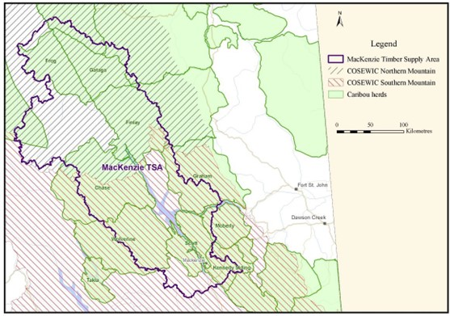
<p class="caption">(\#fig:figure47)Caribou Geographic Distribution</p>
</div>

<div class="figure" style="text-align: center">
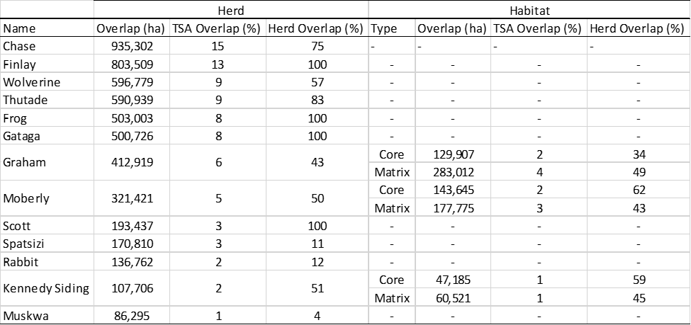
<p class="caption">(\#fig:figure48)Caribou Overlap in the Mackenzie TSA</p>
</div>
The majority of herds have decreasing long-term population trends; some herds have increased recently, but likely due to predator reduction, supplemental feeding and maternal pens.

<div class="figure" style="text-align: center">
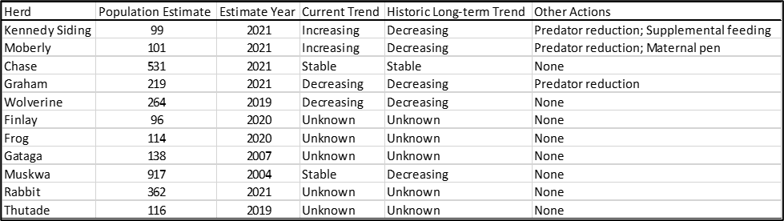
<p class="caption">(\#fig:figure49)Caribou Populations</p>
</div>
Disturbance’ is defined here as areas less than 500 m from roads or early seral (less than 40 year old) forestry cutblocks, or areas burned in the last 40 years. These disturbance types have been negatively correlated with caribou survival rates and population abundance across Canada, and therefore are often used to indicate the effects of habitat change caused by forestry and fire on caribou populations 

Disturbance levels in caribou herds were relatively high, and forestry cutblocks made up a large proportion of disturbance in the Kennedy Siding, Moberly and Scott herds.


<div class="figure" style="text-align: center">
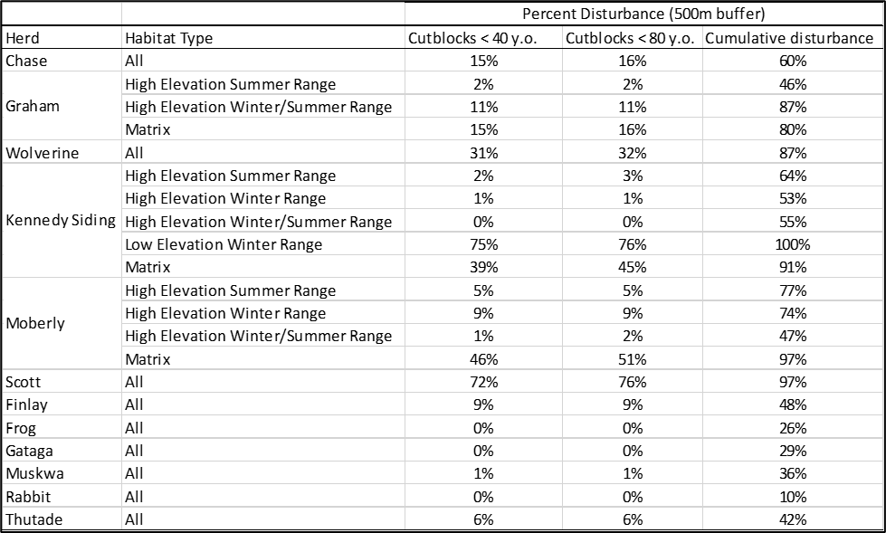
<p class="caption">(\#fig:figure50)Caribou Habitat Disturbance Levels</p>
</div>

The provinces and territories have legal jurisdiction over wildlife. However, Canada can assert itself through a Species at Risk Act (SARA) emergency protection order. Canada has two processes to assess whether an emergency protection order is warranted: a critical habitat protection analysis, and an imminent threat analysis. 

  - In 2017 a [critical habitat assessment was conducted for the central group of southern mountain caribou](https://www.registrelep-sararegistry.gc.ca/virtual_sara/files/ProtectionStudy-Smc-central-v01-0217-Eng.pdf). They recommended that further activities that could destroy critical habitat must be limited or constrained, with few exceptions.
  - On May 4, 2018 the federal Minister of Environment and Climate Change Canada (ECCC) determined that southern mountain caribou (as a whole) are facing [imminent threats to its recovery](https://www.registrelep-sararegistry.gc.ca/virtual_sara/files/ImminentThreatAnalysisSmc-v00-2018Jun-Eng.pdf) and immediate intervention is required to allow for eventual recovery. 
  - The findings of these assessments support the Minister of ECCC to propose a protection order for southern mountain caribou to cabinet.

In 2020, the province entered into two agreements that reduced the risk of a SARA protection order for southern mountain caribou:
	
-   [The Intergovernmental Partnership Agreement for the Conservation of the Central Group of the Southern Mountain Caribou](https://www.canada.ca/en/environment-climate-change/services/species-risk-public-registry/conservation-agreements/intergovernmental-partnership-conservation-central-southern-mountain-caribou-2020.html) 
    - Parties: Canada, B.C., West Moberly First Nations, Saulteau First Nation
    - Geography: Central Group of Southern Mountain Caribou
    - Scope: Establish and confirm actions to achieve the shared recovery objective
    - Shared Recovery Objective: Immediately stabilizing and expeditiously growing the population of the Central Group to levels that are self-sustaining and support traditional aboriginal harvesting activities, consistent with existing Aboriginal and Treaty rights

 - The [Canada-British Columbia Conservation Agreement for Southern Mountain Caribou in British Columbia](https://www.canada.ca/en/environment-climate-change/news/2020/02/new-conservation-agreements-signed-to-protect-southern-mountain-caribou-in-british-columbia.html)
    - Parties: Canada, B.C.
    - Geography: Entirety of Southern Mountain Caribou range
    - Scope: Establish the framework for cooperation between the parties.
      Purpose: Articulate immediate measures and plan future measures to support the recovery of Southern Mountain Caribou to self-sustaining populations.

Although these agreements better align our interests with Canada, they are no guarantee against a SARA emergency protection order.

### Analysis

The influence of current and hypothetical simulated future forestry and fire ‘disturbance’ on caribou habitat was assessed in the Mackenzie timber supply area.•	Below summarizes the amount of disturbance estimated within each caribou subpopulation from 2020 to 2090, for each sensitivity analyses.


<div class="figure" style="text-align: center">
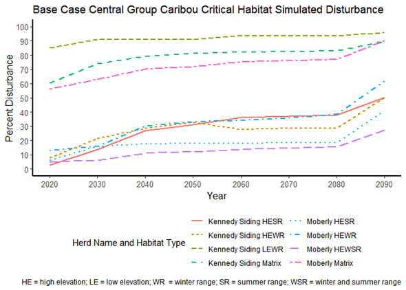
<p class="caption">(\#fig:figure51)Base case Disturbance Levels</p>
</div>

<div class="figure" style="text-align: center">
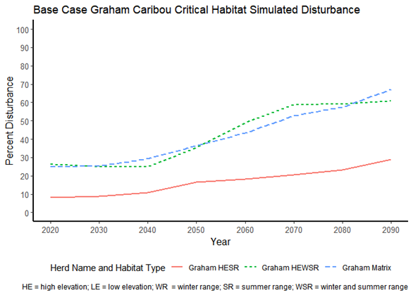
<p class="caption">(\#fig:figure52)Base case Disturbance Levels: Graham Herd</p>
</div>
<div class="figure" style="text-align: center">
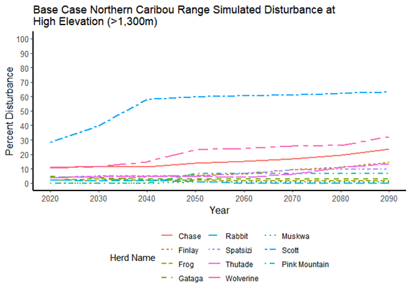
<p class="caption">(\#fig:figure53)Base case Disturbance Levels: High Elevation</p>
</div>
<div class="figure" style="text-align: center">
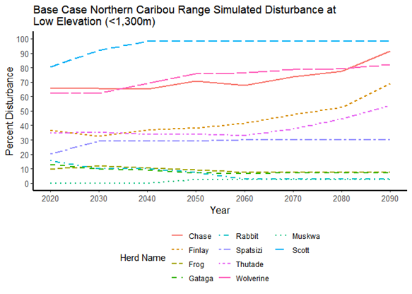
<p class="caption">(\#fig:figure54)Base case Disturbance Levels: Low Elevation</p>
</div>
In the base-case, forestry and fire disturbance increased between 2020 to 2090, suggesting increased loss of habitat and risk to caribou subpopulations in this scenario. 
  - The Kennedy Siding, Graham, Chase, Moberly and Finlay subpopulations appeared to be at greatest risk to hypothetical simulated future forestry development. 
  
A key assumption of the model described here is that roads, and areas within 500 m of roads, were considered ‘permanent’ disturbances throughout the simulation period. Thus road disturbances never recovered, which may result in an overestimation of the amount of simulated disturbance in caribou habitat, if roads are restored or recovered. 

It is important to consider that we only simulated forestry disturbance in portions of the caribou habitat areas that overlapped the Mackenzie TSA. Most of the caribou subpopulation habitat areas only partially overlapped the Mackenzie TSA, and thus hypothetical future disturbance trends across the whole habitat range may be different than what we describe here.

## Grizzly Bear

The following analysis is based on processes described in the [Interim Assessment Protocol for Grizzly Bear in British Columbia (October 2020)](https://www2.gov.bc.ca/assets/gov/environment/natural-resource-stewardship/cumulative-effects/protocols/cef_grizzly_bear_protocol_oct2020_final.pdf ). The protocol enables a provincially consistent assessment approach for understanding the current state of, and risks to grizzly bears and their habitats across B.C. The protocol is based on the scientific understanding of grizzly bear ecology and considers multiple ecological scales and their relation to context-specific decisions, such as provincial and regional policy implementation, major projects, and strategic resource and allocation decisions (e.g., licensed viewing permits, Timber Supply Review)

There are 7 grizzly bear population units (GBPU) covering 70 grizzly bear assessment units (GBAU) within the Mackenzie TSA. Assessment units are based on landscape unit boundaries within the TSA. Fragments of assessment units < 1500 hectares in size that occur along the TSA boundary have been excluded from the analysis

The following map depicts the distribution of assessment units within the associated GBPU within the Mackenzie TSA. Assessment units coloured green have been identified as a moderate to very high conservation concern based on the following core indicators: Population, Grizzly Bear Mortality Rate, Core Security, Front Country, Hunter Day Density, Poor Forage Potential. (The core indicators are the primary flags for identifying potential sources of risk to grizzly bears. The supplemental indicators and indices are intended to provide more detail and contextual information for informing decisions.

<div class="figure" style="text-align: center">
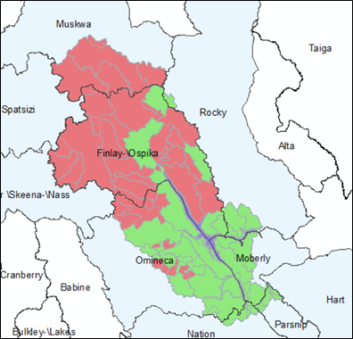
<p class="caption">(\#fig:figure55)Grizzly Bear Population and Assessment Units</p>
</div>
### Core Habitat

The following is an excerpt from the [Interim Assessment Protocol for Grizzly Bear in British Columbia (October 2020)](https://www2.gov.bc.ca/assets/gov/environment/natural-resource-stewardship/cumulative-effects/protocols/cef_grizzly_bear_protocol_oct2020_final.pdf ).  

*Human access to grizzly bear habitat, and subsequent human behaviour in grizzly bear habitat, was the main reason for declines in grizzly bear populations throughout North America. In the past decade, all-terrain vehicles, global positioning systems and Google Earth have increased accessibility everywhere. Further, it is anticipated that as humans respond to increases in natural disturbance, it will accelerate incursions into what is currently secure habitat through the construction of roads and fire guards. As well, with climate change, changes in the abundance and distribution of capable habitat will alter the viability of secure habitat. The effects of roads are complex, and the magnitude of the effect of roads on grizzly bear density vary with road density, road location in relation to good quality habitat, road characteristics, traffic patterns, human activities, and grizzly bear age, gender, experience and behaviour. Essentially, where bears and people overlap in space and time, risk of grizzly bear mortality
increases, and potentially causes population declines.*

*Core security areas are defined as areas that have adequate habitat with a minimum of human use. They are large enough to accommodate a female grizzly bear’s daily foraging requirements. The integrity of the security area is sensitive to the extent and spatial arrangement of developments including roads, settlements, recreation areas and industrial areas. Science and policy from other jurisdictions recommend that secure habitat constitute 68-84% of an average female home range for long-term stability; in addition, the Yellowstone and Northern Continental Divide Ecosystem conservation plans apply the objective of no less than 60% core security in any one bear management unit to support recovery of grizzly bear populations.*

**Core Habitat Assessment Methodology**

  - Rasterise Cumulative Effects Framework (CEF) core habitat vector linework at 1 ha resolution.
  - Using the Raster package in R reclassify Distance to Road outputs from timber supply model for years 10, 50, 100 in R (where cells < 500 metres from a road are assigned a value of 0 else 1) as follows:
  

```r
library(readr)
library(dplyr)
library(stringr)
library(ggplot2)
library(DBI)
library(RPostgreSQL)
library(nnet)
library(rio)
library(raster)
library(rgdal)
library(rgeos)
library(tidyr)
library(exactextractr)
library(maptools)
library(sp)
rm(list = ls())

options(scipen = 999, stringsAsFactors = FALSE)
#create  list of raster file paths
datafiles <- Sys.glob("C:\\Data\\tsa16\\grizzly\\Griz_IAF\\step10_IAF1221_rd3_RelativeVolumeCMAI_p1_nd2_sen_con_ct\\oScn250\\grids\\Dist2ActiveRds_1_*.tif")
#create an empty raster stack object
resultingStack<- stack()
#EPSG:3005
#populate the stack with the road density rasters
for(i in 1:NROW(datafiles)){
  tempraster <- raster(datafiles[i])
  resultingStack<- stack(resultingStack,tempraster)
}

library(sf)
#create a sf object....very useful for cleaning geometry after the fact wit st_make_valid
core <-  st_read("C:/Data/tsa16/grizzly/griz_core_ident.shp")
x<-st_is_valid(core)
st_make_valid(core)
# 
# ##################################
outpath <- 'C:/data/tsa16/grizzly'
DistStack<- stack()
for(i in 1:NROW(datafiles)){
  tempraster <- raster(datafiles[i])
  rc<-reclassify(tempraster,c(-Inf,500,0,501,Inf,1))
  plot(rc)
  DistStack<- stack(DistStack,rc)
  writeRaster(DistStack[[i]], file.path(outpath,names(DistStack[[i]])), format='GTiff')
}
```

  - In the SELES value model create new core rasters for each timestep using map algebra as follows:
      - Core10 = 1 where CurrentCore (CEF Core at year 0) EQ 1 and rc10 = 1
      - Core50 = 1 where CurrentCore EQ 1 and rc50 =1
      - Core100 = 1 where CurrentCore EQ 1 and rc100 =1
      
  - Run SELES FilterSmall model to remove all core patches < 1000 ha. in size for each new core rasters (FilteredCore).
  - Run [ExactExtractor package](https://github.com/isciences/exactextractr) in R and generate zonal statistic (sum core values) for each grizzly bear assessment unit for all FilteredCore rasters 
  

```r
# this process utilizes the exact_extract function from the exact_extractr package which creates region statistics based on a vector/raster overlay(Sum of values of raster cells that intersect the polygon, with each raster value weighted by its coverage fraction)
# here the gb assessment unit shp is used as the overlay with all the shp attributes included in the output dataframe

library(sf)
units <-  st_read("C:/Data/tsa16/grizzly/tsa16_griz_polys.shp")
x<-st_is_valid(units)
st_make_valid(units)

grizfiles <- Sys.glob("C:\\Data\\tsa16\\grizzly\\FilteredCore*.tif")
#create an empty raster stack object
resStack<- stack()
#EPSG:3005
#populate the stack with the road density rasters
for(i in 1:NROW(grizfiles)){
  tempraster <- raster(grizfiles[i])
  resStack<- stack(resStack,tempraster)
}

grizBC<- exact_extract(resStack,units,'sum',append_cols = TRUE)
export(grizBC, 'c:/data/tsa16/grizzly/grizCore.csv')
```
 - Determine the proportion of core area each unit and classify (flag) units based on 60% threshold for each time step modeled and create choropleth maps based on threshold flag.

<table class="table table-striped" style="font-size: 8px; margin-left: auto; margin-right: auto;">
<caption style="font-size: initial !important;">(\#tab:table11) Grizzly Core Area Summary</caption>
 <thead>
  <tr>
   <th style="text-align:left;"> GBPU </th>
   <th style="text-align:left;"> Assessment Unit </th>
   <th style="text-align:left;"> ha </th>
   <th style="text-align:left;"> sum.FilteredCore0 </th>
   <th style="text-align:left;"> sum.FilteredCore10 </th>
   <th style="text-align:left;"> sum.FilteredCore50 </th>
   <th style="text-align:left;"> sum.FilteredCore100 </th>
   <th style="text-align:right;"> core0 </th>
   <th style="text-align:right;"> core10 </th>
   <th style="text-align:right;"> core100 </th>
   <th style="text-align:right;"> core50 </th>
  </tr>
 </thead>
<tbody>
  <tr>
   <td style="text-align:left;"> Finlay-Ospika </td>
   <td style="text-align:left;"> Akie </td>
   <td style="text-align:left;"> 102,467.70 </td>
   <td style="text-align:left;"> 78,379.40 </td>
   <td style="text-align:left;"> 77,905.40 </td>
   <td style="text-align:left;"> 75,278.50 </td>
   <td style="text-align:left;"> 70,045.70 </td>
   <td style="text-align:right;"> 0.76 </td>
   <td style="text-align:right;"> 0.76 </td>
   <td style="text-align:right;"> 0.73 </td>
   <td style="text-align:right;"> 0.68 </td>
  </tr>
  <tr>
   <td style="text-align:left;"> Finlay-Ospika </td>
   <td style="text-align:left;"> Akie River </td>
   <td style="text-align:left;"> 45,937.10 </td>
   <td style="text-align:left;"> 42,442.30 </td>
   <td style="text-align:left;"> 42,441.70 </td>
   <td style="text-align:left;"> 42,441.70 </td>
   <td style="text-align:left;"> 33,646.80 </td>
   <td style="text-align:right;"> 0.92 </td>
   <td style="text-align:right;"> 0.92 </td>
   <td style="text-align:right;"> 0.92 </td>
   <td style="text-align:right;"> 0.73 </td>
  </tr>
  <tr>
   <td style="text-align:left;"> Finlay-Ospika </td>
   <td style="text-align:left;"> Buffalohead </td>
   <td style="text-align:left;"> 250,130.30 </td>
   <td style="text-align:left;"> 137,868.20 </td>
   <td style="text-align:left;"> 136,832.60 </td>
   <td style="text-align:left;"> 127,345.80 </td>
   <td style="text-align:left;"> 120,565.60 </td>
   <td style="text-align:right;"> 0.55 </td>
   <td style="text-align:right;"> 0.55 </td>
   <td style="text-align:right;"> 0.51 </td>
   <td style="text-align:right;"> 0.48 </td>
  </tr>
  <tr>
   <td style="text-align:left;"> Finlay-Ospika </td>
   <td style="text-align:left;"> Collins - Davis </td>
   <td style="text-align:left;"> 222,003.30 </td>
   <td style="text-align:left;"> 150,837.70 </td>
   <td style="text-align:left;"> 150,094.60 </td>
   <td style="text-align:left;"> 111,332.50 </td>
   <td style="text-align:left;"> 95,502.50 </td>
   <td style="text-align:right;"> 0.68 </td>
   <td style="text-align:right;"> 0.68 </td>
   <td style="text-align:right;"> 0.50 </td>
   <td style="text-align:right;"> 0.43 </td>
  </tr>
  <tr>
   <td style="text-align:left;"> Finlay-Ospika </td>
   <td style="text-align:left;"> Fox </td>
   <td style="text-align:left;"> 279,712.10 </td>
   <td style="text-align:left;"> 255,452.30 </td>
   <td style="text-align:left;"> 248,592.60 </td>
   <td style="text-align:left;"> 248,592.60 </td>
   <td style="text-align:left;"> 248,592.60 </td>
   <td style="text-align:right;"> 0.91 </td>
   <td style="text-align:right;"> 0.89 </td>
   <td style="text-align:right;"> 0.89 </td>
   <td style="text-align:right;"> 0.89 </td>
  </tr>
  <tr>
   <td style="text-align:left;"> Finlay-Ospika </td>
   <td style="text-align:left;"> Ingenika </td>
   <td style="text-align:left;"> 124,380.40 </td>
   <td style="text-align:left;"> 97,797.90 </td>
   <td style="text-align:left;"> 97,543.20 </td>
   <td style="text-align:left;"> 87,440.40 </td>
   <td style="text-align:left;"> 70,332.60 </td>
   <td style="text-align:right;"> 0.79 </td>
   <td style="text-align:right;"> 0.78 </td>
   <td style="text-align:right;"> 0.70 </td>
   <td style="text-align:right;"> 0.57 </td>
  </tr>
  <tr>
   <td style="text-align:left;"> Finlay-Ospika </td>
   <td style="text-align:left;"> Lower Akie </td>
   <td style="text-align:left;"> 19,934.40 </td>
   <td style="text-align:left;"> 11,516.40 </td>
   <td style="text-align:left;"> 11,364.30 </td>
   <td style="text-align:left;"> 11,353.60 </td>
   <td style="text-align:left;"> 5,068.30 </td>
   <td style="text-align:right;"> 0.58 </td>
   <td style="text-align:right;"> 0.57 </td>
   <td style="text-align:right;"> 0.57 </td>
   <td style="text-align:right;"> 0.25 </td>
  </tr>
  <tr>
   <td style="text-align:left;"> Finlay-Ospika </td>
   <td style="text-align:left;"> Lower Ospika </td>
   <td style="text-align:left;"> 135,093.40 </td>
   <td style="text-align:left;"> 90,402.30 </td>
   <td style="text-align:left;"> 89,246.00 </td>
   <td style="text-align:left;"> 61,762.00 </td>
   <td style="text-align:left;"> 48,239.20 </td>
   <td style="text-align:right;"> 0.67 </td>
   <td style="text-align:right;"> 0.66 </td>
   <td style="text-align:right;"> 0.46 </td>
   <td style="text-align:right;"> 0.36 </td>
  </tr>
  <tr>
   <td style="text-align:left;"> Finlay-Ospika </td>
   <td style="text-align:left;"> Lower Pesika </td>
   <td style="text-align:left;"> 4,953.30 </td>
   <td style="text-align:left;"> 4,943.60 </td>
   <td style="text-align:left;"> 4,943.20 </td>
   <td style="text-align:left;"> 3,552.00 </td>
   <td style="text-align:left;"> 1,557.50 </td>
   <td style="text-align:right;"> 1.00 </td>
   <td style="text-align:right;"> 1.00 </td>
   <td style="text-align:right;"> 0.72 </td>
   <td style="text-align:right;"> 0.31 </td>
  </tr>
  <tr>
   <td style="text-align:left;"> Finlay-Ospika </td>
   <td style="text-align:left;"> McCusker </td>
   <td style="text-align:left;"> 96,897.50 </td>
   <td style="text-align:left;"> 76,557.50 </td>
   <td style="text-align:left;"> 76,532.40 </td>
   <td style="text-align:left;"> 72,548.80 </td>
   <td style="text-align:left;"> 56,380.50 </td>
   <td style="text-align:right;"> 0.79 </td>
   <td style="text-align:right;"> 0.79 </td>
   <td style="text-align:right;"> 0.75 </td>
   <td style="text-align:right;"> 0.58 </td>
  </tr>
  <tr>
   <td style="text-align:left;"> Finlay-Ospika </td>
   <td style="text-align:left;"> North Firesteel </td>
   <td style="text-align:left;"> 44,195.70 </td>
   <td style="text-align:left;"> 43,887.00 </td>
   <td style="text-align:left;"> 42,314.50 </td>
   <td style="text-align:left;"> 42,314.50 </td>
   <td style="text-align:left;"> 42,314.50 </td>
   <td style="text-align:right;"> 0.99 </td>
   <td style="text-align:right;"> 0.96 </td>
   <td style="text-align:right;"> 0.96 </td>
   <td style="text-align:right;"> 0.96 </td>
  </tr>
  <tr>
   <td style="text-align:left;"> Finlay-Ospika </td>
   <td style="text-align:left;"> North Ingenika </td>
   <td style="text-align:left;"> 47,688.10 </td>
   <td style="text-align:left;"> 40,295.30 </td>
   <td style="text-align:left;"> 40,200.90 </td>
   <td style="text-align:left;"> 33,849.70 </td>
   <td style="text-align:left;"> 18,319.20 </td>
   <td style="text-align:right;"> 0.84 </td>
   <td style="text-align:right;"> 0.84 </td>
   <td style="text-align:right;"> 0.71 </td>
   <td style="text-align:right;"> 0.38 </td>
  </tr>
  <tr>
   <td style="text-align:left;"> Finlay-Ospika </td>
   <td style="text-align:left;"> Obo River </td>
   <td style="text-align:left;"> 130,244.00 </td>
   <td style="text-align:left;"> 119,154.60 </td>
   <td style="text-align:left;"> 119,147.60 </td>
   <td style="text-align:left;"> 119,147.60 </td>
   <td style="text-align:left;"> 119,147.60 </td>
   <td style="text-align:right;"> 0.91 </td>
   <td style="text-align:right;"> 0.91 </td>
   <td style="text-align:right;"> 0.91 </td>
   <td style="text-align:right;"> 0.91 </td>
  </tr>
  <tr>
   <td style="text-align:left;"> Finlay-Ospika </td>
   <td style="text-align:left;"> Pelly </td>
   <td style="text-align:left;"> 138,724.30 </td>
   <td style="text-align:left;"> 119,640.30 </td>
   <td style="text-align:left;"> 119,563.80 </td>
   <td style="text-align:left;"> 115,475.90 </td>
   <td style="text-align:left;"> 90,694.00 </td>
   <td style="text-align:right;"> 0.86 </td>
   <td style="text-align:right;"> 0.86 </td>
   <td style="text-align:right;"> 0.83 </td>
   <td style="text-align:right;"> 0.65 </td>
  </tr>
  <tr>
   <td style="text-align:left;"> Finlay-Ospika </td>
   <td style="text-align:left;"> Pesika </td>
   <td style="text-align:left;"> 67,973.50 </td>
   <td style="text-align:left;"> 63,734.30 </td>
   <td style="text-align:left;"> 63,685.50 </td>
   <td style="text-align:left;"> 62,871.30 </td>
   <td style="text-align:left;"> 45,985.30 </td>
   <td style="text-align:right;"> 0.94 </td>
   <td style="text-align:right;"> 0.94 </td>
   <td style="text-align:right;"> 0.92 </td>
   <td style="text-align:right;"> 0.68 </td>
  </tr>
  <tr>
   <td style="text-align:left;"> Finlay-Ospika </td>
   <td style="text-align:left;"> South Firesteel </td>
   <td style="text-align:left;"> 94,642.60 </td>
   <td style="text-align:left;"> 78,551.90 </td>
   <td style="text-align:left;"> 78,279.50 </td>
   <td style="text-align:left;"> 78,279.50 </td>
   <td style="text-align:left;"> 78,279.50 </td>
   <td style="text-align:right;"> 0.83 </td>
   <td style="text-align:right;"> 0.83 </td>
   <td style="text-align:right;"> 0.83 </td>
   <td style="text-align:right;"> 0.83 </td>
  </tr>
  <tr>
   <td style="text-align:left;"> Finlay-Ospika </td>
   <td style="text-align:left;"> Swannell </td>
   <td style="text-align:left;"> 63,898.20 </td>
   <td style="text-align:left;"> 55,400.00 </td>
   <td style="text-align:left;"> 53,961.20 </td>
   <td style="text-align:left;"> 49,155.80 </td>
   <td style="text-align:left;"> 46,802.30 </td>
   <td style="text-align:right;"> 0.87 </td>
   <td style="text-align:right;"> 0.84 </td>
   <td style="text-align:right;"> 0.77 </td>
   <td style="text-align:right;"> 0.73 </td>
  </tr>
  <tr>
   <td style="text-align:left;"> Finlay-Ospika </td>
   <td style="text-align:left;"> Thutade </td>
   <td style="text-align:left;"> 406,497.90 </td>
   <td style="text-align:left;"> 329,481.70 </td>
   <td style="text-align:left;"> 324,893.60 </td>
   <td style="text-align:left;"> 323,936.30 </td>
   <td style="text-align:left;"> 321,824.30 </td>
   <td style="text-align:right;"> 0.81 </td>
   <td style="text-align:right;"> 0.80 </td>
   <td style="text-align:right;"> 0.80 </td>
   <td style="text-align:right;"> 0.79 </td>
  </tr>
  <tr>
   <td style="text-align:left;"> Finlay-Ospika </td>
   <td style="text-align:left;"> Upper Akie River </td>
   <td style="text-align:left;"> 148,524.80 </td>
   <td style="text-align:left;"> 93,420.40 </td>
   <td style="text-align:left;"> 93,420.40 </td>
   <td style="text-align:left;"> 93,420.40 </td>
   <td style="text-align:left;"> 86,879.90 </td>
   <td style="text-align:right;"> 0.63 </td>
   <td style="text-align:right;"> 0.63 </td>
   <td style="text-align:right;"> 0.63 </td>
   <td style="text-align:right;"> 0.58 </td>
  </tr>
  <tr>
   <td style="text-align:left;"> Finlay-Ospika </td>
   <td style="text-align:left;"> Upper Ospika </td>
   <td style="text-align:left;"> 44,639.00 </td>
   <td style="text-align:left;"> 38,746.90 </td>
   <td style="text-align:left;"> 38,746.90 </td>
   <td style="text-align:left;"> 35,020.50 </td>
   <td style="text-align:left;"> 25,234.30 </td>
   <td style="text-align:right;"> 0.87 </td>
   <td style="text-align:right;"> 0.87 </td>
   <td style="text-align:right;"> 0.78 </td>
   <td style="text-align:right;"> 0.57 </td>
  </tr>
  <tr>
   <td style="text-align:left;"> Finlay-Ospika </td>
   <td style="text-align:left;"> Upper Pelly </td>
   <td style="text-align:left;"> 134,656.30 </td>
   <td style="text-align:left;"> 115,552.50 </td>
   <td style="text-align:left;"> 115,552.50 </td>
   <td style="text-align:left;"> 115,552.50 </td>
   <td style="text-align:left;"> 114,802.20 </td>
   <td style="text-align:right;"> 0.86 </td>
   <td style="text-align:right;"> 0.86 </td>
   <td style="text-align:right;"> 0.86 </td>
   <td style="text-align:right;"> 0.85 </td>
  </tr>
  <tr>
   <td style="text-align:left;"> Finlay-Ospika </td>
   <td style="text-align:left;"> Wicked River </td>
   <td style="text-align:left;"> 60,617.50 </td>
   <td style="text-align:left;"> 51,625.60 </td>
   <td style="text-align:left;"> 51,614.60 </td>
   <td style="text-align:left;"> 45,039.10 </td>
   <td style="text-align:left;"> 34,069.80 </td>
   <td style="text-align:right;"> 0.85 </td>
   <td style="text-align:right;"> 0.85 </td>
   <td style="text-align:right;"> 0.74 </td>
   <td style="text-align:right;"> 0.56 </td>
  </tr>
  <tr>
   <td style="text-align:left;"> Finlay-Ospika </td>
   <td style="text-align:left;"> Kwadacha </td>
   <td style="text-align:left;"> 116,009.60 </td>
   <td style="text-align:left;"> 70,825.30 </td>
   <td style="text-align:left;"> 70,287.70 </td>
   <td style="text-align:left;"> 70,287.70 </td>
   <td style="text-align:left;"> 70,287.70 </td>
   <td style="text-align:right;"> 0.61 </td>
   <td style="text-align:right;"> 0.61 </td>
   <td style="text-align:right;"> 0.61 </td>
   <td style="text-align:right;"> 0.61 </td>
  </tr>
  <tr>
   <td style="text-align:left;"> Finlay-Ospika </td>
   <td style="text-align:left;"> Kwadacha Addition </td>
   <td style="text-align:left;"> 12,789.60 </td>
   <td style="text-align:left;"> 12,747.60 </td>
   <td style="text-align:left;"> 12,747.60 </td>
   <td style="text-align:left;"> 12,747.60 </td>
   <td style="text-align:left;"> 12,747.60 </td>
   <td style="text-align:right;"> 1.00 </td>
   <td style="text-align:right;"> 1.00 </td>
   <td style="text-align:right;"> 1.00 </td>
   <td style="text-align:right;"> 1.00 </td>
  </tr>
  <tr>
   <td style="text-align:left;"> Finlay-Ospika </td>
   <td style="text-align:left;"> Finlay-Russel </td>
   <td style="text-align:left;"> 117,087.40 </td>
   <td style="text-align:left;"> 102,900.90 </td>
   <td style="text-align:left;"> 102,871.80 </td>
   <td style="text-align:left;"> 102,871.80 </td>
   <td style="text-align:left;"> 102,851.60 </td>
   <td style="text-align:right;"> 0.88 </td>
   <td style="text-align:right;"> 0.88 </td>
   <td style="text-align:right;"> 0.88 </td>
   <td style="text-align:right;"> 0.88 </td>
  </tr>
  <tr>
   <td style="text-align:left;"> Finlay-Ospika </td>
   <td style="text-align:left;"> Ed Bird Estells Lake </td>
   <td style="text-align:left;"> 5,263.70 </td>
   <td style="text-align:left;"> 3,597.10 </td>
   <td style="text-align:left;"> 3,328.20 </td>
   <td style="text-align:left;"> 3,158.20 </td>
   <td style="text-align:left;"> 3,141.60 </td>
   <td style="text-align:right;"> 0.68 </td>
   <td style="text-align:right;"> 0.63 </td>
   <td style="text-align:right;"> 0.60 </td>
   <td style="text-align:right;"> 0.60 </td>
  </tr>
  <tr>
   <td style="text-align:left;"> Finlay-Ospika </td>
   <td style="text-align:left;"> Ospika Cones </td>
   <td style="text-align:left;"> 1,505.30 </td>
   <td style="text-align:left;"> 1,505.30 </td>
   <td style="text-align:left;"> 1,505.30 </td>
   <td style="text-align:left;"> 1,505.30 </td>
   <td style="text-align:left;"> 1,283.80 </td>
   <td style="text-align:right;"> 1.00 </td>
   <td style="text-align:right;"> 1.00 </td>
   <td style="text-align:right;"> 1.00 </td>
   <td style="text-align:right;"> 0.85 </td>
  </tr>
  <tr>
   <td style="text-align:left;"> Finlay-Ospika </td>
   <td style="text-align:left;"> Tatlatui </td>
   <td style="text-align:left;"> 103,388.50 </td>
   <td style="text-align:left;"> 83,718.90 </td>
   <td style="text-align:left;"> 83,193.70 </td>
   <td style="text-align:left;"> 83,193.70 </td>
   <td style="text-align:left;"> 83,193.70 </td>
   <td style="text-align:right;"> 0.81 </td>
   <td style="text-align:right;"> 0.80 </td>
   <td style="text-align:right;"> 0.80 </td>
   <td style="text-align:right;"> 0.80 </td>
  </tr>
  <tr>
   <td style="text-align:left;"> Moberly </td>
   <td style="text-align:left;"> Clearwater </td>
   <td style="text-align:left;"> 109,885.70 </td>
   <td style="text-align:left;"> 78,149.90 </td>
   <td style="text-align:left;"> 76,430.60 </td>
   <td style="text-align:left;"> 62,365.50 </td>
   <td style="text-align:left;"> 61,993.50 </td>
   <td style="text-align:right;"> 0.71 </td>
   <td style="text-align:right;"> 0.70 </td>
   <td style="text-align:right;"> 0.57 </td>
   <td style="text-align:right;"> 0.56 </td>
  </tr>
  <tr>
   <td style="text-align:left;"> Moberly </td>
   <td style="text-align:left;"> Misinchinka </td>
   <td style="text-align:left;"> 103,373.10 </td>
   <td style="text-align:left;"> 49,014.10 </td>
   <td style="text-align:left;"> 36,740.40 </td>
   <td style="text-align:left;"> 29,188.30 </td>
   <td style="text-align:left;"> 28,518.60 </td>
   <td style="text-align:right;"> 0.47 </td>
   <td style="text-align:right;"> 0.36 </td>
   <td style="text-align:right;"> 0.28 </td>
   <td style="text-align:right;"> 0.28 </td>
  </tr>
  <tr>
   <td style="text-align:left;"> Moberly </td>
   <td style="text-align:left;"> Morfee </td>
   <td style="text-align:left;"> 21,067.20 </td>
   <td style="text-align:left;"> 4,612.80 </td>
   <td style="text-align:left;"> 4,067.30 </td>
   <td style="text-align:left;"> 3,963.00 </td>
   <td style="text-align:left;"> 3,894.60 </td>
   <td style="text-align:right;"> 0.22 </td>
   <td style="text-align:right;"> 0.19 </td>
   <td style="text-align:right;"> 0.19 </td>
   <td style="text-align:right;"> 0.18 </td>
  </tr>
  <tr>
   <td style="text-align:left;"> Moberly </td>
   <td style="text-align:left;"> Parsnip </td>
   <td style="text-align:left;"> 121,467.90 </td>
   <td style="text-align:left;"> 73,309.70 </td>
   <td style="text-align:left;"> 63,584.90 </td>
   <td style="text-align:left;"> 46,895.70 </td>
   <td style="text-align:left;"> 40,285.10 </td>
   <td style="text-align:right;"> 0.60 </td>
   <td style="text-align:right;"> 0.52 </td>
   <td style="text-align:right;"> 0.39 </td>
   <td style="text-align:right;"> 0.33 </td>
  </tr>
  <tr>
   <td style="text-align:left;"> Moberly </td>
   <td style="text-align:left;"> Selwyn </td>
   <td style="text-align:left;"> 57,059.20 </td>
   <td style="text-align:left;"> 37,638.90 </td>
   <td style="text-align:left;"> 37,289.60 </td>
   <td style="text-align:left;"> 23,411.70 </td>
   <td style="text-align:left;"> 18,774.00 </td>
   <td style="text-align:right;"> 0.66 </td>
   <td style="text-align:right;"> 0.65 </td>
   <td style="text-align:right;"> 0.41 </td>
   <td style="text-align:right;"> 0.33 </td>
  </tr>
  <tr>
   <td style="text-align:left;"> Moberly </td>
   <td style="text-align:left;"> Heather Dina Lake </td>
   <td style="text-align:left;"> 5,970.00 </td>
   <td style="text-align:left;"> 2,348.60 </td>
   <td style="text-align:left;"> 1,182.90 </td>
   <td style="text-align:left;"> 1,090.00 </td>
   <td style="text-align:left;"> 1,089.20 </td>
   <td style="text-align:right;"> 0.39 </td>
   <td style="text-align:right;"> 0.20 </td>
   <td style="text-align:right;"> 0.18 </td>
   <td style="text-align:right;"> 0.18 </td>
  </tr>
  <tr>
   <td style="text-align:left;"> Muskwa </td>
   <td style="text-align:left;"> Bluff Creek </td>
   <td style="text-align:left;"> 24,474.40 </td>
   <td style="text-align:left;"> 22,769.90 </td>
   <td style="text-align:left;"> 22,769.90 </td>
   <td style="text-align:left;"> 22,769.90 </td>
   <td style="text-align:left;"> 22,769.90 </td>
   <td style="text-align:right;"> 0.93 </td>
   <td style="text-align:right;"> 0.93 </td>
   <td style="text-align:right;"> 0.93 </td>
   <td style="text-align:right;"> 0.93 </td>
  </tr>
  <tr>
   <td style="text-align:left;"> Muskwa </td>
   <td style="text-align:left;"> Braid </td>
   <td style="text-align:left;"> 132,949.30 </td>
   <td style="text-align:left;"> 127,728.50 </td>
   <td style="text-align:left;"> 122,781.40 </td>
   <td style="text-align:left;"> 122,781.40 </td>
   <td style="text-align:left;"> 122,781.40 </td>
   <td style="text-align:right;"> 0.96 </td>
   <td style="text-align:right;"> 0.92 </td>
   <td style="text-align:right;"> 0.92 </td>
   <td style="text-align:right;"> 0.92 </td>
  </tr>
  <tr>
   <td style="text-align:left;"> Muskwa </td>
   <td style="text-align:left;"> Frog </td>
   <td style="text-align:left;"> 287,281.70 </td>
   <td style="text-align:left;"> 262,231.80 </td>
   <td style="text-align:left;"> 260,800.00 </td>
   <td style="text-align:left;"> 260,800.00 </td>
   <td style="text-align:left;"> 260,800.00 </td>
   <td style="text-align:right;"> 0.91 </td>
   <td style="text-align:right;"> 0.91 </td>
   <td style="text-align:right;"> 0.91 </td>
   <td style="text-align:right;"> 0.91 </td>
  </tr>
  <tr>
   <td style="text-align:left;"> Muskwa </td>
   <td style="text-align:left;"> Upper Gataga </td>
   <td style="text-align:left;"> 101,216.60 </td>
   <td style="text-align:left;"> 38,997.30 </td>
   <td style="text-align:left;"> 38,961.90 </td>
   <td style="text-align:left;"> 38,961.90 </td>
   <td style="text-align:left;"> 38,961.90 </td>
   <td style="text-align:right;"> 0.39 </td>
   <td style="text-align:right;"> 0.38 </td>
   <td style="text-align:right;"> 0.38 </td>
   <td style="text-align:right;"> 0.38 </td>
  </tr>
  <tr>
   <td style="text-align:left;"> Muskwa </td>
   <td style="text-align:left;"> Frog-Gataga </td>
   <td style="text-align:left;"> 346,177.70 </td>
   <td style="text-align:left;"> 302,586.00 </td>
   <td style="text-align:left;"> 295,561.70 </td>
   <td style="text-align:left;"> 295,561.70 </td>
   <td style="text-align:left;"> 295,561.70 </td>
   <td style="text-align:right;"> 0.87 </td>
   <td style="text-align:right;"> 0.85 </td>
   <td style="text-align:right;"> 0.85 </td>
   <td style="text-align:right;"> 0.85 </td>
  </tr>
  <tr>
   <td style="text-align:left;"> Nation </td>
   <td style="text-align:left;"> Tudyah A </td>
   <td style="text-align:left;"> 4,929.50 </td>
   <td style="text-align:left;"> 228.8 </td>
   <td style="text-align:left;"> 0 </td>
   <td style="text-align:left;"> 0 </td>
   <td style="text-align:left;"> 0 </td>
   <td style="text-align:right;"> 0.05 </td>
   <td style="text-align:right;"> 0.00 </td>
   <td style="text-align:right;"> 0.00 </td>
   <td style="text-align:right;"> 0.00 </td>
  </tr>
  <tr>
   <td style="text-align:left;"> Nation </td>
   <td style="text-align:left;"> Tudyah B </td>
   <td style="text-align:left;"> 4,737.30 </td>
   <td style="text-align:left;"> 17.4 </td>
   <td style="text-align:left;"> 0 </td>
   <td style="text-align:left;"> 0 </td>
   <td style="text-align:left;"> 0 </td>
   <td style="text-align:right;"> 0.00 </td>
   <td style="text-align:right;"> 0.00 </td>
   <td style="text-align:right;"> 0.00 </td>
   <td style="text-align:right;"> 0.00 </td>
  </tr>
  <tr>
   <td style="text-align:left;"> Omineca </td>
   <td style="text-align:left;"> Aiken </td>
   <td style="text-align:left;"> 38,466.00 </td>
   <td style="text-align:left;"> 29,425.10 </td>
   <td style="text-align:left;"> 29,198.00 </td>
   <td style="text-align:left;"> 26,358.80 </td>
   <td style="text-align:left;"> 23,881.20 </td>
   <td style="text-align:right;"> 0.76 </td>
   <td style="text-align:right;"> 0.76 </td>
   <td style="text-align:right;"> 0.69 </td>
   <td style="text-align:right;"> 0.62 </td>
  </tr>
  <tr>
   <td style="text-align:left;"> Omineca </td>
   <td style="text-align:left;"> Blackwater </td>
   <td style="text-align:left;"> 193,825.60 </td>
   <td style="text-align:left;"> 36,101.20 </td>
   <td style="text-align:left;"> 23,448.30 </td>
   <td style="text-align:left;"> 6,075.20 </td>
   <td style="text-align:left;"> 5,567.00 </td>
   <td style="text-align:right;"> 0.19 </td>
   <td style="text-align:right;"> 0.12 </td>
   <td style="text-align:right;"> 0.03 </td>
   <td style="text-align:right;"> 0.03 </td>
  </tr>
  <tr>
   <td style="text-align:left;"> Omineca </td>
   <td style="text-align:left;"> Chunamon </td>
   <td style="text-align:left;"> 198,747.30 </td>
   <td style="text-align:left;"> 100,779.50 </td>
   <td style="text-align:left;"> 99,814.80 </td>
   <td style="text-align:left;"> 77,942.00 </td>
   <td style="text-align:left;"> 70,870.10 </td>
   <td style="text-align:right;"> 0.51 </td>
   <td style="text-align:right;"> 0.50 </td>
   <td style="text-align:right;"> 0.39 </td>
   <td style="text-align:right;"> 0.36 </td>
  </tr>
  <tr>
   <td style="text-align:left;"> Omineca </td>
   <td style="text-align:left;"> Connaghan Creek </td>
   <td style="text-align:left;"> 8,461.90 </td>
   <td style="text-align:left;"> 5,962.70 </td>
   <td style="text-align:left;"> 5,937.00 </td>
   <td style="text-align:left;"> 4,235.30 </td>
   <td style="text-align:left;"> 4,222.30 </td>
   <td style="text-align:right;"> 0.70 </td>
   <td style="text-align:right;"> 0.70 </td>
   <td style="text-align:right;"> 0.50 </td>
   <td style="text-align:right;"> 0.50 </td>
  </tr>
  <tr>
   <td style="text-align:left;"> Omineca </td>
   <td style="text-align:left;"> Discovery </td>
   <td style="text-align:left;"> 13,262.50 </td>
   <td style="text-align:left;"> 5,924.20 </td>
   <td style="text-align:left;"> 5,909.60 </td>
   <td style="text-align:left;"> 4,010.20 </td>
   <td style="text-align:left;"> 3,671.70 </td>
   <td style="text-align:right;"> 0.45 </td>
   <td style="text-align:right;"> 0.45 </td>
   <td style="text-align:right;"> 0.30 </td>
   <td style="text-align:right;"> 0.28 </td>
  </tr>
  <tr>
   <td style="text-align:left;"> Omineca </td>
   <td style="text-align:left;"> Duckling </td>
   <td style="text-align:left;"> 28,212.20 </td>
   <td style="text-align:left;"> 14,113.00 </td>
   <td style="text-align:left;"> 13,908.10 </td>
   <td style="text-align:left;"> 12,421.50 </td>
   <td style="text-align:left;"> 11,770.20 </td>
   <td style="text-align:right;"> 0.50 </td>
   <td style="text-align:right;"> 0.49 </td>
   <td style="text-align:right;"> 0.44 </td>
   <td style="text-align:right;"> 0.42 </td>
  </tr>
  <tr>
   <td style="text-align:left;"> Omineca </td>
   <td style="text-align:left;"> Eklund </td>
   <td style="text-align:left;"> 24,933.30 </td>
   <td style="text-align:left;"> 14,218.30 </td>
   <td style="text-align:left;"> 14,069.20 </td>
   <td style="text-align:left;"> 10,933.60 </td>
   <td style="text-align:left;"> 10,877.20 </td>
   <td style="text-align:right;"> 0.57 </td>
   <td style="text-align:right;"> 0.56 </td>
   <td style="text-align:right;"> 0.44 </td>
   <td style="text-align:right;"> 0.44 </td>
  </tr>
  <tr>
   <td style="text-align:left;"> Omineca </td>
   <td style="text-align:left;"> Gaffney </td>
   <td style="text-align:left;"> 151,921.90 </td>
   <td style="text-align:left;"> 40,689.40 </td>
   <td style="text-align:left;"> 36,399.20 </td>
   <td style="text-align:left;"> 12,461.60 </td>
   <td style="text-align:left;"> 11,622.60 </td>
   <td style="text-align:right;"> 0.27 </td>
   <td style="text-align:right;"> 0.24 </td>
   <td style="text-align:right;"> 0.08 </td>
   <td style="text-align:right;"> 0.08 </td>
  </tr>
  <tr>
   <td style="text-align:left;"> Omineca </td>
   <td style="text-align:left;"> Germansen Mountain </td>
   <td style="text-align:left;"> 11,454.50 </td>
   <td style="text-align:left;"> 9,086.00 </td>
   <td style="text-align:left;"> 9,085.00 </td>
   <td style="text-align:left;"> 7,037.80 </td>
   <td style="text-align:left;"> 6,940.80 </td>
   <td style="text-align:right;"> 0.79 </td>
   <td style="text-align:right;"> 0.79 </td>
   <td style="text-align:right;"> 0.61 </td>
   <td style="text-align:right;"> 0.61 </td>
  </tr>
  <tr>
   <td style="text-align:left;"> Omineca </td>
   <td style="text-align:left;"> Gillis </td>
   <td style="text-align:left;"> 36,968.30 </td>
   <td style="text-align:left;"> 25,686.80 </td>
   <td style="text-align:left;"> 25,502.30 </td>
   <td style="text-align:left;"> 16,134.50 </td>
   <td style="text-align:left;"> 16,097.80 </td>
   <td style="text-align:right;"> 0.69 </td>
   <td style="text-align:right;"> 0.69 </td>
   <td style="text-align:right;"> 0.44 </td>
   <td style="text-align:right;"> 0.44 </td>
  </tr>
  <tr>
   <td style="text-align:left;"> Omineca </td>
   <td style="text-align:left;"> Jackfish </td>
   <td style="text-align:left;"> 17,768.50 </td>
   <td style="text-align:left;"> 6,392.50 </td>
   <td style="text-align:left;"> 6,381.50 </td>
   <td style="text-align:left;"> 5,324.20 </td>
   <td style="text-align:left;"> 5,242.20 </td>
   <td style="text-align:right;"> 0.36 </td>
   <td style="text-align:right;"> 0.36 </td>
   <td style="text-align:right;"> 0.30 </td>
   <td style="text-align:right;"> 0.30 </td>
  </tr>
  <tr>
   <td style="text-align:left;"> Omineca </td>
   <td style="text-align:left;"> Klawli </td>
   <td style="text-align:left;"> 79,797.40 </td>
   <td style="text-align:left;"> 40,824.80 </td>
   <td style="text-align:left;"> 40,194.80 </td>
   <td style="text-align:left;"> 19,813.70 </td>
   <td style="text-align:left;"> 19,324.70 </td>
   <td style="text-align:right;"> 0.51 </td>
   <td style="text-align:right;"> 0.50 </td>
   <td style="text-align:right;"> 0.25 </td>
   <td style="text-align:right;"> 0.24 </td>
  </tr>
  <tr>
   <td style="text-align:left;"> Omineca </td>
   <td style="text-align:left;"> Manson River </td>
   <td style="text-align:left;"> 22,446.40 </td>
   <td style="text-align:left;"> 4,249.70 </td>
   <td style="text-align:left;"> 4,102.70 </td>
   <td style="text-align:left;"> 2,314.50 </td>
   <td style="text-align:left;"> 2,248.50 </td>
   <td style="text-align:right;"> 0.19 </td>
   <td style="text-align:right;"> 0.18 </td>
   <td style="text-align:right;"> 0.10 </td>
   <td style="text-align:right;"> 0.10 </td>
  </tr>
  <tr>
   <td style="text-align:left;"> Omineca </td>
   <td style="text-align:left;"> Mesilinka </td>
   <td style="text-align:left;"> 122,522.20 </td>
   <td style="text-align:left;"> 79,280.00 </td>
   <td style="text-align:left;"> 78,297.90 </td>
   <td style="text-align:left;"> 66,885.00 </td>
   <td style="text-align:left;"> 58,117.90 </td>
   <td style="text-align:right;"> 0.65 </td>
   <td style="text-align:right;"> 0.64 </td>
   <td style="text-align:right;"> 0.55 </td>
   <td style="text-align:right;"> 0.47 </td>
  </tr>
  <tr>
   <td style="text-align:left;"> Omineca </td>
   <td style="text-align:left;"> Nation </td>
   <td style="text-align:left;"> 13,761.50 </td>
   <td style="text-align:left;"> 4,316.70 </td>
   <td style="text-align:left;"> 1,960.40 </td>
   <td style="text-align:left;"> 0 </td>
   <td style="text-align:left;"> 0 </td>
   <td style="text-align:right;"> 0.31 </td>
   <td style="text-align:right;"> 0.14 </td>
   <td style="text-align:right;"> 0.00 </td>
   <td style="text-align:right;"> 0.00 </td>
  </tr>
  <tr>
   <td style="text-align:left;"> Omineca </td>
   <td style="text-align:left;"> Nina Creek </td>
   <td style="text-align:left;"> 22,195.40 </td>
   <td style="text-align:left;"> 14,743.10 </td>
   <td style="text-align:left;"> 14,673.00 </td>
   <td style="text-align:left;"> 11,421.10 </td>
   <td style="text-align:left;"> 9,837.60 </td>
   <td style="text-align:right;"> 0.66 </td>
   <td style="text-align:right;"> 0.66 </td>
   <td style="text-align:right;"> 0.51 </td>
   <td style="text-align:right;"> 0.44 </td>
  </tr>
  <tr>
   <td style="text-align:left;"> Omineca </td>
   <td style="text-align:left;"> Osilinka </td>
   <td style="text-align:left;"> 230,036.70 </td>
   <td style="text-align:left;"> 128,506.70 </td>
   <td style="text-align:left;"> 126,612.90 </td>
   <td style="text-align:left;"> 112,109.60 </td>
   <td style="text-align:left;"> 106,567.80 </td>
   <td style="text-align:right;"> 0.56 </td>
   <td style="text-align:right;"> 0.55 </td>
   <td style="text-align:right;"> 0.49 </td>
   <td style="text-align:right;"> 0.46 </td>
  </tr>
  <tr>
   <td style="text-align:left;"> Omineca </td>
   <td style="text-align:left;"> Philip </td>
   <td style="text-align:left;"> 187,603.60 </td>
   <td style="text-align:left;"> 32,770.70 </td>
   <td style="text-align:left;"> 9,400.80 </td>
   <td style="text-align:left;"> 2,722.10 </td>
   <td style="text-align:left;"> 2,441.10 </td>
   <td style="text-align:right;"> 0.17 </td>
   <td style="text-align:right;"> 0.05 </td>
   <td style="text-align:right;"> 0.01 </td>
   <td style="text-align:right;"> 0.01 </td>
  </tr>
  <tr>
   <td style="text-align:left;"> Omineca </td>
   <td style="text-align:left;"> Philip Lake </td>
   <td style="text-align:left;"> 12,798.40 </td>
   <td style="text-align:left;"> 2,068.40 </td>
   <td style="text-align:left;"> 0 </td>
   <td style="text-align:left;"> 0 </td>
   <td style="text-align:left;"> 0 </td>
   <td style="text-align:right;"> 0.16 </td>
   <td style="text-align:right;"> 0.00 </td>
   <td style="text-align:right;"> 0.00 </td>
   <td style="text-align:right;"> 0.00 </td>
  </tr>
  <tr>
   <td style="text-align:left;"> Omineca </td>
   <td style="text-align:left;"> South Germansen - Upper Manson </td>
   <td style="text-align:left;"> 16,291.00 </td>
   <td style="text-align:left;"> 8,047.70 </td>
   <td style="text-align:left;"> 7,894.40 </td>
   <td style="text-align:left;"> 2,499.20 </td>
   <td style="text-align:left;"> 2,460.20 </td>
   <td style="text-align:right;"> 0.49 </td>
   <td style="text-align:right;"> 0.48 </td>
   <td style="text-align:right;"> 0.15 </td>
   <td style="text-align:right;"> 0.15 </td>
  </tr>
  <tr>
   <td style="text-align:left;"> Omineca </td>
   <td style="text-align:left;"> Tutizza </td>
   <td style="text-align:left;"> 49,376.00 </td>
   <td style="text-align:left;"> 36,641.60 </td>
   <td style="text-align:left;"> 35,805.00 </td>
   <td style="text-align:left;"> 34,316.90 </td>
   <td style="text-align:left;"> 32,193.10 </td>
   <td style="text-align:right;"> 0.74 </td>
   <td style="text-align:right;"> 0.73 </td>
   <td style="text-align:right;"> 0.70 </td>
   <td style="text-align:right;"> 0.65 </td>
  </tr>
  <tr>
   <td style="text-align:left;"> Omineca </td>
   <td style="text-align:left;"> Twenty Mile </td>
   <td style="text-align:left;"> 21,105.60 </td>
   <td style="text-align:left;"> 15,453.50 </td>
   <td style="text-align:left;"> 14,888.40 </td>
   <td style="text-align:left;"> 10,842.00 </td>
   <td style="text-align:left;"> 9,170.00 </td>
   <td style="text-align:right;"> 0.73 </td>
   <td style="text-align:right;"> 0.71 </td>
   <td style="text-align:right;"> 0.51 </td>
   <td style="text-align:right;"> 0.43 </td>
  </tr>
  <tr>
   <td style="text-align:left;"> Omineca </td>
   <td style="text-align:left;"> Chase </td>
   <td style="text-align:left;"> 35,945.30 </td>
   <td style="text-align:left;"> 32,986.20 </td>
   <td style="text-align:left;"> 32,816.20 </td>
   <td style="text-align:left;"> 32,748.50 </td>
   <td style="text-align:left;"> 32,638.60 </td>
   <td style="text-align:right;"> 0.92 </td>
   <td style="text-align:right;"> 0.91 </td>
   <td style="text-align:right;"> 0.91 </td>
   <td style="text-align:right;"> 0.91 </td>
  </tr>
  <tr>
   <td style="text-align:left;"> Omineca </td>
   <td style="text-align:left;"> Omineca </td>
   <td style="text-align:left;"> 127,169.60 </td>
   <td style="text-align:left;"> 112,835.50 </td>
   <td style="text-align:left;"> 112,391.40 </td>
   <td style="text-align:left;"> 109,827.90 </td>
   <td style="text-align:left;"> 109,172.90 </td>
   <td style="text-align:right;"> 0.89 </td>
   <td style="text-align:right;"> 0.88 </td>
   <td style="text-align:right;"> 0.86 </td>
   <td style="text-align:right;"> 0.86 </td>
  </tr>
  <tr>
   <td style="text-align:left;"> Omineca </td>
   <td style="text-align:left;"> Muscovite </td>
   <td style="text-align:left;"> 5,741.40 </td>
   <td style="text-align:left;"> 4,182.90 </td>
   <td style="text-align:left;"> 4,135.40 </td>
   <td style="text-align:left;"> 4,007.20 </td>
   <td style="text-align:left;"> 3,977.80 </td>
   <td style="text-align:right;"> 0.73 </td>
   <td style="text-align:right;"> 0.72 </td>
   <td style="text-align:right;"> 0.70 </td>
   <td style="text-align:right;"> 0.69 </td>
  </tr>
  <tr>
   <td style="text-align:left;"> Parsnip </td>
   <td style="text-align:left;"> Kennedy </td>
   <td style="text-align:left;"> 24,347.10 </td>
   <td style="text-align:left;"> 18,927.00 </td>
   <td style="text-align:left;"> 17,876.90 </td>
   <td style="text-align:left;"> 16,604.10 </td>
   <td style="text-align:left;"> 15,908.80 </td>
   <td style="text-align:right;"> 0.78 </td>
   <td style="text-align:right;"> 0.73 </td>
   <td style="text-align:right;"> 0.68 </td>
   <td style="text-align:right;"> 0.65 </td>
  </tr>
  <tr>
   <td style="text-align:left;"> Parsnip </td>
   <td style="text-align:left;"> Pine Pass </td>
   <td style="text-align:left;"> 10,255.10 </td>
   <td style="text-align:left;"> 8,090.30 </td>
   <td style="text-align:left;"> 8,001.10 </td>
   <td style="text-align:left;"> 7,795.00 </td>
   <td style="text-align:left;"> 7,795.00 </td>
   <td style="text-align:right;"> 0.79 </td>
   <td style="text-align:right;"> 0.78 </td>
   <td style="text-align:right;"> 0.76 </td>
   <td style="text-align:right;"> 0.76 </td>
  </tr>
  <tr>
   <td style="text-align:left;"> Rocky </td>
   <td style="text-align:left;"> Nabesche </td>
   <td style="text-align:left;"> 152,345.10 </td>
   <td style="text-align:left;"> 111,586.60 </td>
   <td style="text-align:left;"> 110,799.20 </td>
   <td style="text-align:left;"> 76,952.00 </td>
   <td style="text-align:left;"> 66,638.70 </td>
   <td style="text-align:right;"> 0.73 </td>
   <td style="text-align:right;"> 0.73 </td>
   <td style="text-align:right;"> 0.51 </td>
   <td style="text-align:right;"> 0.44 </td>
  </tr>
  <tr>
   <td style="text-align:left;"> Rocky </td>
   <td style="text-align:left;"> Schooler </td>
   <td style="text-align:left;"> 65,889.60 </td>
   <td style="text-align:left;"> 49,483.00 </td>
   <td style="text-align:left;"> 48,440.70 </td>
   <td style="text-align:left;"> 17,138.70 </td>
   <td style="text-align:left;"> 15,758.70 </td>
   <td style="text-align:right;"> 0.75 </td>
   <td style="text-align:right;"> 0.74 </td>
   <td style="text-align:right;"> 0.26 </td>
   <td style="text-align:right;"> 0.24 </td>
  </tr>
</tbody>
</table>
**Core Habitat Assessment Results**

The following table summarises the change in core habitat resulting from base case harvest projection. The table details the number of grizzly bear assessment units that fall below the 60% threshold core security in four time periods: 2020, 2030, 2070 and 2120.


<table class="table table-striped" style="font-size: 10px; margin-left: auto; margin-right: auto;">
<caption style="font-size: initial !important;">(\#tab:table12) Grizzly Core Area Results</caption>
 <thead>
  <tr>
   <th style="text-align:left;"> Category </th>
   <th style="text-align:left;"> Current </th>
   <th style="text-align:left;"> Year10 </th>
   <th style="text-align:left;"> Year50 </th>
   <th style="text-align:left;"> Year100 </th>
  </tr>
 </thead>
<tbody>
  <tr>
   <td style="text-align:left;"> Above 60% Core </td>
   <td style="text-align:left;"> 48 </td>
   <td style="text-align:left;"> 47 </td>
   <td style="text-align:left;"> 35 </td>
   <td style="text-align:left;"> 28 </td>
  </tr>
  <tr>
   <td style="text-align:left;"> Below 60% Core </td>
   <td style="text-align:left;"> 22 </td>
   <td style="text-align:left;"> 23 </td>
   <td style="text-align:left;"> 35 </td>
   <td style="text-align:left;"> 42 </td>
  </tr>
  <tr>
   <td style="text-align:left;"> % Below </td>
   <td style="text-align:left;"> 31.4% </td>
   <td style="text-align:left;"> 32.9% </td>
   <td style="text-align:left;"> 50.0% </td>
   <td style="text-align:left;"> 60.0% </td>
  </tr>
</tbody>
</table>

The number of units that fall below the core security threshold 60% of the assessment doubles over the same period as a consequence of northward progression of development in the base case.The following figure on the illustrates the change in core area over the 100-year period. Core area at the start of the base case projection is coloured in red and is overlain by the core area at year 100 in green. As a result of road development projected for the base case, total core habitat is reduced by 17% (~ 755000 ha reduction in total area) over the first 100 years of the projection. Ongoing harvest and roading concentration in the southern portion of the TSA reduces core habitat by 47% (~ 235000 ha reduction) over the first 100 years with most of the reduction occurring in the first 30 years of the projection (37% reduction).


<div class="figure" style="text-align: center">
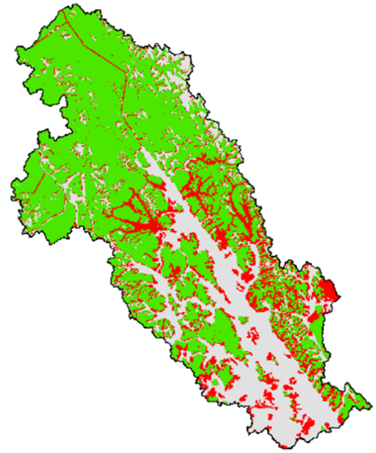
<p class="caption">(\#fig:figure56)Grizzly Bear Core Habitat at Year 100</p>
</div>

The following figure depicts the spatial distribution of units that fall below the 60% threshold.

<div class="figure" style="text-align: center">
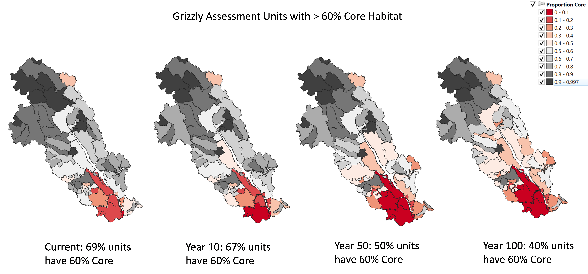
<p class="caption">(\#fig:figure57)Grizzly Bear Core Habitat by Assessment Unit</p>
</div>

### Road Density

The following is an excerpt from: [Interim Assessment Protocol for Grizzly Bear in British Columbia (October 2020)](https://www2.gov.bc.ca/assets/gov/environment/natural-resource-stewardship/cumulative-effects/protocols/cef_grizzly_bear_protocol_oct2020_final.pdf ).  

*Studies have found that most known grizzly bear deaths occur within 500 m of a road or other corridor.
Although grizzly bears avoid busy roads, resource roads with fewer vehicles attract some individuals because of food availability (naturally regenerated or seeded vegetation or carrion), for security from dominant bears, and as travel routes.*

*Grizzly bears that are active close to roads usually have a higher risk of human-caused mortality. 
Since roads and traffic can alter bear behaviour in complex ways that vary by bear gender and dominance, some demographic groups may experience higher road-related mortality risk than others. Grizzly bear mortality is higher close to open roads when people who use the roads and  most human/bear conflicts are also near access routes. Collisions with vehicles also kill bears though typically only on highways. As road density increases, grizzly bear mortality risk increases, habitat avoidance increases, and populations decline although nearby areas of high-quality secure habitat potentially reduce the impact of high road density at a population scale. Female grizzly bears use areas with lower road density than is available over the landscape, suggesting that they select a home range to minimize roads. With high road densities, secure grizzly bear habitat can shrink to isolated islands surrounded by a matrix of hazards to the extent that bears do not use areas with high road density, nor the islands in between the alienated matrix.*

*Climate change is likely to increase natural disturbances events such as forest fire, insect and disease outbreaks which will likely increase plant-based foods for bears. However, as humans respond to these events, through activities such as forest salvage, road densities will increase beyond what would be expected under a stable climate, potentially increasing negative human-bear encounters.Determining a road density threshold for population maintenance is challenging because of the
variety of factors that affect habitat use and mortality, including the distance to human populations, attractiveness of habitat to humans, and human behaviour. Road densities above 0.75 km/km2 wereassociated with modeled population decline in an Alberta population (Boulanger & Stenhouse,2014). This work has been used to establish road density targets of 0.6 km/km2 in areas managed for conservation (Government of Alberta, 2008), and of 0.75 km/km2 in areas managed for long-term
stability.*

*Consistent with this level, adjacent B.C./US trans-border sub-populations have increased in a region where road density in a female home range averages 0.39 km/km2 and decreased where density averaged 0.9 km/km2. Several studies have recommended landscape scale thresholds of 0.6 km/km2, and planning processes in B.C., Alberta and the US have used these recommendations.*

**Road Density Assessment Methodology**

Road density is defined for each grid cell as the length of road (m or km) per km2 within a 1 km2 circular window . A road density surface is maintained dynamically using a moving window algorithm, updated at the end of each time step, after new road segments and spur access roads have been built, and deactivated road segments disabled.

Road density constraints (RdCs) specify either a maximum area that is allowed above a road density threshold or a minimum area that must be below a road density threshold. That is, RdCs specify the maximum area that can be “high road density”. As with forest cover constraints, the "reference area" can be all forest, productive forest, THLB, or all land. Constraints can be specified using zones (e.g., some landscape units might have higher or lower targets) and met within "reference units" (e.g., by assessment watersheds). The following are two examples:

  - Nanika LU: Max 10% of forest above 0.6 km/km2, met within each assessment watershed
  - Owen LU: Max 75% of land above 0.6 km/km2, met within each assessment watershed

During a run, the area above the threshold density is tracked within each “unit” (zone and reference sub-zone, corresponding to LU and assessment watershed in the above examples). For the Grizzly Bear road density assessment densities were tracked for each grizzly bear assessment unit using a density threshold of 0.6km/km2 to classify each hectare in the unit as either high road density or not. The sum of high-density hectares was then divided by the area of the unit, with units with areas containing greater than 60% high road density cells flagged as high risk.

**Road Density Assessment Results**

The following table summarises the change in road density resulting from base case harvest projection. The table details the number of grizzly bear assessment units that exceed a 60% threshold of high-density area (> 0.6km/km2) in four time periods: 2020, 2030, 2070 and 2120.

<table class="table table-striped" style="font-size: 10px; margin-left: auto; margin-right: auto;">
<caption style="font-size: initial !important;">(\#tab:table13) Grizzly Road Density Results</caption>
 <thead>
  <tr>
   <th style="text-align:left;"> Category </th>
   <th style="text-align:left;"> Current </th>
   <th style="text-align:left;"> Year10 </th>
   <th style="text-align:left;"> Year50 </th>
   <th style="text-align:left;"> Year100 </th>
  </tr>
 </thead>
<tbody>
  <tr>
   <td style="text-align:left;"> Above 60% High Density </td>
   <td style="text-align:left;"> 7 </td>
   <td style="text-align:left;"> 7 </td>
   <td style="text-align:left;"> 12 </td>
   <td style="text-align:left;"> 15 </td>
  </tr>
  <tr>
   <td style="text-align:left;"> Below 60% High Density </td>
   <td style="text-align:left;"> 63 </td>
   <td style="text-align:left;"> 63 </td>
   <td style="text-align:left;"> 58 </td>
   <td style="text-align:left;"> 55 </td>
  </tr>
  <tr>
   <td style="text-align:left;"> % Above </td>
   <td style="text-align:left;"> 10.0% </td>
   <td style="text-align:left;"> 10.0% </td>
   <td style="text-align:left;"> 17.1% </td>
   <td style="text-align:left;"> 21.4% </td>
  </tr>
</tbody>
</table>
As a result of road development projected for the base case total % of units classified with > 60% of its area classified as high density (> 0.6km/km2) doubled (114% increase) over the first 100 years of the projection. In the absence of road density management (including deactivation and rehabilitation) just over 21% (15) units of the assessment units would be classified as high density by the end of the base case harvest projection.

The following figure depicts the spatial distribution of units that fall above (green) the 60% threshold of high density roading.

<div class="figure" style="text-align: center">
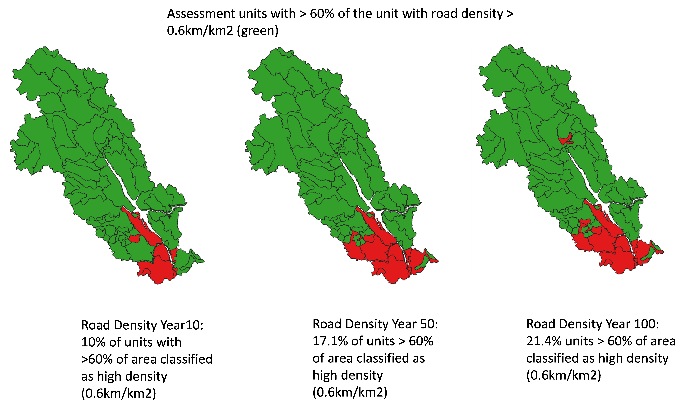
<p class="caption">(\#fig:figure58)Grizzly Bear High Density Classification by Assessment Unit</p>
</div>

## Fisher

### Cuurent Condition

Fisher are medium-sized (weigh 2-6 kg and measure 75-120 cm in length) carnivores that have the long thin body characteristic of the weasel family. •	They are forest-dependent species. They require sufficient overhead forest cover in their territories to provide protection as they go about their day-to-day activities. In addition, several aspects of their ecology require the use of structural features found in late-successional forests, for example, large, dead, or dying trees that provide the cavities needed for denning and raising kits.

Although moderate levels of forest modification can increase the capacity of some landscapes for fishers by providing a diverse mosaic of habitat types, forest modifications that occur too quickly and cover too large of an area will greatly reduce the ability of fishers to occupy an area.

The Mackenzie TSA overlaps the boreal and sub-boreal fisher habitat zones (see map below). The sub-boreal zone is part of the Columbian population of fisher, which is currently red-listed (i.e., extirpated, endangered, or threatened); the boreal population is currently blue-listed (i.e., special concern) by the B.C. Conservation Data Centre.

<div class="figure" style="text-align: center">
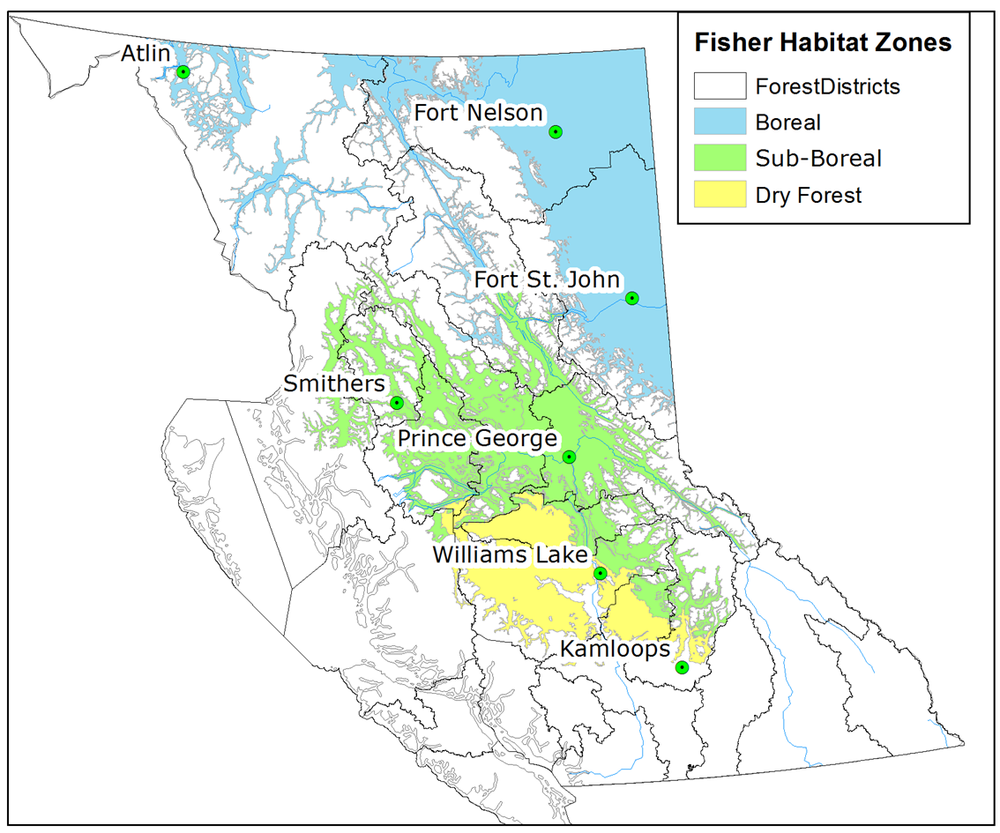
<p class="caption">(\#fig:figure59)Fisher Range</p>
</div>
Fisher harvest (trapping) is regulated under the Wildlife Act. Trapping of fisher in the Columbian population (green and yellow zones in the map above) was closed in 2021 due to concern over loss of habitat and low population numbers. The Boreal population remains open for harvest.

Fisher are a species of concern to First Nations in the TSA, and to the governments of British Columbia and Canada. First Nations requested an analysis to assess the potential influence of future forest harvest on fisher as part of the timber supply review. The government of British Columbia is actively developing a provincial fisher conservation and recovery implementation plan to stabilize and increase the abundance of fisher in the province. This plan will pro-actively address strategic risks from the potential of emergency listing under the federal Species at Risk Act as well as impacts on Indigenous rights.

The BC Fisher Habitat Working Group has developed habitat tools and a series of videos to present information about fishers, fisher habitat, and management options to help natural resource practitioners conserve and augment key forest features specifically tailored to the different phases of timber development. The [BC Fisher Habitat Working Group](https://www.bcfisherhabitat.ca/) was formed in 2009 with the goal of communicating information to the people that can affect the quantity and quality of fisher habitat on the landscape across British Columbia. The working group used information from four research studies to describe important habitats and identify the amounts of these habitats required by fishers. The Fisher model is described below.

### Analysis

Here we estimate and report on indicators of fisher territory relative probability of occupancy across the Mackenzie TSA.

Fisher territory relative probability of occupancy was estimated using the model developed by [Weir and Courbold (2010)](https://www.jstor.org/stable/27760469), where the percentage of a fisher territory that is wetlands or less than 12-year-old logged forest (i.e., “open area”) was found to be a useful indicator of whether fisher occupied a territory. Territories with more wetland or logged forest were less likely to be occupied.

An important limitation on the use of this model as an indicator of fisher occurrence is that it does not consider the quality of habitat within territories. For example, this approach does not evaluate the presence of large trees with cavities that are necessary for fisher denning. Therefore, even though the relative probability of occupancy for a given territory may be high, it does not mean that all of the habitat features necessary for fisher survival and reproduction are provided.

We created a standard territory size across fisher range within the TSA. Each territory is hexagon in shape and 30km2 in size (i.e., an average female fisher home range size). Although not a biologically relevant shape, these may be considered as fisher-equivalent territory areas (FETAs), which represent the amount of area and habitat that could theoretically support a female fisher.FETA relative probability of occupancy was calculated using the Weir and Courbold (2010) model.
Currently, the relative probability of fisher relative probability of occupancy of FETAs was considered low in the southwest portion of the Mackenzie TSA and considered high in the east-central and northern portions of the TSA.

<div class="figure" style="text-align: center">
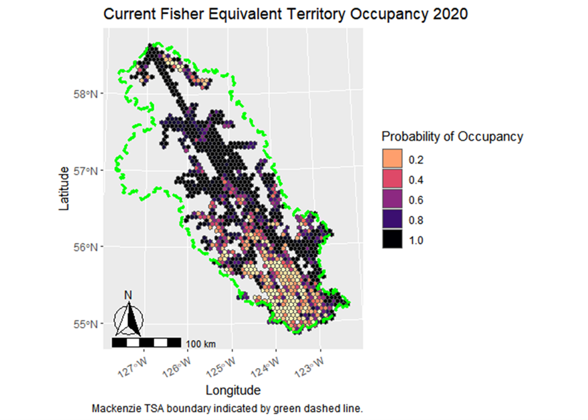
<p class="caption">(\#fig:figure60)Fisher Probability of Occupancy Map</p>
</div>
In the base case scenario, the sum of the relative probability of occupancy values of all FETAs (i.e., the total relative occupancy) decreased across the simulation period. From 2020 to 2090, the total relative occupancy of FETAs in the base case decreased from approximately 820 to approximately 780. 

## Fisheries Sensitive Watersheds

In the past there have been various forms of fisheries management initiatives aimed at protecting fish values. Typically, these were targeted at specific stocks or locations. Today, however, science has recognized the integral linkage between upland conditions and their influence on maintaining aquatic conditions necessary to sustain healthy fish populations. Accordingly, the tools required to manage for connectivity at the entire watershed level have been set out in the Fisheries Sensitive Watersheds (FSW) portions of the Forest Practices and Range Act (FRPA) regulations, and specifically the Government Actions Regulation (Sec 14) and the Forest Practices and Planning Regulation (Sec 8).

To qualify as an FSW candidate, watersheds must meet two criteria: they must have significant fisheries values and watershed sensitivity. Watersheds which meet the FSW test, and that have been designated by way of a Ministerial Order as an FSW, require Forest Act agreement holders to establish results and strategies in their Forest Stewardship Plans consistent with the objective(s) set by the Minister. An FSW order established by the Minister sets out management direction to conserve important watershed level attributes protecting fisheries values or to prevent cumulative hydrological effects that would have a material adverse effect on fish. 

These attributes include the:

  - natural hydrological conditions
  - natural stream bed dynamics
  - stream channel integrity; and 
  - quality, quantity and timing of water flow.

In the Mackenzie TSA there are currently no established FSWs. The Ministry of Land, Water and Resource Stewardship (LWRS) is actively collaborating with First Nations to prepare a draft FSW package to move forward in the near future. It is important to note that a 'draft' FSW is in the initial stages of development and provides a starting point for internal discussion, collaboration with First Nations and discussions with Forest Act Agreement holders.  A draft FSW may or may not move forward to become a proposed FSW and then released for formal review, comment and consultation.  Also, there may be additional watersheds that are not part of this report that may be considered as draft FSWs and then move forward as proposed FSWs.  

Sensitivity analysis was developed to assess the potential impacts to timber supply of establishing all the draft FSWs.The figure that follows depicts the geographic distribution of current draft FSWs while the following table summarises area by land base designation of current draft FSW watersheds and their associated target equivilent clearcut areas.

<div class="figure" style="text-align: center">
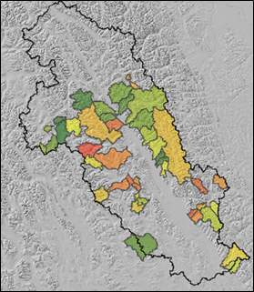
<p class="caption">(\#fig:figure61)Draft Fisheries Sensitive Watershed Map</p>
</div>
The draft FSWs encompass approximately 30% of the TSA and 25% of the THLB within the TSA.

<table class="table table-striped" style="font-size: 10px; margin-left: auto; margin-right: auto;">
<caption style="font-size: initial !important;">(\#tab:table14)Draft Fisheries Sensitive Watershed</caption>
 <thead>
  <tr>
   <th style="text-align:left;"> NAME </th>
   <th style="text-align:left;"> gross </th>
   <th style="text-align:left;"> aflb </th>
   <th style="text-align:left;"> thlb </th>
   <th style="text-align:right;"> thlb% </th>
   <th style="text-align:right;"> target eca % </th>
   <th style="text-align:left;"> Notes </th>
  </tr>
 </thead>
<tbody>
  <tr>
   <td style="text-align:left;"> Akie River </td>
   <td style="text-align:left;"> 186,100 </td>
   <td style="text-align:left;"> 60,276 </td>
   <td style="text-align:left;"> 16,897 </td>
   <td style="text-align:right;"> 9.08 </td>
   <td style="text-align:right;"> 15 </td>
   <td style="text-align:left;"> ECA from wtrshd specific report </td>
  </tr>
  <tr>
   <td style="text-align:left;"> Attichika Creek </td>
   <td style="text-align:left;"> 48,404 </td>
   <td style="text-align:left;"> 18,786 </td>
   <td style="text-align:left;"> 1,042 </td>
   <td style="text-align:right;"> 2.15 </td>
   <td style="text-align:right;"> 20 </td>
   <td style="text-align:left;"> default ECA </td>
  </tr>
  <tr>
   <td style="text-align:left;"> Attycelley Creek </td>
   <td style="text-align:left;"> 13,424 </td>
   <td style="text-align:left;"> 4,399 </td>
   <td style="text-align:left;"> 0 </td>
   <td style="text-align:right;"> 0.00 </td>
   <td style="text-align:right;"> 20 </td>
   <td style="text-align:left;"> default ECA </td>
  </tr>
  <tr>
   <td style="text-align:left;"> Big Creek </td>
   <td style="text-align:left;"> 13,634 </td>
   <td style="text-align:left;"> 10,101 </td>
   <td style="text-align:left;"> 4,202 </td>
   <td style="text-align:right;"> 30.82 </td>
   <td style="text-align:right;"> 20 </td>
   <td style="text-align:left;"> default ECA </td>
  </tr>
  <tr>
   <td style="text-align:left;"> Bower Creek </td>
   <td style="text-align:left;"> 69,357 </td>
   <td style="text-align:left;"> 28,083 </td>
   <td style="text-align:left;"> 0 </td>
   <td style="text-align:right;"> 0.00 </td>
   <td style="text-align:right;"> 20 </td>
   <td style="text-align:left;"> default ECA </td>
  </tr>
  <tr>
   <td style="text-align:left;"> Bruin Creek </td>
   <td style="text-align:left;"> 13,878 </td>
   <td style="text-align:left;"> 10,123 </td>
   <td style="text-align:left;"> 4,235 </td>
   <td style="text-align:right;"> 30.52 </td>
   <td style="text-align:right;"> 16 </td>
   <td style="text-align:left;"> ECA from wtrshd specific report </td>
  </tr>
  <tr>
   <td style="text-align:left;"> Chowika Creek </td>
   <td style="text-align:left;"> 47,789 </td>
   <td style="text-align:left;"> 26,110 </td>
   <td style="text-align:left;"> 7,912 </td>
   <td style="text-align:right;"> 16.56 </td>
   <td style="text-align:right;"> 23 </td>
   <td style="text-align:left;"> default ECA </td>
  </tr>
  <tr>
   <td style="text-align:left;"> Clearwater Creek </td>
   <td style="text-align:left;"> 63,146 </td>
   <td style="text-align:left;"> 38,426 </td>
   <td style="text-align:left;"> 18,998 </td>
   <td style="text-align:right;"> 30.09 </td>
   <td style="text-align:right;"> 20 </td>
   <td style="text-align:left;"> default ECA </td>
  </tr>
  <tr>
   <td style="text-align:left;"> Colbourne Creek </td>
   <td style="text-align:left;"> 11,255 </td>
   <td style="text-align:left;"> 9,890 </td>
   <td style="text-align:left;"> 3,963 </td>
   <td style="text-align:right;"> 35.21 </td>
   <td style="text-align:right;"> 30 </td>
   <td style="text-align:left;"> ECA from wtrshd specific report </td>
  </tr>
  <tr>
   <td style="text-align:left;"> Collins Creek </td>
   <td style="text-align:left;"> 12,181 </td>
   <td style="text-align:left;"> 8,979 </td>
   <td style="text-align:left;"> 2,630 </td>
   <td style="text-align:right;"> 21.59 </td>
   <td style="text-align:right;"> 18 </td>
   <td style="text-align:left;"> ECA from wtrshd specific report </td>
  </tr>
  <tr>
   <td style="text-align:left;"> Davis River </td>
   <td style="text-align:left;"> 48,265 </td>
   <td style="text-align:left;"> 33,007 </td>
   <td style="text-align:left;"> 13,581 </td>
   <td style="text-align:right;"> 28.14 </td>
   <td style="text-align:right;"> 17 </td>
   <td style="text-align:left;"> default ECA </td>
  </tr>
  <tr>
   <td style="text-align:left;"> Del Creek </td>
   <td style="text-align:left;"> 33,782 </td>
   <td style="text-align:left;"> 3,022 </td>
   <td style="text-align:left;"> 346 </td>
   <td style="text-align:right;"> 1.02 </td>
   <td style="text-align:right;"> 20 </td>
   <td style="text-align:left;"> default ECA </td>
  </tr>
  <tr>
   <td style="text-align:left;"> Ducette Creek </td>
   <td style="text-align:left;"> 18,765 </td>
   <td style="text-align:left;"> 15,219 </td>
   <td style="text-align:left;"> 6,891 </td>
   <td style="text-align:right;"> 36.72 </td>
   <td style="text-align:right;"> 20 </td>
   <td style="text-align:left;"> default ECA </td>
  </tr>
  <tr>
   <td style="text-align:left;"> Flegel Creek </td>
   <td style="text-align:left;"> 5,388 </td>
   <td style="text-align:left;"> 3,080 </td>
   <td style="text-align:left;"> 822 </td>
   <td style="text-align:right;"> 15.25 </td>
   <td style="text-align:right;"> 20 </td>
   <td style="text-align:left;"> default ECA </td>
  </tr>
  <tr>
   <td style="text-align:left;"> Fredrickson Creek </td>
   <td style="text-align:left;"> 46,402 </td>
   <td style="text-align:left;"> 9,084 </td>
   <td style="text-align:left;"> 1,665 </td>
   <td style="text-align:right;"> 3.59 </td>
   <td style="text-align:right;"> 20 </td>
   <td style="text-align:left;"> default ECA </td>
  </tr>
  <tr>
   <td style="text-align:left;"> Klawli River </td>
   <td style="text-align:left;"> 62,223 </td>
   <td style="text-align:left;"> 46,425 </td>
   <td style="text-align:left;"> 21,573 </td>
   <td style="text-align:right;"> 34.67 </td>
   <td style="text-align:right;"> 20 </td>
   <td style="text-align:left;"> default ECA </td>
  </tr>
  <tr>
   <td style="text-align:left;"> Lafferty Creek </td>
   <td style="text-align:left;"> 18,154 </td>
   <td style="text-align:left;"> 14,619 </td>
   <td style="text-align:left;"> 6,302 </td>
   <td style="text-align:right;"> 34.71 </td>
   <td style="text-align:right;"> 24 </td>
   <td style="text-align:left;"> ECA from wtrshd specific report </td>
  </tr>
  <tr>
   <td style="text-align:left;"> Lay Creek </td>
   <td style="text-align:left;"> 30,376 </td>
   <td style="text-align:left;"> 8,156 </td>
   <td style="text-align:left;"> 2,081 </td>
   <td style="text-align:right;"> 6.85 </td>
   <td style="text-align:right;"> 20 </td>
   <td style="text-align:left;"> default ECA </td>
  </tr>
  <tr>
   <td style="text-align:left;"> McGraw Creek </td>
   <td style="text-align:left;"> 25,145 </td>
   <td style="text-align:left;"> 9,194 </td>
   <td style="text-align:left;"> 3,440 </td>
   <td style="text-align:right;"> 13.68 </td>
   <td style="text-align:right;"> 20 </td>
   <td style="text-align:left;"> default ECA </td>
  </tr>
  <tr>
   <td style="text-align:left;"> Misinchinka River </td>
   <td style="text-align:left;"> 60,207 </td>
   <td style="text-align:left;"> 40,138 </td>
   <td style="text-align:left;"> 14,449 </td>
   <td style="text-align:right;"> 24.00 </td>
   <td style="text-align:right;"> 30 </td>
   <td style="text-align:left;"> ECA from wtrshd specific report </td>
  </tr>
  <tr>
   <td style="text-align:left;"> Nina Creek </td>
   <td style="text-align:left;"> 22,689 </td>
   <td style="text-align:left;"> 15,284 </td>
   <td style="text-align:left;"> 3,840 </td>
   <td style="text-align:right;"> 16.92 </td>
   <td style="text-align:right;"> 9 </td>
   <td style="text-align:left;"> ECA from wtrshd specific report </td>
  </tr>
  <tr>
   <td style="text-align:left;"> Niven River </td>
   <td style="text-align:left;"> 29,945 </td>
   <td style="text-align:left;"> 9,943 </td>
   <td style="text-align:left;"> 0 </td>
   <td style="text-align:right;"> 0.00 </td>
   <td style="text-align:right;"> 27 </td>
   <td style="text-align:left;"> ECA from wtrshd specific report </td>
  </tr>
  <tr>
   <td style="text-align:left;"> Osilinka Headwaters </td>
   <td style="text-align:left;"> 37,200 </td>
   <td style="text-align:left;"> 10,678 </td>
   <td style="text-align:left;"> 5,019 </td>
   <td style="text-align:right;"> 13.49 </td>
   <td style="text-align:right;"> 20 </td>
   <td style="text-align:left;"> default ECA </td>
  </tr>
  <tr>
   <td style="text-align:left;"> Ospika River </td>
   <td style="text-align:left;"> 297,927 </td>
   <td style="text-align:left;"> 147,273 </td>
   <td style="text-align:left;"> 56,822 </td>
   <td style="text-align:right;"> 19.07 </td>
   <td style="text-align:right;"> 9 </td>
   <td style="text-align:left;"> ECA from wtrshd specific report </td>
  </tr>
  <tr>
   <td style="text-align:left;"> Paul River </td>
   <td style="text-align:left;"> 71,572 </td>
   <td style="text-align:left;"> 9,844 </td>
   <td style="text-align:left;"> 0 </td>
   <td style="text-align:right;"> 0.00 </td>
   <td style="text-align:right;"> 20 </td>
   <td style="text-align:left;"> default ECA </td>
  </tr>
  <tr>
   <td style="text-align:left;"> Pelly Creek </td>
   <td style="text-align:left;"> 173,609 </td>
   <td style="text-align:left;"> 67,097 </td>
   <td style="text-align:left;"> 21,105 </td>
   <td style="text-align:right;"> 12.16 </td>
   <td style="text-align:right;"> 20 </td>
   <td style="text-align:left;"> default ECA </td>
  </tr>
  <tr>
   <td style="text-align:left;"> Pesika Creek </td>
   <td style="text-align:left;"> 72,151 </td>
   <td style="text-align:left;"> 41,500 </td>
   <td style="text-align:left;"> 13,773 </td>
   <td style="text-align:right;"> 19.09 </td>
   <td style="text-align:right;"> 14 </td>
   <td style="text-align:left;"> ECA from wtrshd specific report </td>
  </tr>
  <tr>
   <td style="text-align:left;"> Point Creek </td>
   <td style="text-align:left;"> 9,961 </td>
   <td style="text-align:left;"> 3,719 </td>
   <td style="text-align:left;"> 1,642 </td>
   <td style="text-align:right;"> 16.49 </td>
   <td style="text-align:right;"> 20 </td>
   <td style="text-align:left;"> default ECA </td>
  </tr>
  <tr>
   <td style="text-align:left;"> Portion Kwadacha_ws S154 </td>
   <td style="text-align:left;"> 8,539 </td>
   <td style="text-align:left;"> 5,776 </td>
   <td style="text-align:left;"> 0 </td>
   <td style="text-align:right;"> 0.00 </td>
   <td style="text-align:right;"> 20 </td>
   <td style="text-align:left;"> default ECA </td>
  </tr>
  <tr>
   <td style="text-align:left;"> Portion Kwadacha_ws S155 </td>
   <td style="text-align:left;"> 4,556 </td>
   <td style="text-align:left;"> 166 </td>
   <td style="text-align:left;"> 0 </td>
   <td style="text-align:right;"> 0.00 </td>
   <td style="text-align:right;"> 20 </td>
   <td style="text-align:left;"> default ECA </td>
  </tr>
  <tr>
   <td style="text-align:left;"> Prospector Creek </td>
   <td style="text-align:left;"> 8,088 </td>
   <td style="text-align:left;"> 4,447 </td>
   <td style="text-align:left;"> 1,348 </td>
   <td style="text-align:right;"> 16.66 </td>
   <td style="text-align:right;"> 20 </td>
   <td style="text-align:left;"> default ECA </td>
  </tr>
  <tr>
   <td style="text-align:left;"> Russell Creek </td>
   <td style="text-align:left;"> 42,726 </td>
   <td style="text-align:left;"> 3,515 </td>
   <td style="text-align:left;"> 376 </td>
   <td style="text-align:right;"> 0.88 </td>
   <td style="text-align:right;"> 20 </td>
   <td style="text-align:left;"> default ECA </td>
  </tr>
  <tr>
   <td style="text-align:left;"> Schooler Creek </td>
   <td style="text-align:left;"> 26,949 </td>
   <td style="text-align:left;"> 21,871 </td>
   <td style="text-align:left;"> 9,483 </td>
   <td style="text-align:right;"> 35.19 </td>
   <td style="text-align:right;"> 20 </td>
   <td style="text-align:left;"> default ECA </td>
  </tr>
  <tr>
   <td style="text-align:left;"> Scott Creek </td>
   <td style="text-align:left;"> 21,057 </td>
   <td style="text-align:left;"> 14,006 </td>
   <td style="text-align:left;"> 5,671 </td>
   <td style="text-align:right;"> 26.93 </td>
   <td style="text-align:right;"> 20 </td>
   <td style="text-align:left;"> default ECA </td>
  </tr>
  <tr>
   <td style="text-align:left;"> Swannell River </td>
   <td style="text-align:left;"> 105,334 </td>
   <td style="text-align:left;"> 51,556 </td>
   <td style="text-align:left;"> 22,619 </td>
   <td style="text-align:right;"> 21.47 </td>
   <td style="text-align:right;"> 19 </td>
   <td style="text-align:left;"> default ECA </td>
  </tr>
  <tr>
   <td style="text-align:left;"> Tenakihi Creek </td>
   <td style="text-align:left;"> 34,065 </td>
   <td style="text-align:left;"> 21,874 </td>
   <td style="text-align:left;"> 9,745 </td>
   <td style="text-align:right;"> 28.61 </td>
   <td style="text-align:right;"> 20 </td>
   <td style="text-align:left;"> default ECA </td>
  </tr>
  <tr>
   <td style="text-align:left;"> Trib North of Flagel Creek </td>
   <td style="text-align:left;"> 9,152 </td>
   <td style="text-align:left;"> 5,771 </td>
   <td style="text-align:left;"> 2,087 </td>
   <td style="text-align:right;"> 22.80 </td>
   <td style="text-align:right;"> 20 </td>
   <td style="text-align:left;"> default ECA </td>
  </tr>
  <tr>
   <td style="text-align:left;"> Tsayliz Creek </td>
   <td style="text-align:left;"> 33,555 </td>
   <td style="text-align:left;"> 18,239 </td>
   <td style="text-align:left;"> 8,532 </td>
   <td style="text-align:right;"> 25.43 </td>
   <td style="text-align:right;"> 11 </td>
   <td style="text-align:left;"> ECA from wtrshd specific report </td>
  </tr>
  <tr>
   <td style="text-align:left;"> Un-name Trib W Thudate Lake </td>
   <td style="text-align:left;"> 10,135 </td>
   <td style="text-align:left;"> 2,499 </td>
   <td style="text-align:left;"> 0 </td>
   <td style="text-align:right;"> 0.00 </td>
   <td style="text-align:right;"> 20 </td>
   <td style="text-align:left;"> default ECA </td>
  </tr>
  <tr>
   <td style="text-align:left;"> Un-named Trib SE Thutade Lake </td>
   <td style="text-align:left;"> 7,812 </td>
   <td style="text-align:left;"> 773 </td>
   <td style="text-align:left;"> 0 </td>
   <td style="text-align:right;"> 0.00 </td>
   <td style="text-align:right;"> 40 </td>
   <td style="text-align:left;"> default ECA </td>
  </tr>
  <tr>
   <td style="text-align:left;"> West Nabesche River </td>
   <td style="text-align:left;"> 25,516 </td>
   <td style="text-align:left;"> 14,532 </td>
   <td style="text-align:left;"> 4,860 </td>
   <td style="text-align:right;"> 19.05 </td>
   <td style="text-align:right;"> 28 </td>
   <td style="text-align:left;"> ECA from wtrshd specific report </td>
  </tr>
  <tr>
   <td style="text-align:left;"> West of Prospector Creek </td>
   <td style="text-align:left;"> 10,177 </td>
   <td style="text-align:left;"> 5,680 </td>
   <td style="text-align:left;"> 1,839 </td>
   <td style="text-align:right;"> 18.07 </td>
   <td style="text-align:right;"> 20 </td>
   <td style="text-align:left;"> default ECA </td>
  </tr>
  <tr>
   <td style="text-align:left;"> Weston Creek </td>
   <td style="text-align:left;"> 10,023 </td>
   <td style="text-align:left;"> 6,298 </td>
   <td style="text-align:left;"> 3,322 </td>
   <td style="text-align:right;"> 33.14 </td>
   <td style="text-align:right;"> 20 </td>
   <td style="text-align:left;"> default ECA </td>
  </tr>
  <tr>
   <td style="text-align:left;"> Wrede Creek </td>
   <td style="text-align:left;"> 52,741 </td>
   <td style="text-align:left;"> 14,404 </td>
   <td style="text-align:left;"> 6,018 </td>
   <td style="text-align:right;"> 11.41 </td>
   <td style="text-align:right;"> 20 </td>
   <td style="text-align:left;"> ECA from wtrshd specific report </td>
  </tr>
  <tr>
   <td style="text-align:left;"> Total FSWs </td>
   <td style="text-align:left;"> 1,953,354 </td>
   <td style="text-align:left;"> 893,862 </td>
   <td style="text-align:left;"> 309,131 </td>
   <td style="text-align:right;"> 15.83 </td>
   <td style="text-align:right;"> NA </td>
   <td style="text-align:left;">  </td>
  </tr>
  <tr>
   <td style="text-align:left;"> Area Outside FSW </td>
   <td style="text-align:left;"> -1,953,354 </td>
   <td style="text-align:left;"> -893,862 </td>
   <td style="text-align:left;"> -309,131 </td>
   <td style="text-align:right;"> NA </td>
   <td style="text-align:right;"> NA </td>
   <td style="text-align:left;">  </td>
  </tr>
</tbody>
</table>
Two management objectives were tested for each draft FSW:

1.	Enhanced retention along small streams
2.	ECA thresholds 

### Enhanced retention

The inclusion factor for the THLB within each draft FSW was decreased to account for additional retention along minor streams consistent with the objectives set out in Small Stream Riparian Retention: [the Prince George Small Streams Project.](https://www.for.gov.bc.ca/hfd/pubs/Docs/En/En100.htm)

**Stream Buffer Methodology**

1.	Generate a new landbase and apply additional 3% to THLB inclusion factor within all draft FSW to account for 10 m. buffered small stream retention 

Applying an additional 3% retention factor to the THLB within the draft FSWs reduces the overall THLB for the TSA by 10158ha or 0.83%. Applying the additional retention has 2.5% impact on the base case harvest projection.

### ECA thresholds 

Equivalent Clear-cut Area (ECA) is a modeled metric that relates the influence of forest cover disturbance (e.g., clear-cuts, wildfire) to changes in stream flow. ECA includes the area of land that has been harvested or otherwise cleared. Natural disturbance is included in ECA calculations to account for increases in surface water runoff due to changes in forest structure and function. Hydrologic recovery (HR) curves reflecting changes in flows resulting from the regenerating forest are used to modify the ECA.

**ECA Methodology**

Standard forest cover constraints apply a single “recovery threshold” (e.g., age or height) above which a stand is deemed meet the constraint (e.g., the qualify as “old” or “greened up”). This has two implications/limitations:

1.	Partial satisfaction: In normal forest cover constraints, stands “recover” from 0% to 100% at a specified age/height (e.g., 249-year-old stands don’t qualify as old but 250- year-old stands do). This effectively represents a “step function” whereby the result steps discontinuously change from FALSE (below the threshold age/height) to TRUE (at the threshold age/height). There are some objectives for which a step function is a poor match. For example, hydrological recovery occurs gradually over time. A given stand may be “partially recovered” (e.g., 60% recovered at a given age/height). An objective to limit hydrological risk (e.g., a minimum of 80% of a watershed must be in hydrologically recovered condition) generally refers to the average of the different levels of site-level conditions (e.g., low, partial, and full recovery) rather than the average of sites that meet a specific green-up threshold.

2.	Spatial variation in recovery thresholds: In normal forest cover constraints, the same age/height threshold is applied to all cells in the applicable zone (e.g., 100 years for an ungulate winter range requirement, or 5m for a visual quality objective). However, these threshold ages/heights often indirectly represent the desired value (e.g., habitat suitability or visually effective green-up), and the age/height at which a stand meets a condition may vary spatially across a zone (e.g., the age at which habitat becomes sufficiently suitable may depend on productivity or BEC). If there is a wide range of spatial variation, the use of average thresholds across a zone may not be adequate.

Partial recovery curves and/or spatial recovery thresholds was added to the timber supply model to address these limitations. For the ECA objective partial recovery based on stand height was modelled and a hydrological recovery curve developed by [Winker and Boon (2015)](https://www.for.gov.bc.ca/hfd/pubs/docs/en/EN116.htm) without MPB adjustment was used. 

During a run the timber supply model sums the proportional contribution of the partial recovery to get an overall condition for the applicable zone/reference unit (e.g., watershed). If the constraint condition is not met, then logging is restricted the same as for other constraints. In most cases, this means that logging is generally prevented until sufficient recovery has occurred. An added dimension to the Mackenzie timber supply model is an explicit (spatial) natural disturbance event (fire) that occurs along side harvest and roading. Consequently, fire events can affect the ECA level in a given FSW and also restrict stand availability for harvest. 

Sensitivity analysis assessed the potential impacts of the prescribed ECA targets for the draft FSWs on timber supply. The target was applied to the productive forest within the draft FSW. The productive forest was chosen as the reference land base to ensure recovery heights were achievable and undisturbed natural forests were not treated as equivalent clearcut areas due to low productivity.

**ECA Sensitivity Results**

The following charts depict the state of hydrological recovery (the proportion of the unit considered hydrological recovered [HR] ) across all draft FSWs through-out the planning horizon of the base case where losses to fire are modeled explicitly (left chart) or treated aspatially as a nonrecoverable loss (right chart). The red line represents the median HR with the blue and green lines representing the upper and lower quartiles.


<div class="figure" style="text-align: center">
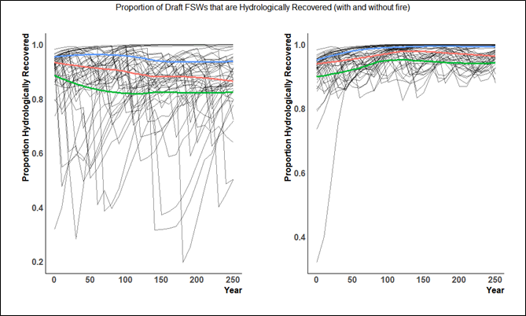
<p class="caption">(\#fig:figure62)Hydrological Recovery in FSWs</p>
</div>
Fire is the primary driver impacting HR in the base case. Although harvest does impact HR the impacts appear relatively modest relative to the implementation of an explicit fire regime in the base case. The effect of fire disturbance is significant with the model burning approximately 6500 of forest per year causing non-harvesting related roll-over in age and heights in both the contributing (THLB) and non-contributing (nTHLB) portions of the productive forest. This causes the ECA constraints to become more binding, particularly in units with greater proportions of THLB as ~ 87% of modeled fire activity occurs in the nTHLB.

When fire is removed from the model HR remains relatively stable above 80% for all units through out the planning horizon. This is likely partially due to the modeled concentration of harvest in the southern portion of the TSA and the more northernly distribution of the majority of draft FSWs which see limited harvesting. 

The following chart contrasts the base case with sensitivities that establish HR requirements for all draft FSWs and where the impacts of fire either modeled explicitly or aspatially.The scenario was designed to highlight the effect of explicit natural disturbance. No attempt was made to increase harvest levels in the mid or long-term as a result of modelling disturbance aspatially. If fire is removed from the base case and replaced with an aspatial NRL then the short-term impact is +2.6%.

The chart depicts 250 years of harvest projection with the TSA harvest level represented by the solid lines (the black line representing the base case) with the associated volumes identified on the left Y axis and the combined contributions of the draft FSWs to the harvest flow represented by the dashed lines with the associated volumes identified on the right Y axis.

<div class="figure" style="text-align: center">
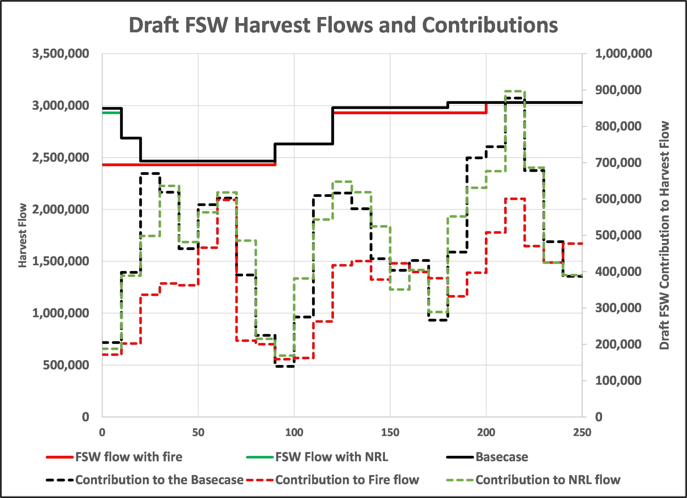
<p class="caption">(\#fig:figure63)ECA Harvest Flows</p>
</div>

Implementation of ECA constraints in conjunction with an explicit fire natural disturbance regime reduces short term by 18% in the first decade and 10% in the second decade. Conversely implementing the ECA constraints while modeling natural disturbance aspatially (as a standard non-recoverable loss applied to the harvest request) has a modest 1.5% impact  on the first decade of the short-term. The draft FSW Flow with NRL contribution projection tracks the base case relatively closely suggesting that the aspatial application of the constraint is non-binding across the planning horizon.

The contrast in outcomes between the application of ECA requirements with natural disturbance occurring explicitly versus implicitly is significant. In the base case, harvesting activities alone appear to have a limited impact on hydrological recovery with minor consequences for harvest flow but when taken in conjunction with fire, the combined effect creates a substantial downward pressure on the short-term harvest projection. The modeling also suggests that aspatial approaches to disturbance may serve to underestimate the potential effects of a given management regime on harvest flows.


## Aquatic Ecosystem Health/WHOPR

Watershed hazard was evaluated using the Watershed Health Project Omineca Region protocol and the Provincial cumulative effects framework Interim Assessment Protocol for Aquatic Ecosystems. The assessment presented here is scaled to the assessment unit watershed (AUW) which are areas between 2,000 and 10,000 ha meant to emulate third order watersheds. 

### WHPOR

The current condition of watershed hazard was assessed using the Watershed Health Project Omineca Region (WHPOR) protocol.
WHPOR findings indicate the Mackenzie TSA has more than 20% of AUW in moderate or higher streamflow hazard as shown in the figure on the right. These areas of the TSA have been influenced by forest disturbance or their watershed characteristics are such that the units may be more responsive than others to increased peak flow with forest canopy disturbance.

Mackenzie TSA has close to 20% or more AUW with a moderate or higher sediment hazard so sediment erosion and control planning is important with road development and other sediment generating activities.Hazard estimates reflect disturbance and watershed characteristics. Disturbance indicators such as ECA or stream crossing density can show a high or lower disturbance footprint relative to watershed hazard because watershed characteristics such as slope, presence of sensitive soils, and drainage density can buffer or amplify disturbance response. 


The table below shows the distribution of hazard score for three hazard types in the Mackenzie District.The findings identified in this summary are from a desktop GIS based exercise that has not been field verified for the area.  The hazard estimates provided here present a relative comparison of potential hazards across AUWs with the expectation that other supporting activities such as air photo interpretation and field verification would occur during development and conservation planning and review.

<table class="table table-striped" style="font-size: 10px; margin-left: auto; margin-right: auto;">
<caption style="font-size: initial !important;">(\#tab:table15)WHOPR Summary</caption>
 <thead>
  <tr>
   <th style="text-align:left;"> Hazard </th>
   <th style="text-align:left;"> Very Low </th>
   <th style="text-align:left;"> Low </th>
   <th style="text-align:left;"> Moderate </th>
   <th style="text-align:left;"> High </th>
   <th style="text-align:left;"> Very High </th>
  </tr>
 </thead>
<tbody>
  <tr>
   <td style="text-align:left;"> Streamflow </td>
   <td style="text-align:left;"> 7% </td>
   <td style="text-align:left;"> 67.40% </td>
   <td style="text-align:left;"> 19.60% </td>
   <td style="text-align:left;"> 5.60% </td>
   <td style="text-align:left;"> 0.40% </td>
  </tr>
  <tr>
   <td style="text-align:left;"> Sediment </td>
   <td style="text-align:left;"> 70.60% </td>
   <td style="text-align:left;"> 9.80% </td>
   <td style="text-align:left;"> 7.30% </td>
   <td style="text-align:left;"> 5.50% </td>
   <td style="text-align:left;"> 6.70% </td>
  </tr>
  <tr>
   <td style="text-align:left;"> Riparian </td>
   <td style="text-align:left;"> 76.40% </td>
   <td style="text-align:left;"> 20% </td>
   <td style="text-align:left;"> 3.60% </td>
   <td style="text-align:left;"> 0.00% </td>
   <td style="text-align:left;"> 0.00% </td>
  </tr>
</tbody>
</table>

### Aquatic Ecosystem Assessment

The following analysis is based on processes described in the [Interim Assessment Protocol for Aquatic Ecosystem in British Columbia (December 2020).]( https://www2.gov.bc.ca/assets/gov/environment/natural-resource-stewardship/cumulative-effects/protocols/cef_aquatic_ecosystems_protocol_dec2020_final.pdf)

This analysis will focus on trends in core indicator hazard ranking over time. Six Core indicators: Road Density, Stream Crossing Density, Peak Flow, Road Density < 100m from streams, Road Density on Unstable Slopes and Riparian Disturbance will be assessed over three periods: 2030, 2070 and 2120. 

#### Road Density

The following is an excerpt from: The Interim Assessment Protocol for Aquatic Ecosystems in British Columbia (Oct 2020):

*As road densities increase, more surface materials are exposed to erosion, which can result in an increase in the mobilization of sediment to nearby waterways. Human-constructed fire guards present an additional source of sediment and are becoming more prevalent in the landscape with increased fire activity in recent years. Peak flows within a watershed may be magnified as road density increases because the compact nature of roads resists water infiltration and facilitates surface water runoff. Ditch lines that run perpendicular to slopes intercept sub-surface and surface flows as well as collect run off from roads, all of which are then rapidly transported to nearby stream channels. During heavy precipitation and/or snow melting events, these processes are exacerbated as high levels of water and sediments are diverted to streams via roads and ditch lines.*

Indicator Metric: Area weighted average Road Density within AWS

**Methodology**

Road density is defined for each grid cell as the length of road (m or km) per km2 within a 1 km2 circular window. A road density surface is maintained dynamically in the timber supply model using a moving window algorithm, updated at the end of each time step, after new road segments and spur access roads have been built, and deactivated road segments disabled.

1.	Run base case in timber supply model and output road density raster for each 10-year time step. 
2.	Import road density rasters and Fresh Water Atlas analysis watersheds (aws) vector file for the Mackenzie TSA into R as follows:


```r
#create # list of raster file paths
datafiles <- Sys.glob("C:\\Data\\tsa16\\SELES\\STSM2020\\2017STSM_course\\updates\\Mackenzie\\Outputs\\TimberSupply\\watershed\\step10_aws_rd3_RelativeVolumeCMAI_p0_nd3_sen_con_ct\\oScn250\\density\\*.tif")
#create an empty raster stack object
resultingStack<- stack()
#populate the stack with the road density rasters
for(i in 1:NROW(datafiles)){
  tempraster <- raster(datafiles[i])
  resultingStack<- stack(resultingStack,tempraster)
}
#read the aws shp as a sp object 
aws<-readOGR(dsn = "C:/Data/tsa16/shp",layer = "tsa16_aws")

#using the exact_extract function extract the sum of the road density values (m/km2) for each aws
ex<- exact_extract(resultingStack,aws,'sum',append_cols = TRUE)
#generate the area weighted average for each aws
ex<-ex%>%mutate(rd0 = (sum.RdDensityMperKm2_1_0/1000)/AREA_HA,
                rd1 = (sum.RdDensityMperKm2_1_1/1000)/AREA_HA,
                rd2 = (sum.RdDensityMperKm2_1_2/1000)/AREA_HA,
                rd3 = (sum.RdDensityMperKm2_1_3/1000)/AREA_HA,
                rd4 = (sum.RdDensityMperKm2_1_4/1000)/AREA_HA,
                rd5 = (sum.RdDensityMperKm2_1_5/1000)/AREA_HA,
                rd6 = (sum.RdDensityMperKm2_1_6/1000)/AREA_HA,
                rd7 = (sum.RdDensityMperKm2_1_7/1000)/AREA_HA,
                rd8 = (sum.RdDensityMperKm2_1_8/1000)/AREA_HA,
                rd9 = (sum.RdDensityMperKm2_1_9/1000)/AREA_HA,
                rd10 = (sum.RdDensityMperKm2_1_10/1000)/AREA_HA,
                rd11 = (sum.RdDensityMperKm2_1_11/1000)/AREA_HA,
                rd12 = (sum.RdDensityMperKm2_1_12/1000)/AREA_HA,
                rd13 = (sum.RdDensityMperKm2_1_13/1000)/AREA_HA,
                rd14 = (sum.RdDensityMperKm2_1_14/1000)/AREA_HA,
                rd15 = (sum.RdDensityMperKm2_1_15/1000)/AREA_HA,
                rd16 = (sum.RdDensityMperKm2_1_16/1000)/AREA_HA,
                rd17 = (sum.RdDensityMperKm2_1_17/1000)/AREA_HA,
                rd18 = (sum.RdDensityMperKm2_1_18/1000)/AREA_HA,
                rd19 = (sum.RdDensityMperKm2_1_19/1000)/AREA_HA,
                rd20 = (sum.RdDensityMperKm2_1_20/1000)/AREA_HA,
                rd21 = (sum.RdDensityMperKm2_1_21/1000)/AREA_HA,
                rd22 = (sum.RdDensityMperKm2_1_22/1000)/AREA_HA,
                rd23 = (sum.RdDensityMperKm2_1_23/1000)/AREA_HA,
                rd24 = (sum.RdDensityMperKm2_1_24/1000)/AREA_HA,
                rd25 = (sum.RdDensityMperKm2_1_25/1000)/AREA_HA)

#classify each aws based on provincial protocol for three periods...here wee're using the values for sensitive watershed which are more stringent

ex<-ex%>%mutate(dens_score0=case_when(
  rd0 < 0.6 ~ 'Low',
  rd0 < 1.2 ~ 'Mod',
  rd0 >= 1.2 ~ 'High', 
  TRUE ~ 'Nil'
),dens_score1=case_when(
  rd1 < 0.6 ~ 'Low',
  rd1 < 1.2 ~ 'Mod',
  rd1 >= 1.2 ~ 'High', 
  TRUE ~ 'Nil'
), dens_score5=case_when(
  rd5 < 0.6 ~ 'Low',
  rd5 < 1.2 ~ 'Mod',
  rd5 >= 1.2 ~ 'High', 
  TRUE ~ 'Nil'
),
 dens_score10=case_when(
  rd10 < 0.6 ~ 'Low',
  rd10 < 1.2 ~ 'Mod',
  rd10 >= 1.2 ~ 'High', 
  TRUE ~ 'Nil'))
#generate a summary for three periods :10 years, 50 years, 100 years
export(ex,'c:/data/tsa16/WHPOR/rd_density.csv')
View(ex)

#create a rank df for aggregation at the end of the process
rdDen_rank<-ex%>%dplyr::select(2,57:59)%>%rename(
  rdDens_rank1 = dens_score1,
  rdDens_rank5 = dens_score5,
  rdDens_rank10 = dens_score10,
  watershed_feature_id = WATERSHED_
)

```
**Road Density Assessment Results**

In the Mackenzie TSA the median road density in AWS overlapping the THLB is 0.39km/km2   (mean = 0.7km/km2). The third quartile ( 75 percentile) is 1.13 km/km2.  The following histogram depicts the distribution of road density at the beginning of the base case harvest projection (the x axis is km/km2).

<div class="figure" style="text-align: center">
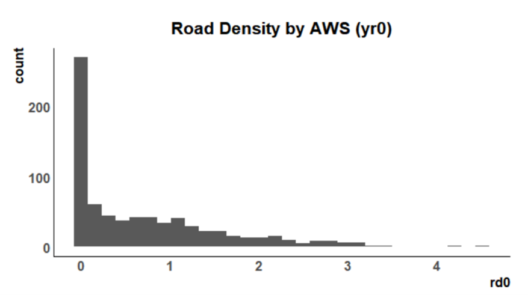
<p class="caption">(\#fig:figure64)Road Density Distribution</p>
</div>

The following table summarises the change in road density hazard resulting from base case harvest assumptions and projection. The table details the percentage of watershed assessment units in the THLB (49% of the aws: 753/1524)  in each rank category (low, medium, high) in three time periods: 2030, 2070 and 2120.


<table class="table table-striped" style="font-size: 10px; margin-left: auto; margin-right: auto;">
<caption style="font-size: initial !important;">(\#tab:table16)Road Density Summary</caption>
 <thead>
  <tr>
   <th style="text-align:left;"> Rank </th>
   <th style="text-align:left;"> Road Density yr10 </th>
   <th style="text-align:left;"> Road Density yr50 </th>
   <th style="text-align:left;"> Road Density yr100 </th>
  </tr>
 </thead>
<tbody>
  <tr>
   <td style="text-align:left;"> Low </td>
   <td style="text-align:left;"> 57.31% </td>
   <td style="text-align:left;"> 50.57% </td>
   <td style="text-align:left;"> 47.89% </td>
  </tr>
  <tr>
   <td style="text-align:left;"> Mod </td>
   <td style="text-align:left;"> 19.16% </td>
   <td style="text-align:left;"> 21.31% </td>
   <td style="text-align:left;"> 23.49% </td>
  </tr>
  <tr>
   <td style="text-align:left;"> High </td>
   <td style="text-align:left;"> 23.54% </td>
   <td style="text-align:left;"> 28.12% </td>
   <td style="text-align:left;"> 28.62% </td>
  </tr>
</tbody>
</table>

At the start of the projection (year 0) 44% of the units within the THLB had a weighted average road density greater 0.6km/km2 (moderate or greater ranking). By the year 100 of the projection there is a 20% increase in units with a weighted average road density greater 0.6km/km2 and a 20% increase (223 at year 100/176 at year 0) in units with a high ranking (> 1.2km/km2).

#### Road Density < 100m from streams

The following is an excerpt from: The interim assessment protocol for Aquatic Ecosystems in British Columbia (Oct 2020):

*High road density near streams may contribute significant amounts of sediment to streams, affecting
water quality, stream bed morphology and biota. Erosion and transport processes are dependent on precipitation, soil texture, road construction and maintenance practices.*

Indicator Metric: Area weighted average road density within 100m buffer of all streams within AWS


**Methodology**


1.	In ArcGIS extract the stream network from the Fresh Water Atlas. Buffer all streams by 100 meters. Execute identity with AWS and output strm100_clean.shp .
2.	Import road density rasters and strm100_clean.shp vector file for the Mackenzie TSA into R 


```r
library(sf)
#create a sf object....very useful for cleaning geometry after the fact wit st_make_valid
str <-  st_read("C:/Data/tsa16/shp/strm100_clean.shp")
x<-st_is_valid(str)
st_make_valid(str)

exStr<- exact_extract(resultingStack,str,'sum',append_cols = TRUE)

exStr<-exStr%>%mutate(rd1 = (sum.RdDensityMperKm2_1_1/1000)/(GEOMETRY_A/10000),
                rd2 = (sum.RdDensityMperKm2_1_2/1000)/(GEOMETRY_A/10000),
                rd3 = (sum.RdDensityMperKm2_1_3/1000)/(GEOMETRY_A/10000),
                rd4 = (sum.RdDensityMperKm2_1_4/1000)/(GEOMETRY_A/10000),
                rd5 = (sum.RdDensityMperKm2_1_5/1000)/(GEOMETRY_A/10000),
                rd6 = (sum.RdDensityMperKm2_1_6/1000)/(GEOMETRY_A/10000),
                rd7 = (sum.RdDensityMperKm2_1_7/1000)/(GEOMETRY_A/10000),
                rd8 = (sum.RdDensityMperKm2_1_8/1000)/(GEOMETRY_A/10000),
                rd9 = (sum.RdDensityMperKm2_1_9/1000)/(GEOMETRY_A/10000),
                rd10 = (sum.RdDensityMperKm2_1_10/1000)/(GEOMETRY_A/10000),
                rd11 = (sum.RdDensityMperKm2_1_11/1000)/(GEOMETRY_A/10000),
                rd12 = (sum.RdDensityMperKm2_1_12/1000)/(GEOMETRY_A/10000),
                rd13 = (sum.RdDensityMperKm2_1_13/1000)/(GEOMETRY_A/10000),
                rd14 = (sum.RdDensityMperKm2_1_14/1000)/(GEOMETRY_A/10000),
                rd15 = (sum.RdDensityMperKm2_1_15/1000)/(GEOMETRY_A/10000),
                rd16 = (sum.RdDensityMperKm2_1_16/1000)/(GEOMETRY_A/10000),
                rd17 = (sum.RdDensityMperKm2_1_17/1000)/(GEOMETRY_A/10000),
                rd18 = (sum.RdDensityMperKm2_1_18/1000)/(GEOMETRY_A/10000),
                rd19 = (sum.RdDensityMperKm2_1_19/1000)/(GEOMETRY_A/10000),
                rd20 = (sum.RdDensityMperKm2_1_20/1000)/(GEOMETRY_A/10000),
                rd21 = (sum.RdDensityMperKm2_1_21/1000)/(GEOMETRY_A/10000),
                rd22 = (sum.RdDensityMperKm2_1_22/1000)/(GEOMETRY_A/10000),
                rd23 = (sum.RdDensityMperKm2_1_23/1000)/(GEOMETRY_A/10000),
                rd24 = (sum.RdDensityMperKm2_1_24/1000)/(GEOMETRY_A/10000),
                rd25 = (sum.RdDensityMperKm2_1_25/1000)/(GEOMETRY_A/10000))

exStr<-exStr%>%mutate(dens_score1=case_when(
  rd1 < .12 ~ 'Low',
  rd1 < .3 ~ 'Mod',
  rd1 >= .3 ~ 'High', 
  TRUE ~ 'Nil'
), dens_score5=case_when(
  rd5 < .12 ~ 'Low',
  rd5 < .3 ~ 'Mod',
  rd5 >= .3 ~ 'High', 
  TRUE ~ 'Nil'
),
dens_score10=case_when(
  rd10 < .12 ~ 'Low',
  rd10 < .3 ~ 'Mod',
  rd10 >= .3 ~ 'High', 
  TRUE ~ 'Nil'))

export(exStr,'c:/data/tsa16/WHPOR/rd_density100.csv')

rdDen100_rank<-exStr%>%dplyr::select(2,56:58)%>%rename(
 rdDens100_rank1 = dens_score1,
 rdDens100_rank5 = dens_score5,
 rdDens100_rank10 = dens_score10,
  watershed_feature_id = fwa_id
)

```
**Road Density < 100m from streams Results**

In the Mackenzie TSA approximately 36% (1,373,062/3,745,626) of the area within AWS overlapping the THLB fall with 100m of a stream.  The following table summarises the change in road density < 100 meters from a stream hazard resulting from base case harvest assumptions. The table details the percentage of watershed assessment units within the THLB in each rank category (low, medium, high) in three time periods: 2030, 2070 and 2120.

<table class="table table-striped" style="font-size: 10px; margin-left: auto; margin-right: auto;">
<caption style="font-size: initial !important;">(\#tab:table17)Road Density &lt; 100 m. Summary</caption>
 <thead>
  <tr>
   <th style="text-align:left;"> Rank </th>
   <th style="text-align:left;"> Road Density within 100m. of stream yr10 </th>
   <th style="text-align:left;"> Road Density within 100m. of stream yr50 </th>
   <th style="text-align:left;"> Road Density within 100m. of stream yr100 </th>
  </tr>
 </thead>
<tbody>
  <tr>
   <td style="text-align:left;"> Low </td>
   <td style="text-align:left;"> 35.62% </td>
   <td style="text-align:left;"> 26.37% </td>
   <td style="text-align:left;"> 10.95% </td>
  </tr>
  <tr>
   <td style="text-align:left;"> Mod </td>
   <td style="text-align:left;"> 9.83% </td>
   <td style="text-align:left;"> 8.09% </td>
   <td style="text-align:left;"> 11.82% </td>
  </tr>
  <tr>
   <td style="text-align:left;"> High </td>
   <td style="text-align:left;"> 54.55% </td>
   <td style="text-align:left;"> 65.54% </td>
   <td style="text-align:left;"> 77.23% </td>
  </tr>
</tbody>
</table>

At the start of the projection (year0) 53% of the units overlapping the THLB had a weighted average road density greater 0.3km/km2 (high ranking) within 100-metre buffers of all streams. By the year 100 of the projection there is a 42% (> 77% ) increase in units with a weighted average road density > 0.3km/km2 within 100-metre buffers of all streams.

#### Road Density on unstable slopes

The following is an excerpt from: The interim assessment protocol for Aquatic Ecosystems in British Columbia (Oct 2020)

*Roads on unstable terrain increase the chance of mass wasting by undermining or loading slopes, bysaturating soils and by reducing soil root. Roads can alter surface drainage patterns and divert subsurface flow to the surface increasing the chance of soil saturation and gulley erosion. Clearings associated with roads reduce the root network that provides structural support to soil and they increase the chance of soil saturation by reducing rainfall interception and increasing snowmelt.*

Indicator Metric: Area weighted average road density on potentially unstable slopes with AWS (potentially unstable is defined as > 60% slope)

**Methodology**

1.	In ArcGIS extract and identify all slopes > 60% using 25m Digital Elevation Model, dissolve and execute an identity with AWS and output Slopes60pct_Identity. shp .
2.	Import road density rasters and Slopes60pct_Identity. shp vector file for the Mackenzie TSA into R 


```r
#Total length of roads and fire guards found on steep slopes divided by the total watershed area (km/km2)

slp <-st_read("C:/Data/tsa16/shp/aws_slp60.shp")
st_make_valid(str)

slope<- exact_extract(resultingStack,slp,'sum',append_cols = TRUE)

slope<-slope%>%mutate(rd1 = (sum.RdDensityMperKm2_1_1/1000)/ha,
                rd2 = (sum.RdDensityMperKm2_1_2/1000)/ha,
                rd3 = (sum.RdDensityMperKm2_1_3/1000)/ha,
                rd4 = (sum.RdDensityMperKm2_1_4/1000)/ha,
                rd5 = (sum.RdDensityMperKm2_1_5/1000)/ha,
                rd6 = (sum.RdDensityMperKm2_1_6/1000)/ha,
                rd7 = (sum.RdDensityMperKm2_1_7/1000)/ha,
                rd8 = (sum.RdDensityMperKm2_1_8/1000)/ha,
                rd9 = (sum.RdDensityMperKm2_1_9/1000)/ha,
                rd10 = (sum.RdDensityMperKm2_1_10/1000)/ha,
                rd11 = (sum.RdDensityMperKm2_1_11/1000)/ha,
                rd12 = (sum.RdDensityMperKm2_1_12/1000)/ha,
                rd13 = (sum.RdDensityMperKm2_1_13/1000)/ha,
                rd14 = (sum.RdDensityMperKm2_1_14/1000)/ha,
                rd15 = (sum.RdDensityMperKm2_1_15/1000)/ha,
                rd16 = (sum.RdDensityMperKm2_1_16/1000)/ha,
                rd17 = (sum.RdDensityMperKm2_1_17/1000)/ha,
                rd18 = (sum.RdDensityMperKm2_1_18/1000)/ha,
                rd19 = (sum.RdDensityMperKm2_1_19/1000)/ha,
                rd20 = (sum.RdDensityMperKm2_1_20/1000)/ha,
                rd21 = (sum.RdDensityMperKm2_1_21/1000)/ha,
                rd22 = (sum.RdDensityMperKm2_1_22/1000)/ha,
                rd23 = (sum.RdDensityMperKm2_1_23/1000)/ha,
                rd24 = (sum.RdDensityMperKm2_1_24/1000)/ha,
                rd25 = (sum.RdDensityMperKm2_1_25/1000)/ha)

slope<-slope%>%mutate(slope1_rank=case_when(
  rd1 < 0.12 ~ 'Low',
  rd1 < .24 ~ 'Mod',
  rd1 >= .24 ~ 'High', 
  TRUE ~ 'Nil'
), slope5_rank=case_when(
  rd5 <.12 ~ 'Low',
  rd5 < .24 ~ 'Mod',
  rd5 >= .24 ~ 'High', 
  TRUE ~ 'Nil'
),
slope10_rank=case_when(
  rd10 < .12 ~ 'Low',
  rd10 < .24 ~ 'Mod',
  rd10 >= .24 ~ 'High', 
  TRUE ~ 'Nil'))
export(slope,'c:/data/tsa16/WHPOR/rd_density_slope.csv')

slope_rank<-slope%>%dplyr::select(2,58:60)%>%rename(watershed_feature_id = WATERSHED_)
```

**Road Density  on unstable slopes Results**

In the Mackenzie TSA approximately 24% (925,865/3,745,626) of the area within AWS overlapping the THLB can be classified as potentially unstable terrain (> 60% slope). The following table summarises the change in road density on potentially unstable terrain hazard resulting from base case harvest assumptions. The table details the percentage of watershed assessment units within the THLB in each rank category (low, medium, high) in three time periods: 2030, 2070 and 2120.

<table class="table table-striped" style="font-size: 10px; margin-left: auto; margin-right: auto;">
<caption style="font-size: initial !important;">(\#tab:table18)Road Density on unstable slopes Summary</caption>
 <thead>
  <tr>
   <th style="text-align:left;"> Rank </th>
   <th style="text-align:left;"> Road Density on unstable terrain yr10 </th>
   <th style="text-align:left;"> Road Density on unstable terrain yr50 </th>
   <th style="text-align:left;"> Road Density on unstable terrain yr100 </th>
  </tr>
 </thead>
<tbody>
  <tr>
   <td style="text-align:left;"> Low </td>
   <td style="text-align:left;"> 53.25% </td>
   <td style="text-align:left;"> 42.26% </td>
   <td style="text-align:left;"> 32.45% </td>
  </tr>
  <tr>
   <td style="text-align:left;"> Mod </td>
   <td style="text-align:left;"> 8.43% </td>
   <td style="text-align:left;"> 11.29% </td>
   <td style="text-align:left;"> 16.85% </td>
  </tr>
  <tr>
   <td style="text-align:left;"> High </td>
   <td style="text-align:left;"> 38.31% </td>
   <td style="text-align:left;"> 46.46% </td>
   <td style="text-align:left;"> 50.71% </td>
  </tr>
</tbody>
</table>

At the start of the projection (year0) 34% of the units overlapping the THLB had a weighted average road density greater 0.3km/km2 (high ranking) on potentially unstable terrain (> 60% slope). By the year 100 of the projection there is a 32% (> 50.7% ) increase in units with a weighted average road density of > 0.3km/km2 on potentially unstable terrain.

#### Riparian Disturbance Streams

The following is an excerpt from: The Interim Assessment Protocol for Aquatic Ecosystems in British Columbia (Oct 2020).

*Riparian areas are intimately connected with stream, lake, and wetland ecosystems, providing a wide variety of ecological services and functions. Multiple factors contribute to riparian condition including water quality, watershed area, distribution and types of vegetation, regulatory compliance, vegetation disturbance, form, and structure. Riparian areas can regulate channel morphology and contribute to aquatic habitats through the provision of large wood. Riparian areas also influence water quality, provide shade, and are sources of food and nutrients to aquatic ecosystems. The maintenance of these functions and services depends upon the intactness of riparian management areas.*

*As the proportion of disturbed streams increases within a watershed, so does the risk of surface erosion and mass-transport of sediment during heavy precipitation events. When riparian vegetation is lost, stream channels are weakened due to the lack of root structures, and intensified surface erosion and mass-wasting are common outcomes. Riparian disturbance is limited to human causes as natural events such as fires or insect damage will retain large wood and provide a measure of other riparian functions until the forest regenerates.*

Indicator Metric: The ratio of the linear length of disturbance within 30meter buffer of streams to the length of all streams within AWS (one cell assumes 100 meters of disturbance). 

**Methodology**

1.	In ArcGIS extract the stream network from the Fresh Water Atlas. Buffer all streams by 30 meters. Execute identity with AWS and output Stream_buf30_Identity. shp .
2.	Import disturbance rasters (initial roads, logging and fire) and Stream_buf100_Identity. shp .vector file for the Mackenzie TSA into R. 


```r

logged <- Sys.glob("C:\\Data\\tsa16\\SELES\\STSM2020\\2017STSM_course\\updates\\Mackenzie\\Outputs\\TimberSupply\\watershed\\step10_aws_rd3_RelativeVolumeCMAI_p0_nd3_sen_con_ct\\oScn250\\grids\\DistId_1_*.tif")
LoggedStack<- stack()
# #EPSG:3005
for(i in 1:NROW(logged)){
   tempraster <- raster(logged[i])
   rc<-reclassify(tempraster,c(-Inf,0,0,1,Inf,100))
   # plot(rc)
   LoggedStack<- stack(LoggedStack,rc)
}

str30 <-  st_read("C:/Data/tsa16/shp/str30buf.shp")
str30
x<-st_is_valid(str30)
st_make_valid(str30)

exStrm30<- exact_extract(LoggedStack,str30,'sum',append_cols = TRUE)
aws_str<-import("c:/data/tsa16/WHPOR/stream_aws_km.csv")
View(aws_str)

exStrm30<-inner_join(exStrm30,aws_str,by = c("WATERSHED_" = "fwa_id"))
rm(LoggedStack)

exStrm30<-exStrm30%>%mutate(dist1 = ((sum.DistId_1_0+sum.DistId_1_1)/1000)/Sum_LENGTH,
                dist2 = ((sum.DistId_1_0+sum.DistId_1_2)/1000)/Sum_LENGTH,
                dist3 = ((sum.DistId_1_0+sum.DistId_1_3)/1000)/Sum_LENGTH,
                dist4 = ((sum.DistId_1_0+sum.DistId_1_4)/1000)/Sum_LENGTH,
                dist5 = ((sum.DistId_1_0+sum.DistId_1_5)/1000)/Sum_LENGTH,
                dist6 = ((sum.DistId_1_0+sum.DistId_1_6)/1000)/Sum_LENGTH,
                dist7 = ((sum.DistId_1_0+sum.DistId_1_6)/1000)/Sum_LENGTH,
                dist8 = ((sum.DistId_1_0+sum.DistId_1_6)/1000)/Sum_LENGTH,
                dist9 = ((sum.DistId_1_0+sum.DistId_1_6)/1000)/Sum_LENGTH,
                dist10 = ((sum.DistId_1_0+sum.DistId_1_6)/1000)/Sum_LENGTH,
                dist11 = ((sum.DistId_1_0+sum.DistId_1_6)/1000)/Sum_LENGTH,
                dist12 = ((sum.DistId_1_0+sum.DistId_1_6)/1000)/Sum_LENGTH,
                dist13 = ((sum.DistId_1_0+sum.DistId_1_6)/1000)/Sum_LENGTH,
                dist14 = ((sum.DistId_1_0+sum.DistId_1_6)/1000)/Sum_LENGTH,
                dist15 = ((sum.DistId_1_0+sum.DistId_1_6)/1000)/Sum_LENGTH,
                dist16 = ((sum.DistId_1_0+sum.DistId_1_6)/1000)/Sum_LENGTH,
                dist17 = ((sum.DistId_1_0+sum.DistId_1_6)/1000)/Sum_LENGTH,
                dist18 = ((sum.DistId_1_0+sum.DistId_1_6)/1000)/Sum_LENGTH,
                dist19 = ((sum.DistId_1_0+sum.DistId_1_6)/1000)/Sum_LENGTH,
                dist20 = ((sum.DistId_1_0+sum.DistId_1_6)/1000)/Sum_LENGTH,
                dist21 = ((sum.DistId_1_0+sum.DistId_1_6)/1000)/Sum_LENGTH,
                dist22 = ((sum.DistId_1_0+sum.DistId_1_6)/1000)/Sum_LENGTH,
                dist23 = ((sum.DistId_1_0+sum.DistId_1_6)/1000)/Sum_LENGTH,
                dist24 = ((sum.DistId_1_0+sum.DistId_1_6)/1000)/Sum_LENGTH,
                dist25 = ((sum.DistId_1_0+sum.DistId_1_6)/1000)/Sum_LENGTH)

exStrm30<-exStrm30%>%mutate(dist_score1=case_when(
  dist1 < 0.12 ~ 'Low',
  dist1 < .21 ~ 'Mod',
  dist1 >= .21 ~ 'High',
  TRUE ~ 'Nil'
), dist_score5=case_when(
  dist5 < .12 ~ 'Low',
  dist5 < .21 ~ 'Mod',
  dist5 >= .21 ~ 'High',
  TRUE ~ 'Nil'
),
dist_score10=case_when(
  dist10 < .12 ~ 'Low',
  dist10 < .21 ~ 'Mod',
  dist10 >= .21 ~ 'High',
  TRUE ~ 'Nil'))
View(exStrm30)
export(exStrm30, 'c:/data/tsa16/WHPOR/stream30.csv')
exStrm30_rank<-exStrm30%>%dplyr::select(2,59:61)%>%rename(
  rip_dist1 = dist_score1,
  rip_dist5 = dist_score5,
  rip_dist10 = dist_score10,
  watershed_feature_id = WATERSHED_
)

```
In the Mackenzie TSA approximately 4% (149 602/3 745 626) of the area within AWS overlapping the THLB fall with 30m of a stream. The following table summarises the change in riparian disturbance (roading, logging and fire) resulting from base case harvest projection. The table details the percentage of watershed assessment units within the THLBin each rank (low, medium, high) in three time periods: 2030, 2070 and 2120.

<table class="table table-striped" style="font-size: 10px; margin-left: auto; margin-right: auto;">
<caption style="font-size: initial !important;">(\#tab:table19)Riparian Disturbance Summary</caption>
 <thead>
  <tr>
   <th style="text-align:left;"> Rank </th>
   <th style="text-align:left;"> Riparian Disturbance yr10 </th>
   <th style="text-align:left;"> Riparian Disturbance yr50 </th>
   <th style="text-align:left;"> Riparian Disturbance yr100 </th>
  </tr>
 </thead>
<tbody>
  <tr>
   <td style="text-align:left;"> Low </td>
   <td style="text-align:left;"> 88.94% </td>
   <td style="text-align:left;"> 76.80% </td>
   <td style="text-align:left;"> 75.82% </td>
  </tr>
  <tr>
   <td style="text-align:left;"> Mod </td>
   <td style="text-align:left;"> 5.68% </td>
   <td style="text-align:left;"> 12.74% </td>
   <td style="text-align:left;"> 13.10% </td>
  </tr>
  <tr>
   <td style="text-align:left;"> High </td>
   <td style="text-align:left;"> 5.39% </td>
   <td style="text-align:left;"> 10.46% </td>
   <td style="text-align:left;"> 11.08% </td>
  </tr>
</tbody>
</table>

After the first decade of the projection (year10) approximate 5% of the units overlapping the THLB had a weighted average disturbance ratio (km of disturbed buffer/km  of stream buffer) >  .21(high ranking). By the year 100 of the base case projection that condition had doubled (> 11% ).

#### Stream Crossing Density

The following is an excerpt from: The Interim Assessment Protocol for Aquatic Ecosystems in British Columbia (Oct 2020).

*Stream crossings (e.g.., roads, utility lines, other linear developments) represent a potential focal point for local sediment and flow delivery. Crossing structures can be a barrier to upstream fish passage, thereby restricting habitat and potentially fragmenting populations. A higher density of stream crossings in a watershed is generally indicative of greater risks of fine sediment inputs, although these risks will be dependent on the construction type (e.g., open box vs. closed box culverts), as well as the condition of stream crossing structures.*

Indicator Metric: Total number of stream crossings divided by the total watershed area (#/km2).

Methodology
1.	In ArcGIS buffer all streams by 10 meters and execute an identity with AWS and output Stream10_Identity. shp .
2.	Import road state rasters and Stream10_Identity. shp vector file for the Mackenzie TSA into R


```r
########################stream Crossing##############################

str10 <-st_read("C:/Data/tsa16/shp/str10.shp")
#x<-st_is_valid(str)
st_make_valid(str)
roads<- Sys.glob("C:\\Data\\tsa16\\SELES\\STSM2020\\2017STSM_course\\updates\\Mackenzie\\Outputs\\TimberSupply\\watershed\\step10_aws_rd3_RelativeVolumeCMAI_p0_nd3_sen_con_ct\\oScn250\\grids\\RoadState_1_*.tif")
roadStack<- stack()
# #EPSG:3005
m<-c(0,0,1,1,2,0,3,1,4,1,5,1,6,1)
rclmat <- matrix(m, ncol=2, byrow=TRUE)

for(i in 1:NROW(roads)){
  tempraster <- raster(roads[i])
  rc<-reclassify(tempraster,rclmat)
  nbc = cellStats(rc,stat="sum")
  print(nbc)
  roadStack<- stack(roadStack,rc)
}
crossings<- exact_extract(roadStack,str10,'sum',append_cols = TRUE)

crossings<-inner_join(crossings,aws_lbl,by = c("WATERSHED_"="watershed_feature_id"))
crossings<-crossings%>%mutate(cr1 = (sum.RoadState_1_1)/(gross/100),
                cr2 = (sum.RoadState_1_2)/(gross/100),
                cr3 = (sum.RoadState_1_3)/(gross/100),
                cr4 = (sum.RoadState_1_4)/(gross/100),
                cr5 = (sum.RoadState_1_5)/(gross/100),
                cr6 = (sum.RoadState_1_6)/(gross/100),
                cr7 = (sum.RoadState_1_7)/(gross/100),
                cr8 = (sum.RoadState_1_8)/(gross/100),
                cr9 = (sum.RoadState_1_9)/(gross/100),
                cr10 = (sum.RoadState_1_10)/(gross/100),
                cr11 = (sum.RoadState_1_11)/(gross/100),
                cr12 = (sum.RoadState_1_12)/(gross/100),
                cr13 = (sum.RoadState_1_13)/(gross/100),
                cr14 = (sum.RoadState_1_14)/(gross/100),
                cr15 = (sum.RoadState_1_15)/(gross/100),
                cr16 = (sum.RoadState_1_16)/(gross/100),
                cr17 = (sum.RoadState_1_17)/(gross/100),
                cr18 = (sum.RoadState_1_18)/(gross/100),
                cr19 = (sum.RoadState_1_19)/(gross/100),
                cr20 = (sum.RoadState_1_20)/(gross/100),
                cr21 = (sum.RoadState_1_21)/(gross/100),
                cr22 = (sum.RoadState_1_22)/(gross/100),
                cr23 = (sum.RoadState_1_23)/(gross/100),
                cr24 = (sum.RoadState_1_24)/(gross/100),
                cr25 = (sum.RoadState_1_25)/(gross/100))

crossings<-crossings%>%mutate(cr1_rank=case_when(
  cr1 < 0.24 ~ 'Low',
  cr1 < .6 ~ 'Mod',
  cr1 >= .6 ~ 'High',
  TRUE ~ 'Nil'
), cr5_rank=case_when(
  cr5 < .24 ~ 'Low',
  cr5 < .6 ~ 'Mod',
  cr5 >= .6 ~ 'High',
  TRUE ~ 'Nil'
),
cr10_rank=case_when(
  cr10< .24 ~ 'Low',
  cr10< .6 ~ 'Mod',
  cr10 >= .6 ~ 'High',
  TRUE ~ 'Nil'))

export(crossings, 'c:/data/tsa16/WHPOR/stream30.csv')
crossing_rank<-crossings%>%dplyr::select(2,61:63)%>%rename(watershed_feature_id = WATERSHED_)

```

**Stream Crossing Density Results**
A vector-based sample of road/stream intersection for the Mackenzie TSA shows an average of 23 intersections (median =  17) per AWS with an average density of 0.65/km2 (median = .42) of AWS. 

The following table summarises the change in stream crossing density resulting from base case harvest projection:
The table details the percentage of watershed assessment units within the THLB in each rank (low, medium, high) in three time periods: 2030, 2070 and 2120.

<table class="table table-striped" style="font-size: 10px; margin-left: auto; margin-right: auto;">
<caption style="font-size: initial !important;">(\#tab:table20)Stream Crossings Summary</caption>
 <thead>
  <tr>
   <th style="text-align:left;"> Rank </th>
   <th style="text-align:left;"> Road Density within 100m. of stream yr10 </th>
   <th style="text-align:left;"> Road Density within 100m. of stream yr50 </th>
   <th style="text-align:left;"> Road Density within 100m. of stream yr100 </th>
  </tr>
 </thead>
<tbody>
  <tr>
   <td style="text-align:left;"> Low </td>
   <td style="text-align:left;"> 35.62% </td>
   <td style="text-align:left;"> 26.37% </td>
   <td style="text-align:left;"> 10.95% </td>
  </tr>
  <tr>
   <td style="text-align:left;"> Mod </td>
   <td style="text-align:left;"> 9.83% </td>
   <td style="text-align:left;"> 8.09% </td>
   <td style="text-align:left;"> 11.82% </td>
  </tr>
  <tr>
   <td style="text-align:left;"> High </td>
   <td style="text-align:left;"> 54.55% </td>
   <td style="text-align:left;"> 65.54% </td>
   <td style="text-align:left;"> 77.23% </td>
  </tr>
</tbody>
</table>

After the first decade of the projection (year10) approximate 11% of the units overlapping the THLB had a weighted average crossing density > 0.6 (high ranking). By the year 100 of the base case projection that condition had tripled (> 37% ).

#### Peak Flow

The following area excerpts from: The Interim Assessment Protocol for Aquatic Ecosystems in British Columbia (Oct 2020)

*The peak flow indicator is an estimate of the likelihood that harmful changes in streamflow will result from current land use activities. A large proportion (up to 80%) of total annual water yield is discharged in the peak flow period. Peak flows are of considerable management concern as they can result in channel forming events, important when considering the design of stream crossings, instream structures or the effects of flooding on downstream values. In particular, an increase in peak
flow frequency and magnitude may result in harmful hydro-geomorphic events such as floods, bank erosion, channel instability, debris floods, and debris flows.* 

*Peak flows are regulated by a combination of factors, including those that are linked to natural runoff generation potential, surface flow attenuation, and equivalent clear-cut area (ECA).  It is the combination of these factors that control the magnitude, timing, and duration of peak flows. Natural runoff generation potential considers bio-geoclimatic (BEC) subzone and alpine non-forested areas. It accounts for the degree of change in peak flows resulting from development, using the assumption that watersheds grouped in specific sub-zone clusters with varying degrees of natural non-forested areas will generate different degrees of additional runoff after forest canopy loss or alteration.*

*Surface flow attenuation refers to how efficiently hillslope and stream runoff is slowed, captured and stored as it is routed through the watershed, and is represented by drainage density ruggedness and absence of lakes and wetlands. Drainage density ruggedness indicates the potential for rapid runoff delivery to and through streams, which may contribute to harmful flood events).*

*The absence of lakes and wetlands and man-made reservoirs in a watershed can have an influence on peak flow discharges because lakes and wetlands are shown to mitigate peak flows. The size and placement of wetlands within a watershed has also shown to influence attenuation, with larger lakes and wetlands located on the main-stem channel lower in a watershed being more effective at reducing downstream flooding.* 

*Equivalent Clear-cut Area (ECA) is a modeled metric that relates the influence of forest cover disturbance (e.g., clear-cuts) to changes in stream flow. ECA includes the area of land that has been harvested or otherwise cleared. Natural disturbance is included in ECA calculations to account for increases in surface water runoff due to changes in forest structure and function. Hydrologic recovery curves reflecting changes in flows resulting from the regenerating forest are used to modify the ECA.*

**Methodology**

1.	In Postgres create watershed_bec table and join with CEF BEC Sensitivity Score table. Create weighted BEC score by area. Determine non-forest area by BEC/watershed and calculate % non-forest. Output resultant to ‘watershed_bec csv’  Load csv into R and classify Natural runoff generation potential as a function of the BEC sensitivity score and non-forest percentage scores.
2.	In ArcGIS intersect FWA aws with FWA stream network and calculate stream length (km) by aws and output as csv. In ArcGIS generate region statistics for elevation for each AWS using 1 ha DEM and Zonal Statistics tool in Spatial Analyst. Load csvs into R and calculate stream density by AWS and multiply by elevation range for each AWS to determine Drainage Density Ruggedness.
3.	In ArcGIS extract waterbodies for the Mackenzie TSA from FWA and add to Postgres database. In Postgres calculate H30, H60 and classify each hectare of waterbody within each AWS based on elevation band the create waterbody weight based on elevation zone. Load weighted zone by AWS (lw), into R, create a lw score by dividing by gross area of AWS then rank
4.	In R rank the Attenuation Rating (as a function of lw_score & ddr_score) and Hydrologic Response Potential (as a function Attenuation Rating  and Natural runoff generation potential ) of each AWS.
5.	Load ECA report from TSM into R. The ECA report details area within each AWS that is not hydrologically recovered for each timestep in the base case harvest projection. Rank the stream flow hazard as a function of ECA and Hydrological Response Potential.
6.	Apply Duast/Price Watershed Sensitivity adjustment to ranking: If non-forest > 70% then Low else if non-forest > 30% then Moderate else High. If adjustment equals Low then drop hazard by two ranks else if adjustment equals Moderate then drop by one rank else maintain original ranking


```r

#####################################stream flow hazard (ECA)##############################################

aws_lbl<-import("c:/data/tsa16/xls/aws_sum2.csv")
aws_lbl$thlb[is.na(aws_lbl$thlb)] <- 0
aws_eca<-import("c:/data/tsa16/xls/AWSseralBySubZonethlb.csv")
View(aws_eca)
aws_eca<-left_join(aws_eca,aws_lbl,by = c("RefZone" = "aws_lbl"))

runoff<-import("c:/data/tsa16/WHPOR/watershed_bec.csv")
runoff<-runoff%>%mutate(runoff_rank = case_when(
  bec_unit_score< 1 & nfor_pct < .31 ~ "Mod",
  bec_unit_score< 1 & nfor_pct < .71 ~ "Low",
  bec_unit_score< 1 & nfor_pct >.7 ~ "V.Low",
  bec_unit_score< 2 & nfor_pct < .31 ~ "High",
  bec_unit_score< 2 & nfor_pct < .71 ~ "Mod",
  bec_unit_score< 2 & nfor_pct >.7 ~ "Low",
  bec_unit_score > 2 & nfor_pct < .31 ~ "V.High",
  bec_unit_score >2 & nfor_pct < .71 ~ "High",
  TRUE ~ "Mod",
))

DDR<-inner_join(aws_lbl,aws_str,by = c("watershed_feature_id" = "fwa_id"))
DDR<-DDR%>%mutate(str_density = Sum_LENGTH/(gross/100))
relief<-import("c:/data/tsa16/WHPOR/relief_range.csv")
DDR<-inner_join(DDR,relief,by = c("watershed_feature_id" = "watershed_id"))
DDR<-DDR%>%mutate(ddr_score= str_density*RANGE)

con <-dbConnect(RPostgreSQL::PostgreSQL(), host="localhost", user = "postgres")
elev<-dbGetQuery(con,"select watershed_feature_id, sum(aws_lake_wetland_wt)lw_area_sum
                 from tsa16_aws_elev_zone group by 1 order by 1")

elev$lw_area_sum[is.na(elev$lw_area_sum)] <- 0
DDR<-inner_join(DDR,elev)
DDR<-DDR%>%mutate(lw_score = lw_area_sum/gross*100,
                  lw_rating= case_when(
                    lw_score< 2.1 ~ "Low",
                    lw_score < 6.1 ~ "Mod",
                    TRUE ~ "High" ))

DDR<-DDR%>%mutate(attenuation_rating = case_when(
                    lw_score< 2.1 & ddr_score < 2000 ~ "Mod",
                    lw_score < 6.1 & ddr_score < 2000 ~ "High",
                    lw_score > 6.0 & ddr_score < 2000 ~ "V.High",
                    lw_score< 2.1 & ddr_score < 4000.1 ~ "Low",
                    lw_score < 6.1 & ddr_score < 4000.1 ~ "Mod",
                    lw_score > 6.0 & ddr_score < 4000.1 ~ "High",
                    lw_score< 2.1 & ddr_score > 4000 ~ "V.Low",
                    lw_score < 6.1 & ddr_score > 4000 ~ "Low",
                    TRUE ~ "Mod" ))

DDR<-inner_join(DDR,runoff,by = c("watershed_feature_id" = "aws"))

DDR<-DDR%>%mutate(response_potential = case_when(
  runoff_rank == "V.Low" & attenuation_rating == "V.High" ~ "V.Low",
  runoff_rank == "Low" & attenuation_rating == "V.High" ~ "V.Low",
  runoff_rank == "Mod" & attenuation_rating == "V.High" ~ "Low",
  runoff_rank == "High" & attenuation_rating == "V.High" ~ "Low",
  runoff_rank == "V.High" & attenuation_rating == "V.High" ~ "Low",
  runoff_rank == "V.Low" & attenuation_rating == "High" ~ "V.Low",
  runoff_rank == "Low" & attenuation_rating == "High" ~ "Low",
  runoff_rank == "Mod" & attenuation_rating == "High" ~ "Low",
  runoff_rank == "High" & attenuation_rating == "High" ~ "Mod",
  runoff_rank == "V.High" & attenuation_rating == "High" ~ "High",
  runoff_rank == "V.Low" & attenuation_rating == "Mod" ~ "Low",
  runoff_rank == "Low" & attenuation_rating == "Mod" ~ "Low",
  runoff_rank == "Mod" & attenuation_rating == "Mod" ~ "Mod",
  runoff_rank == "High" & attenuation_rating == "Mod" ~ "High",
  runoff_rank == "V.High" & attenuation_rating == "Mod" ~ "High",
  runoff_rank == "V.Low" & attenuation_rating == "Low" ~ "Low",
  runoff_rank == "Low" & attenuation_rating == "Low" ~ "Mod",
  runoff_rank == "Mod" & attenuation_rating == "Low" ~ "High",
  runoff_rank == "High" & attenuation_rating == "Low" ~ "High",
  runoff_rank == "V.High" & attenuation_rating == "Low" ~ "V.High",
  runoff_rank == "V.Low" & attenuation_rating == "V.Low" ~ "Mod",
  runoff_rank == "Low" & attenuation_rating == "V.Low" ~ "High",
  runoff_rank == "Mod" & attenuation_rating == "V.Low" ~ "High",
  runoff_rank == "High" & attenuation_rating == "V.Low" ~ "V.High",
  TRUE ~ "V.High" ))

ECA<-aws_eca%>%dplyr::select(3:5,7:8,10:11,13:14,16:17)
ECA<-inner_join(ECA,DDR,by = c("watershed_feature_id" = "watershed_feature_id"))
#ECA<-ECA%>%mutate(adjECA = Below/gross)
ECA<-ECA%>%mutate(stream_flow_hazard = case_when(
  response_potential == "V.High" & pBelow< .1 ~ "V.Low",
  response_potential == "High" & pBelow< .1 ~ "V.Low",
  response_potential == "Mod" & pBelow< .1 ~ "V.Low",
  response_potential == "Low" & pBelow< .1 ~ "V.Low",
  response_potential == "V.Low" & pBelow< .1 ~ "V.Low",
  response_potential == "V.High" & pBelow< .16 ~ "Low",
  response_potential == "High" & pBelow< .16 ~ "V.Low",
  response_potential == "Mod" & pBelow< .16 ~ "V.Low",
  response_potential == "Low" & pBelow< .16 ~ "V.Low",
  response_potential == "V.Low" & pBelow< .16 ~ "V.Low",
  response_potential == "V.High" & pBelow< .2 ~ "Low",
  response_potential == "High" & pBelow< .2 ~ "Low",
  response_potential == "Mod" & pBelow< .2 ~ "V.Low",
  response_potential == "Low" & pBelow< .2 ~ "V.Low",
  response_potential == "V.Low" & pBelow< .20 ~ "V.Low",
  response_potential == "V.High" & pBelow< .26 ~ "Mod",
  response_potential == "High" & pBelow< .26 ~ "Low",
  response_potential == "Mod" & pBelow< .26 ~ "Low",
  response_potential == "Low" & pBelow< .26 ~ "V.Low",
  response_potential == "V.Low" & pBelow< .26 ~ "V.Low",
  response_potential == "V.High" & pBelow< .3 ~ "Mod",
  response_potential == "High" & pBelow< .3 ~ "Mod",
  response_potential == "Mod" & pBelow< .3 ~ "Low",
  response_potential == "Low" & pBelow< .3 ~ "Low",
  response_potential == "V.Low" & pBelow< .3 ~ "V.Low",
  response_potential == "V.High" & pBelow< .36 ~ "High",
  response_potential == "High" & pBelow< .36 ~ "Mod",
  response_potential == "Mod" & pBelow< .36 ~ "Mod",
  response_potential == "Low" & pBelow< .36 ~ "Low",
  response_potential == "V.Low" & pBelow< .36 ~ "Low",
  response_potential == "V.High" & pBelow< .4 ~ "High",
  response_potential == "High" & pBelow< .4 ~ "High",
  response_potential == "Mod" & pBelow< .4 ~ "Mod",
  response_potential == "Low" & pBelow< .4 ~ "Mod",
  response_potential == "V.Low" & pBelow< .4 ~ "Low",
  response_potential == "V.High" & pBelow< .46 ~ "V.High",
  response_potential == "High" & pBelow< .46 ~ "High",
  response_potential == "Mod" & pBelow< .46 ~ "High",
  response_potential == "Low" & pBelow< .46 ~ "Mod",
  response_potential == "V.Low" & pBelow< .46 ~ "Mod",
  response_potential == "V.High" & pBelow< .5 ~ "V.High",
  response_potential == "High" & pBelow< .5 ~ "V.High",
  response_potential == "Mod" & pBelow< .5 ~ "High",
  response_potential == "Low" & pBelow< .5 ~ "Mod",
  response_potential == "V.Low" & pBelow< .5 ~ "Mod",
  response_potential == "V.High" & pBelow< .56 ~ "V.High",
  response_potential == "High" & pBelow< .56~ "V.High",
  response_potential == "Mod" & pBelow< .56 ~ "High",
  response_potential == "Low" & pBelow< .56 ~ "High",
  response_potential == "V.Low" & pBelow< .56 ~ "Mod",
  response_potential == "V.High" & pBelow< .6 ~ "V.High",
  response_potential == "High" & pBelow< .6 ~ "V.High",
  response_potential == "Mod" & pBelow< .6 ~ "V.High",
  response_potential == "Low" & pBelow< .6 ~ "High",
  response_potential == "V.Low" & pBelow< .6 ~ "High",
  response_potential == "V.High" & pBelow< .66 ~ "V.High",
  response_potential == "High" & pBelow< .66 ~ "V.High",
  response_potential == "Low" & pBelow< .66 ~ "High",
  response_potential == "V.Low" & pBelow< .66 ~ "High",
  response_potential == "V.High" & pBelow< .7 ~ "V.High",
  response_potential == "High" & pBelow< .7 ~ "V.High",
  response_potential == "Mod" & pBelow< .7 ~ "V.High",
  response_potential == "Low" & pBelow< .7 ~ "V.High",
  response_potential == "V.Low" & pBelow< .7 ~ "High",
  TRUE ~ "V.High"
))

ECA$stream_flow_hazard <- factor(ECA$stream_flow_hazard , levels = c("V.Low", "Low", "Mod","High","V.High"))

ECA_thlb = ECA%>%filter(thlb > 0)

#####rank
ECA1_rank<-ECA%>%filter(Year == 0)%>%dplyr::select(11,7,47)%>%rename(str_flow_haz1 = stream_flow_hazard,eca1=pBelow)
ECA5_rank<-ECA%>%filter(Year ==50)%>%dplyr::select(7,47)%>%rename(str_flow_haz5 = stream_flow_hazard,eca5=pBelow)
ECA10_rank<-ECA%>%filter(Year==100)%>%dplyr::select(7,47)%>%rename(str_flow_haz10 = stream_flow_hazard,eca10=pBelow)
ECA_rank<-cbind(ECA1_rank,ECA5_rank,ECA10_rank)
ECA_rank<-distinct(ECA_rank, watershed_feature_id, .keep_all = TRUE)

```
Peak Flow: Base case

For AWS that overlap the THLB 92 % of the units are currently in some state of hydrological recovery due to disturbance (both anthro and non-anthropogenic) with 21% of the units 99% recovered  and 95% of the units 60% recovered. The mean area not hydrologically recovered equally approximately to 18% (median = 9%). The histogram on the right details the distribution of proportions of AWS units that are not hydrologically recovered.


<div class="figure" style="text-align: center">
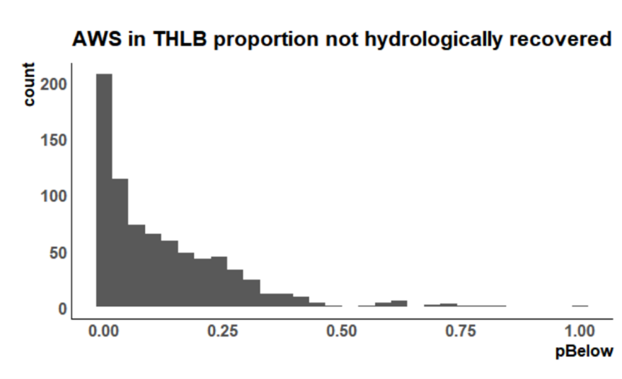
<p class="caption">(\#fig:figure65)Peak Flow Distribution</p>
</div>


The following table summarises the change peak flow hazard resulting from base case harvest projection. The table details the percentage of watershed assessment units within the THLB  in each rank (very low, low, medium, high and very high) in sethree time periods: 2030, 2070 and 2120.

<table class="table table-striped" style="font-size: 10px; margin-left: auto; margin-right: auto;">
<caption style="font-size: initial !important;">(\#tab:table21)Peak Flow Summary</caption>
 <thead>
  <tr>
   <th style="text-align:left;"> Rank </th>
   <th style="text-align:left;"> Stream flow yr10 </th>
   <th style="text-align:left;"> Stream flow yr50 </th>
   <th style="text-align:left;"> Stream flow yr100 </th>
  </tr>
 </thead>
<tbody>
  <tr>
   <td style="text-align:left;"> V.Low </td>
   <td style="text-align:left;"> 77.37% </td>
   <td style="text-align:left;"> 63.15% </td>
   <td style="text-align:left;"> 72.58% </td>
  </tr>
  <tr>
   <td style="text-align:left;"> Low </td>
   <td style="text-align:left;"> 14.13% </td>
   <td style="text-align:left;"> 20.36% </td>
   <td style="text-align:left;"> 12.11% </td>
  </tr>
  <tr>
   <td style="text-align:left;"> Mod </td>
   <td style="text-align:left;"> 5.27% </td>
   <td style="text-align:left;"> 10.01% </td>
   <td style="text-align:left;"> 9.31% </td>
  </tr>
  <tr>
   <td style="text-align:left;"> High </td>
   <td style="text-align:left;"> 1.41% </td>
   <td style="text-align:left;"> 5.38% </td>
   <td style="text-align:left;"> 4.24% </td>
  </tr>
  <tr>
   <td style="text-align:left;"> V.High </td>
   <td style="text-align:left;"> 1.83% </td>
   <td style="text-align:left;"> 1.09% </td>
   <td style="text-align:left;"> 1.75% </td>
  </tr>
</tbody>
</table>
After the first decade of the projection (year10) approximate 8 % (60) of the units overlapping the THLB had a  ‘Moderate’ to ‘High’ Peak Flow Hazard rating (high ranking). By the year 50 of the base case projection that condition had increased to approximately 16% and had plateaued there after as earlier units recovered with time balancing the aggregate impact.


#### Summary

The following table details how the overall ranking of AWS changes with time with the base case harvest projection. The focus is on units with either 2 or more or three or more ‘High’ hazard scores as a percentage of all the AWS that overlap the THLB (753 units overlap).

<table class="table table-striped" style="font-size: 10px; margin-left: auto; margin-right: auto;">
<caption style="font-size: initial !important;">(\#tab:table22)Summary</caption>
 <thead>
  <tr>
   <th style="text-align:left;"> Year </th>
   <th style="text-align:left;"> Category </th>
   <th style="text-align:left;"> pct of all AWS </th>
   <th style="text-align:right;"> AWS Count </th>
  </tr>
 </thead>
<tbody>
  <tr>
   <td style="text-align:left;"> Yr10 </td>
   <td style="text-align:left;"> two or more High ranks </td>
   <td style="text-align:left;"> 39.84% </td>
   <td style="text-align:right;"> 300 </td>
  </tr>
  <tr>
   <td style="text-align:left;"> Yr10 </td>
   <td style="text-align:left;"> three or more High ranks </td>
   <td style="text-align:left;"> 25.63% </td>
   <td style="text-align:right;"> 193 </td>
  </tr>
  <tr>
   <td style="text-align:left;"> Yr50 </td>
   <td style="text-align:left;"> two or more High ranks </td>
   <td style="text-align:left;"> 54.85% </td>
   <td style="text-align:right;"> 413 </td>
  </tr>
  <tr>
   <td style="text-align:left;"> Yr50 </td>
   <td style="text-align:left;"> three or more High ranks </td>
   <td style="text-align:left;"> 38.51% </td>
   <td style="text-align:right;"> 290 </td>
  </tr>
  <tr>
   <td style="text-align:left;"> Yr100 </td>
   <td style="text-align:left;"> two or more High ranks </td>
   <td style="text-align:left;"> 59.36% </td>
   <td style="text-align:right;"> 447 </td>
  </tr>
  <tr>
   <td style="text-align:left;"> Yr100 </td>
   <td style="text-align:left;"> three or more High ranks </td>
   <td style="text-align:left;"> 42.23% </td>
   <td style="text-align:right;"> 318 </td>
  </tr>
</tbody>
</table>

There are trends of increasing hazard for all indicators across the first 50 years of the projection with a minor reduction in hazard for Peak Flow occurring by the end of the second assessment period. After the first decade of the projection (year10) 43% of the units had no ‘High’ rank for the 6 primary indicators of potential hazard while approximate 40% of the units overlapping the THLB had two or more ‘High’ hazard ranks. By the year 100 approximately 20% of the units had no ‘High’ rank while the percentage of units with 2 or more increased by 20%. Units with 3 or more ‘High’ ranks increased by approximately 16% (42% in year 100 vs 26% in year 10).


